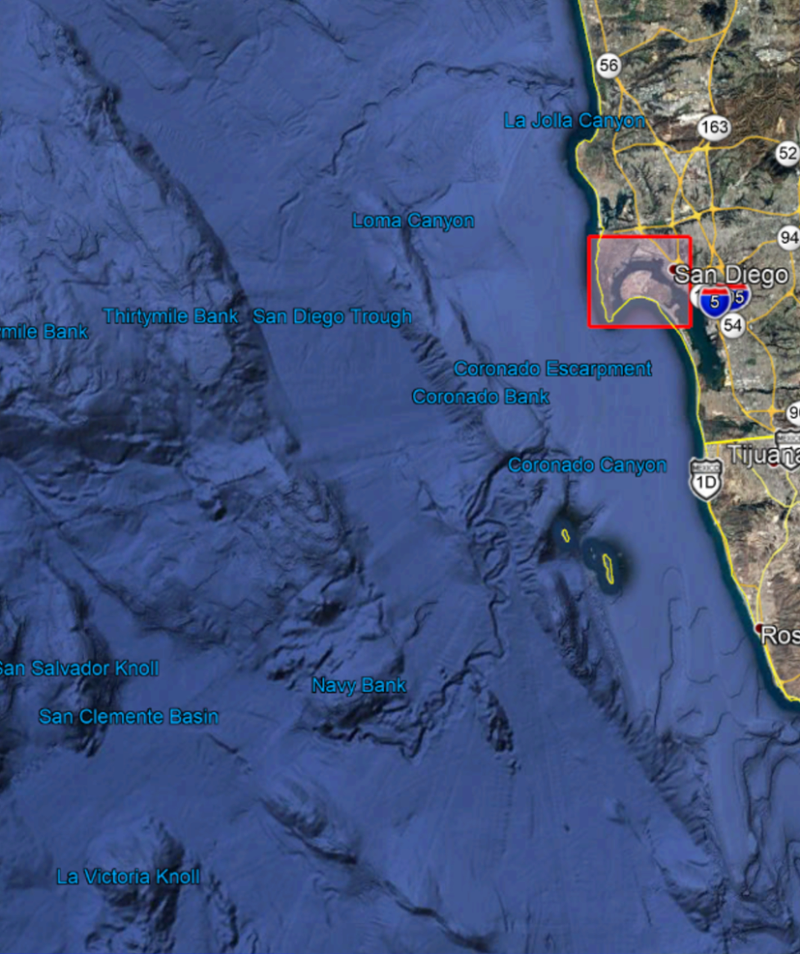

[[ExampleClause]]
== Example Clause

[NOTE]
.Instructions
===============================================
This section is under construction.
===============================================

[IMPORTANT]
====
For citations that also have an associated URL, the URL should be inserted inline as in https://www.ogc.org/[this example]. An endnote citation should still also be included (just in case the link stops working in the future).

See <<UseOfCitations, Use of Citations>> for full citation instructions.
====

== Material and Purpose

=== Call for Pariticipation

The ISG Sprint Year 2: Call for Participation (CfP) was released on 1 April 2021 by the Open Geospatial Consortium for the purpose of obtaining proposals from organizations interested in studying data and model handling within the CDB environment. The CfP provided all of the material necessary for organizations to make a proposal for participantion either by direct inclusion in the doucment or publicly available links.

The CfP specificed the schedule from kickoff meeting (2 June 2021) through the two spring weeks (weeks of 7 June and 21 June), and the participant final report inputs (31 July). The Sprint was designed from the beginning to be virtual dur to pandemic safety restrictions and precautions. The descion was made prior to the release of the CfP.

=== Data Sets

The primary data set for the Sprint is known as San Diego CDB (licensed under the SanGIS Legal Notice - SanGIS GIS Data End User Use Agreement and Disclaimer for Data Released to the Public). This data set was collected using a number of sensors and methods from <start> to <end> and encompassed nearly all of the downtown San Diego and vicinity, including the port, sports stadium, recreational facilities, commercial, and housing areas.

[#img_SanDiegoOverview,reftext='{figure-caption} {counter:figure-num}']
.An  overview of the coverage of the San Diego CDB V4.1. It is a single geocell with the southwest corner at N33 V118. The image was provided by CAE during Sprint Year 1.

[#img_SanDiegoRendered,reftext='{figure-caption} {counter:figure-num}']
.A rendering of a portion of this dataset. Up is approximately north-east with the San Diego Convention Center at bottom center-right. The rendered view was provided by CAE during Sprint Year 1.

Participants were free to use other data sets to provide the sufficient and necessary data for development and testing. Several participants did choose to use other data sets. The full list of data sets used along with other reference and meta-data information is provided in Appendix **C**. The table below summarizes data set usages and the participants.

[#table_summary-datasets,reftext='{table-caption} {counter:table-num}']
.Data sets used by the participants. Details on each data set are provided in Appendix _**B**_.
[cols="1,^1,^1,^1,^1,^1,^1",options="header",align="center"]
|===
|*Data set*|*Cesium*|*Ecere*|*FlightSafety*|*InfoDao*|*SimBblocks*|*Steinbeis*
|Austin| - | - | X | - | - | - 
|Miami| - | - | - | X | - | - 
|New York CDB| - |  - |  - |  - |  - |  - 
|Paris| - | - | - | - | - | - 
|San Diego CDB| - |  - |  - |  - |  - |  - 
|Stuttgard| - | X | - | - | - | X 
|Yeman| X | - | - | - | - | - 
|===

=== Discussion of Scenarios

==== Overview

The CfP described four possible scenarios. Scenario 1 was split into a A and B part. Particiapnts could chooise to work on any combination (to a maximum of three) of these or propose their own within the guidelines established by these scenarios and the rest of the CfP.

==== Scenario 1

This scenario related to the conversion of data formats from one to another. They differed in whether the new format was user-requested on-demand or a batch pre-demand process. In both cases the participants were requested to use OGC Standards and specifications or provide a good reason why that did not work. Note that in both scenarios, glTF is considered an OGC format.

Scenario 1A addressed the needs of on-demand conversion from one OGC data format to another. The results needed to be quantified in terms of response times from initial request to content delivery. The use of existing OGC Standards, API, and Specifications (Osas) for this scenario was important to the process. It allowed for variations if a good reason could be provided and a recommendation was made for an alternate.

Scenario 1B addressed the needs of pre-demand batch conversion from formats found in a CDB dataset to other OGC formats. This sub-scenario was designed to quantify the server resources needed for a batch conversion. The conversion process was not required to use existing Osas, but did need to propose a prototype of a new standard. _This sub-scenario was also designed to provide guidance on recommended sizing limits of future versions of CDB._

==== Scenario 2

Scenario 2 was designed to address the issues involved from navigating from outside to inside. Traditionally these models serve different purposes and are not necessarily compatible. CDB defines buildings and their relationship to other objects in the scene. Other OGC Standards (e.g., CityGML _**Check THIS**_) define the interior structures. Moving from outside to inside without loosing context of the other side has not been a smooth process. _needs additional/better description_

==== Scenario 3

The integration of animated transportation networks is critical in understanding how a region operates. This scenario requires the participant to show transportation networks with animated vehicles. There was no limitation placed on the the network type except that it be land- or air-based. This scenario also tested incompleteness in existing OGC specifications for tracking moving objects.

==== Scenario 4

CDB is considering using glTF as its modeling format. It is necessary to understand the advantages and disadvantages of glTF compared to the existing CDB model format - OpenFlight. Preliminary work included in the CfP (and included in Appendix _**A**_) showed that glTF and OpenFlight were similar in features. Participants working on this scenario were to analyze the formats in the context of CDB and specify additional capabilities needed by glTF to functionaly replace OpenFlight.

=== Material provided to Participants

All participants were provided a cross-reference table indicating which OGC and Khronos Specifications and Standards were applicable to which scenarios. This table is available in Appendi A.

= Instructional Material (to be removed)
=== Headlines
All headlines are marked by "=" signs. The top level in each each file starts with level 2 ("=="). Important: For whatever strange reason, headings in annexes are marked differently.

=== Figures
If you want to reference a figure by using a figure number, it is important to use the following syntax. The figure identifier for <<img_mindMap>> is the first statement of the header. Please adapt the width as appropriate, but generally a width of 800 is good for landscape-shaped figures and 400 is good for portrait-shaped ones.

[#img_mindMap,reftext='{figure-caption} {counter:figure-num}']
.This is an example figure
image::images/placeholder.png[width=600,align="center"]

It is important that you use the same syntax for all images, otherwise the automatic numbering is corrupted!

=== Tables
Tables are easy to deal with as long as you keep them simple! To add a table, please use the following syntax.

[#table_countries,reftext='{table-caption} {counter:table-num}']
.Countries in Europe
[cols="50e,^25m,>25s",width="75%",options="header",align="center"]
|===
|Country | Population | Size

| Monaco
| 36371
| 1.98

| Gibraltar
| 29431
| 6.8
|===

The first line is used for referencing. You can reference <<table_countries>> in your text. The only thing you should change in that line is the table id, which is "table_countries" in this case. Please do not remove the "#", please do not change anything else in that line.

You can define the style and width of each column. In our example, the first column takes 50% of the entire width, the second and third column take 25% each. The total width of the table is 75% of the text width.

The letters after the width percentage indicate if the column is e=emphasis, m=monospaced, a=asciidoc, s=strong. The d=default does not need to be set.

Cell alignment: If you need to align a column, you may indicate this by setting ^,<, or >. Examples:

* ^25m = centered, 25% width, monospaced.
* >25e = aligned right, 25% width, emphasised
* <25 = aligned left, 25% width, asciidoc

In any case, please make sure that your table fit on a piece of A4 or letter-size paper!!

[[RecommendedAsciidocEnvironment]]
=== Recommended Asciidoc Environment

We recommend to use http://asciidoctor.org[asciidoctor] and http://asciidoctor.org/docs/convert-asciidoc-to-pdf/[asciidoctor-pdf] in combination with the https://atom.io[Atom] editor.

==== Installation on MacOS and Linux
. Please follow the steps on https://asciidoctor.org/#installation.
. Install the bibtex extension: _gem install asciidoctor-bibtex_

==== Installation on Windows
We have made best experiences with the following steps:

. Install ruby for windows: https://rubyinstaller.org/downloads/. If you experience any issues, the following link may help: https://stackoverflow.com/questions/18908708/installing-ruby-gem-in-windows[stackoverflow]

. Open command prompt and install two gems:
.. Execute: "gem install asciidoctor"
.. Execute: "gem install asciidoctor-bibtex"

. Text your installation
.. Open a folder that contains your Engineering Report asciidoc source files, including the _er.adoc_ file.
.. Execute the following command: _asciidoctor -r asciidoctor-bibtex er.adoc_

==== Using Asciidoctor with Atom
In Atom, you should install the following packages:

* asciidoc-preview
* autocomplete-asciidoc
* language-asciidoc
* markdown-writer: requires changing of key-map to allow for keyboard shortcuts such as e.g. *bold*
* platformio-IDE-terminal

This environment allows you to use keyboard shortcuts, autocomplete, syntax highlighting and a rendered preview for asciidoc; and provides you an terminal window within the editor to convert your asciidoc to html and pdf.

=== Asciidoc Conversion
In order to achieve a uniform look-and-feel of all ERs in both HTML and PDF, we have provided a css and theme file. The following commands can be used to convert the ER:

*Command for PDF output:*
 asciidoctor-pdf -r asciidoctor-bibtex -a pdf-stylesdir=resources -a pdf-style=ogc -a pdf-fontsdir=resources/fonts er.adoc

*Command for HTML output:*
asciidoctor -r asciidoctor-bibtex -a linkcss -a stylesheet=rocket-panda.css -a stylesdir=./stylesheets er.adoc

=== Source Code

You can add code snippets using the following syntax:

.Code Example XML
[source,xml]
----
<section>
  <title>Section Title</title> <!--1-->
</section>
----
<1> This notation allows to reference particular sections within the code.

You can alternatively use line numbers to reference a specific section in your code.

.Code Example JSON
[source,json,linenumbers]
----
{"menu": {
  "id": "file",
  "value": "File",
  "popup": {
    "menuitem": [
      {"value": "New", "onclick": "CreateNewDoc()"},
      {"value": "Open", "onclick": "OpenDoc()"},
      {"value": "Close", "onclick": "CloseDoc()"}
    ]
  }
}}
----

As shown in line 2, the value of "id" is "File".

=== Asciidoc(tor) Syntax Help
Is available e.g. here: http://asciidoctor.org/docs/

[[UseOfCitations]]
=== Use of Citations

For citations that also have an associated URL, the URL should be inserted inline as in https://www.ogc.org/[this example]. An endnote citation should still also be included (just in case the link stops working in the future).

Please use the following syntax to insert citations anywhere in the text:

----
cite:[VanZyl2009]
----

or, if it is more than one citation that should be added at the same location, use

----
cite:[Pross2018,OGCTechTrends2018]
----

which will create links in the compiled HTML/PDF that look as follows: cite:[VanZyl2009], of for the second example given above, it results in cite:[Pross2018,OGCTechTrends2018]

Then you need to provide all citation information in the file resources/bibtex-file.bib. This file uses the bibtex file format, which is defined in full detail http://www.bibtex.org/Format/[here]. The bibtex-style file shall remain untouched.

The conversion of _cite:[]_ takes place at the time of asciidoc-to-pdf/html conversion and requires two things:

. The definition of the _bibtex-file_ and the _bibtex-style_ attributes. This is done in this template in file <<bibtexAttributes,er.adoc>>. Please make sure that both files are available at their defined locations.

----
Examples of bibtex attributes as set in file er.adoc

:bibtex-file: resources/bibtex-file.bib
:bibtex-style: resources/lncs.csl
----

[arabic, start=2]
. Adding a flag to the asciidoctor conversion command

----
asciidoctor -r asciidoctor-bibtex er.adoc
----

A full conversion command could look as in the following example:

====
asciidoctor -r asciidoctor-bibtex -a linkcss -a s
tylesheet=rocket-panda.css -a stylesdir=./resources/stylesheets er.adoc
====

For further information, please consult https://github.com/asciidoctor/asciidoctor-bibtex.
