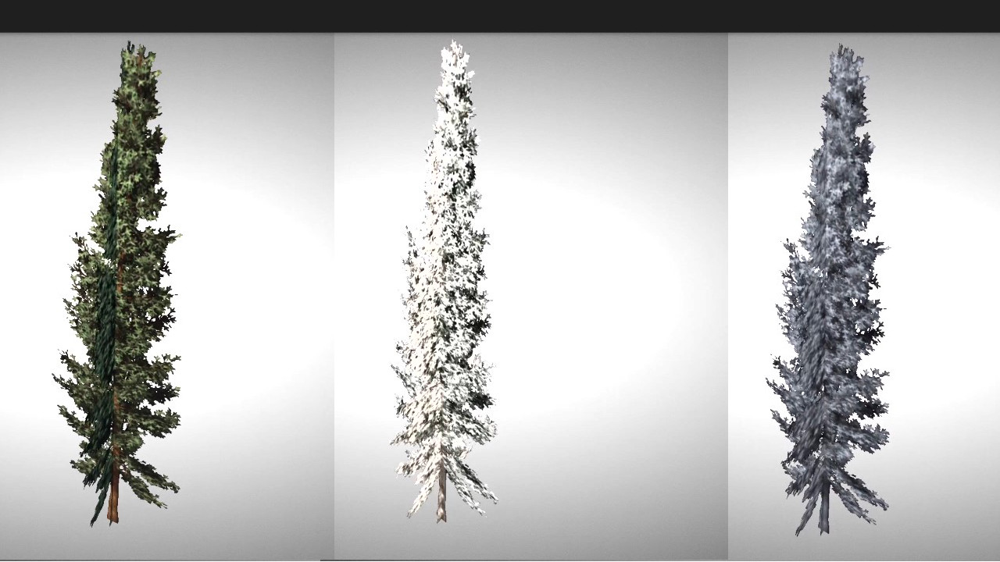

[[Findings]]
== Findings

=== Introduction

These findings all come from comments (written or verbal) from the participants. These represent items that were deemed important by the participants. The information here comes from achieved results, not unachieved stretch goals.

=== Aspects of Investigation

Each participant was free to choose which one (or more) scenarios to pursue. Four scenarios were discussed in the https://portal.ogc.org/files/?artifact_id=96942[Call for Participation] cite:[CFP_ISG_2]. Participants could also define their own scenario. OGC reviewed each participant’s proposal and suggested revisions to better align with the goals of the Sprint, the interest of the Sponsor, and the coverage of the scenarios by the other participants. <<table_scenario-listing>> provides a summary description of the selected scenarios. <<table_scenario-participant>> shows the coverage of scenarios by the participants.

[#table_scenario-listing,reftext='{table-caption} {counter:table-num}']
.A summary of the scenarios used during Sprint Year 2. Cesium proposed in-kind work as a modification of Scenario 4.
[cols="^1,6",width="80%",options="header",align="center"]
|===
| Scenario | Summary Description

| 1A | Develop efficient on-demand conversion from on OGC 3D format to another. 
| 1B | Develop efficient batch conversion from on OGC 3D format to another. 
| 2  | Integrate indoor and outdoor displays with metadata.
| 3  | Integrate animated transportation networks with 3D tiled display.
| 4  | Perform actual-use gap analysis on OpenFlight and glTF core + modules.
| 4C | Develop specific glTF extensions to support needed capabilities in CDB.
|===

[#table_scenario-participant,reftext='{table-caption} {counter:table-num}']
.A summary of the scenarios used during Sprint Year 2. Scenarios 1-4 were defined in the Call for Participation. Cesium proposed in-kind work as a modification of Scenario 4.
[cols="<3,^1,^1,^1,^1,^1,^1",width="80%",options="header",align="center"]
|===
|             6+| Scenario
| *Participant* | *1A* | *1B* | *2* | *3* | *4* | *4C*

|<<Cesium,Cesium>>             | | | | | | *&#10003;*
|<<Ecere,Ecere>>               | *&#10003;* | *&#10003;* | *&#10003;* | | | 
|<<FlightSafety,FlightSafety>> | | | | ^|*&#10003;* | 
|<<InfoDao,InfoDao>>           | *&#10003;* | *&#10003;* | | | |
|<<SimBlocks,SimBlocks>>       | | *&#10003;* | | *&#10003;* | | 
|<<Steinbeis,Steinbeis>>       | | | *&#10003;* | *&#10003;* | | | 
|===

==== Cooperative Efforts

Unlike the http://docs.ogc.org/per/20-087.html[ISG Sprint Year 1] cite:[ISG_Y1_ER] or the https://docs.ogc.org/per/20-030.html[GeoVolumes Pilot] cite:[GeoVolumes], this Sprint did not require or make major use of a Technology Integration Experiment (TIE). There was still substantial cooperation between some of the participants that need to be recognized. The following list is presented without order.

* *Cesium* and *FlightSafety* cooperated on the understanding and development of glTF extensions and OpenFlight feature analysis.

* *Ecere* and *Steinbeis* worked together on the indoor/outdoor display capabilities required by Scenario 2.

* *Cesium's* geospatial client, CesiumJS, was used by *Ecere*, *FlightSafety*, *Steinbeis*, and *Cesium*.

=== Results

==== General Results

These findings are not particular to a specific scenario and were reported by more than one participant.

* Do not split a planned 2-week sprint with another activity such as the OGC Member Meeting
* Best to entirely avoid the OGC Member Meeting week
* glTF needs additional work to fully support geospatial work and CDB requirements in particular

[[discovered-inconsistencies]]
==== Discovered Inconsistencies

Various inconsistencies with aspect or external items were discovered. These include OGC Standards, OGC data, modeling standards, and software. Some of the inconsistencies are documented, and others reflect documentation that needs improving.

* Ecere
** <<CDB-X-Minor-Mistakes,Minor mistake in prototyped CDB X dataset>>
** <<CesiumJS-Prevents-Refinement,Error in CesiumJS interpretation of empty tiles>> (a clarification may be needed in the 3D Tiles specification as well as the OGC COmmunity Standard)

* FlightSafety
** <<OpenFlight-Different-Coordinate-System,OpenFlight coordinate reference system is different than glTF or 3dsMax>>. This is not really an inconsistency, but known difference between modeling formats.
*** https://docs.ogc.org/bp/16-009r5.html#_model_coordinate_systems[OpenFlight is a left-handed system with Z-up] cite:[CDB_1]
*** https://github.com/KhronosGroup/glTF/blob/master/specification/2.0/README.md#coordinate-system-and-units[glTF is a right-handed system with Y-up]
*** https://knowledge.autodesk.com/support/3ds-max/learn-explore/caas/CloudHelp/cloudhelp/2020/ENU/3DSMax-Basics/files/GUID-0F3E2822-9296-42E5-A572-B600884B07E3-htm.html#GUID-0F3E2822-9296-42E5-A572-B600884B07E3[3DS Max is a right-handed system with Y-up] cite:[ThreeDSMax]

* SimBlocks.io
** <<Unity-Development-Issues,Some open source software is not as reliable or performant as needed>>
** <<SanDiego-CDB-Issues,Tile content issues with San Diego CDB>>
*** Tile Model Geometry limits exceeded
*** Tile Model Reference counts exceeded

==== Game Engine Interface

InfoDSao, SimBlocks.io, and Steinbeis incorporated game engine (Unreal or Unity) into the client display of geospatial data while working on their chosen scenarios. Specifically:

* **InfoDao** displayed <<InfoDao-Scenario-3,results in Unity while investigating moving models>>. Additional testing is needed to determine goodness-of-fit for this use in real-world applications.

* **SimBlocks.io** used Unreal and Unity game engines as the client display when batch converting CDB and other geospatial data.

* **Steinbeis** developed an indoor / outdoor navigation scenario that incorporated a real-time interface to the SensorThings API and a drone-view that enabled a merged over-the-shoulder and altitude view of the 3D environment. They integrated display capabilities from Unreal Engine (e.g., trees) into their scene.

While not part of their Sprint work, Cesium has a https://cesium.com/blog/2021/03/30/cesium-for-unreal-now-available/[plugin for Unreal that on-demand imports 3D geospatial data] cite:[Cesium_Unreal].

==== Conversion (Scenario 1)

The general problem of data conversion was http://docs.ogc.org/per/20-087.html#_issues[noted in Year 1 Sprint ER] and http://docs.ogc.org/per/20-087.html#_data_2[recommended for further investigation] cite:[ISG_Y1_ER]. This Sprint had one scenario that focused on two aspects of conversion - full-batch mode, and on-demand. InfoDao investigated the timing of conversion and strategies for reducing user wait-time. Ecere looked into <<ogc-api---tiles-distribution,optimizing the conversion to 3D Tiles>> for the purpose of handling large levels of detail. SimBlocks.io investigated the conversion issues when importing CDB and other datasets into game engines.

[#image-findings-ConversionTime,reftext='{figure-caption} {counter:figure-num}']
.InfoDao measured the conversion time for the San Diego CDB dataset and is shown here. See <<img_InfoDao-1, InfoDao's report for context and detail>>
image::images/InfoDao/breakdown.png[width=700,align="center"]

[#image-findings-SanDiego-LoRes,reftext='{figure-caption} {counter:figure-num}']
image::images/Ecere/gnosis-sandiego2.jpg[width=700,align="center"]
[#image-findings-SanDIego-CoronadoBridge,reftext='{figure-caption} {counter:figure-num}']
.Two levels of details from the San Diego CDB dataset shown in GNOSIS Cartographer client. The bridge in the bottom image can be seen slightly above image center in the top view.
image::images/Ecere/gnosis-sandiego6.jpg[width=700,align="center"]

[#image-findings-Austin-Unity,reftext='{figure-caption} {counter:figure-num}']
image::images/SimBlocks/SimBlocks - ISG2 - Austin in Unity.jpg[width=700,align="center"]
[#image-findings-Austin-Unreal,reftext='{figure-caption} {counter:figure-num}']
.These two images show Austin as rendered in Unity (top) and Unreal Engine (bottom). SimBlocks.io found the <<dataset-notes-austin,Austin Dataset>>
image::images/SimBlocks/SimBlocks - ISG2 - Austin in Unreal.png[width=700,align="center"]

==== Indoor / Outdoor (Scenario 2)

Scenario 2 was designed to improve the interaction between outdoor scenes (frequently CDB models for these Sprints) and indoor building models. Steinbeis worked with Ecere on this task. Steinbeis used the models from University of Applied Sciences Stuttgart (HFT Stuttgart). The buildings were modeled with Trimble SketchUp format and through a multi-step process converted to glTF. Steinbeis also integrated SensorThings API into this demo.

[#image-findings-SensorThings,reftext='{figure-caption} {counter:figure-num}']
image::images/Steinbeis/SensorThingsUnreal2.JPG[width=700,align="center"]
[#image-findings-Building-Stairway,reftext='{figure-caption} {counter:figure-num}']
.The top image shows the exterior of a building showing real-time and live SensorThings API integration in Unreal Engine. The same building was used to provide the transition between the outdoor and indoor environments. The bottom image shows Ecere's rendering in GNOSIS Cartographer of the building interior.
image::images/Ecere/HfT-upper-level.jpg[width=700,align="center"]

==== Moving models (Scenario 3)

This scenario proved more difficult than expected. InfoDao performed initial investigation but determined that additional testing was needed before producing conclusive results. Steinbeis built on their http://docs.ogc.org/per/20-087.html#_sensorthings_api_server_for_urban_mobility[results from Year 1 Sprint] cite:[ISG_Y1_ER] and work in Scenario 2 to <<Moving-Things-Web_visualization,show transportation routes with tracking and multiple objects>>.

[#image-findings-Moving-Models,reftext='{figure-caption} {counter:figure-num}']
.Steinbeis' moving objects routes and tracking display using a CesiumJS web client and a GeoVolumes server. The region is HFT Stuttgart.
image::images/Steinbeis/routeCesium.jpg[width=700,align="center"]

==== glTF as a Modeling Standard (Scenario 4)

This scenario was important to establish real-world capability limits of glTF in a CDB environment. FlightSafety and Cesium worked on different aspects of the effort. Cesium took the approach of developing specific extensions that provided solutions to specific capabilities of OpenFlight and CDB. FlightSafety looked more broadly at the feature coverage of glTF in comparison with OpenFlight.

Cesium developed four extensions - two for metadata, one for <<gpu-instancing-of-meshes,instancing>>, and one for <<conversion-to-3d-tiles-next,data/tile management>>. The two metadata extensions allowed for very fine-grain metadata. One extension supports metadata at the <<per-texel-metadata---source-data,texel level>> (illustrated below); the other one supports <<per-vertex-metadata,vertex metadata>>.

FlightSafety performed a <<proposed-gltf-solution,gap analysis>> of glTF compared to OpenFlight as used in a CDB datastore. The full results for these experiments are presented in <<table_cdb_features>>. From that analysis, FlightSafety produced three <<glTF-Gap_analysis-Recommendations,recommendations>> (summarized here).

1. Create a new glTF extension to support mesh switching that can be used for Damaged States and simple geometry switching.

2. Additional testing of the proposed extensions is needed. This is to deterine if the estensions cover the capabilities of OpenFlight as used in a CDB datastore.

3. Create some standardized moving models for testing purposes.

FlightSafety also tested one existing extension (https://github.com/KhronosGroup/glTF/blob/master/extensions/2.0/Khronos/KHR_materials_variants/README.md[KHR_materials_variants]) as well as worked with Cesium on testing their texel metadata extension - <<per-texel-metadata---source-data,EXT_feature_metadata>>. They completed their work by  <<glTF-Multiple-Environments,inserting a glTF model of the Space Shuttle>> into one of their products VITAL 1150 Image Generator. Renderings in different environments were successfully produced.

[#image-findings-Texel-Metadata,reftext='{figure-caption} {counter:figure-num}']
.CesiumJS visualization of the per-texel metadata from Aden, Yemen CDB at a high-level of detail taken near the center of <<Cesium_RMTexture_MetadataLoLOD>>.
image::images/Cesium/EXT_feature_metadata_4.png[align="center"]

[#image-findings-Tree-Materials-Variants,reftext='{figure-caption} {counter:figure-num}']
.This rendering shows a single geometry model with three different textures embedded in the file. The application allows the user to choose which texture to display.

[#image-findings-Shuttle-Honolulu-Day,reftext='{figure-caption} {counter:figure-num}']
.A glTF model in FlightSafety's VITAL 1150 showing a NASA space shuttle at the end of Honolulu International Airport runway.
image::images/FlightSafety/Shuttle_behind.JPG[width=600,align="center"]
[#image-findings-Shuttle-Honolulu-Night,reftext='{figure-caption} {counter:figure-num}']
.The same setup as <<image-findings-Shuttle-Honolulu-Day>>, but with evening environmental conditions.
image::images/FlightSafety/Shuttle_evening.jpg[width=600,align="center"]

==== Other Accomplishments

This sections discusses accomplishments that were not directly tied to a scenario or part of the participants efforts. As part of their Scenario 2 work, Steinbeis also integrated the SensorThings API with other 3D images and displayed Unreal Engine.

As part of their investigation into optimizing <<Low-Bandwidth-Applications,dataset updates in a low-bandwidth environment>>, InfoDao showed how a glTF model could be inserted into an older dataset to reflect recent events. They chose the Surfside condo complex in Miami.

Finally Steinbeis <<mobile-visualization,integrated 3D Tiles data>> into <<android--unreal-engine,Android>> and <<ios--geovolumes,iOS>> phone clients. The iOS client needed to use USDZ model data (Apple requirement). These demonstrations showed how OGC APIs work in low-powered mobile devices in Augmented or Virtual Reality.

[#image-findings-Surside-Collapse,reftext='{figure-caption} {counter:figure-num}']
.A "Before" and "After" image of the Surfside condo collapse using the Miami CDB as a base with a run-time update.
image::images/InfoDao/edition.png[width=700,align="center"]

