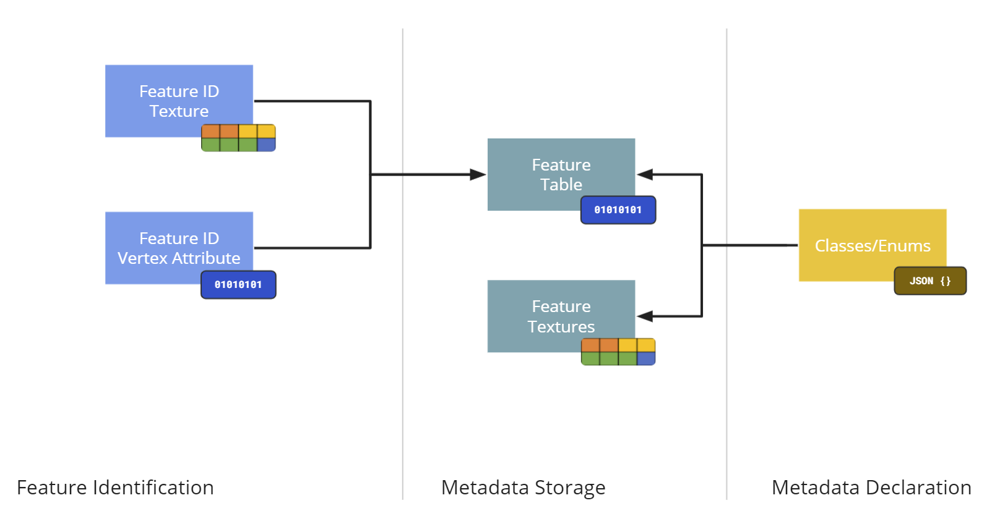
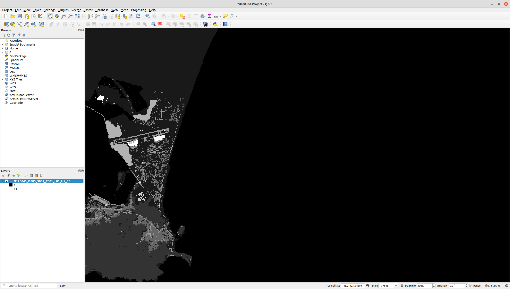
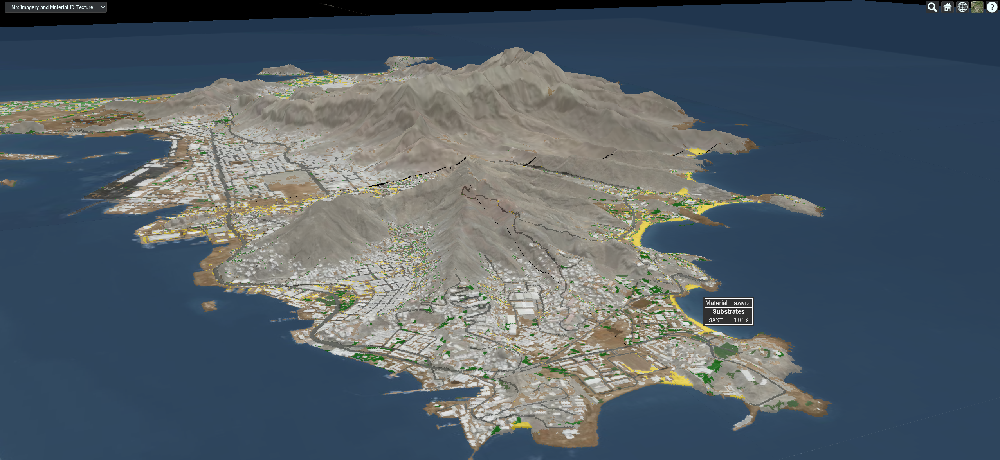
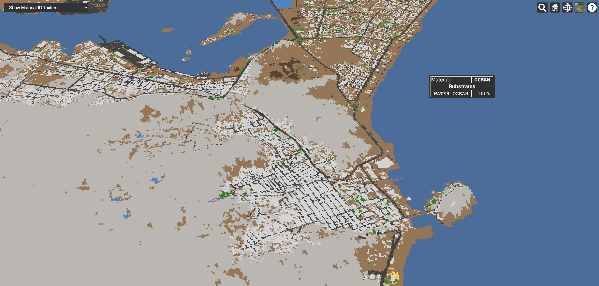
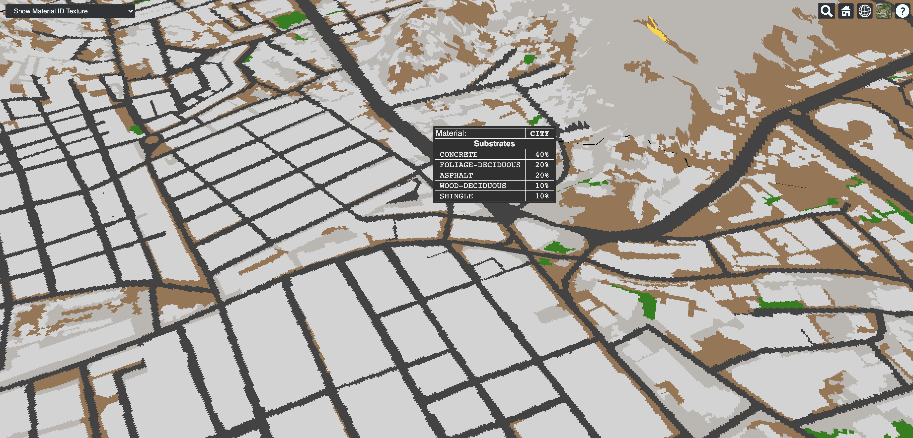
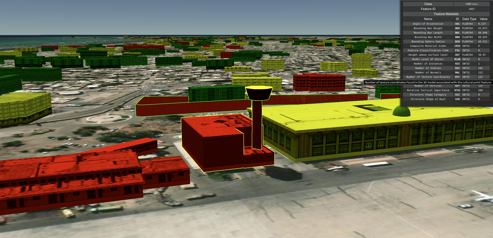
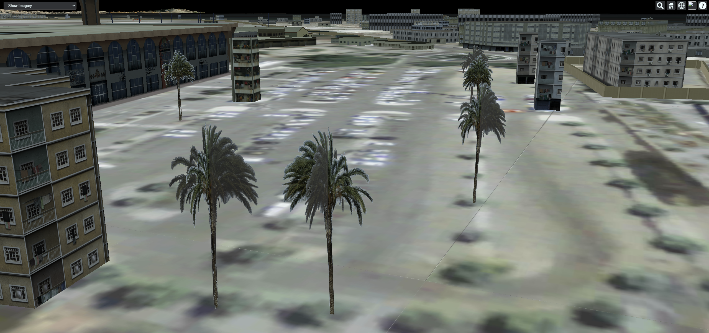
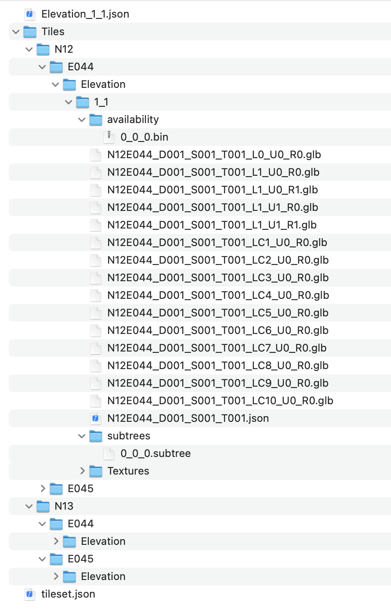

== Component Implementation: Cesium

=== Overview

In this Sprint, the Cesium team focused on exploring how extensions to glTF enable runtime-efficient storage and attribution of data stored in https://www.presagis.com/en/glossary/detail/openflight/[OpenFlight], the 3D model format used in https://www.ogc.org/standards/cdb[CDB] datasets. Similarly, the team also investigated extensions to https://github.com/CesiumGS/3d-tiles[3D Tiles] that facilitated the conversion from CDB to 3D Tiles.

In the previous OGC ISG Sprint, the Cesium team focused on investigating the optimal method of serving 3D content from a CDB dataset into a web viewer. The result of that effort was an https://github.com/CesiumGS/cdb-to-3dtiles[open source CDB to 3D Tiles conversion pipeline]. The results of this Sprint were derived from work done to extend the pipeline to support new extensions to https://github.com/KhronosGroup/glTF[glTF] and 3D Tiles.

=== Conversion from _CDB_ to _3D Tiles_ 1.0

The work in the previous Sprint covered the steps to convert a CDB dataset with 3D models to a 3D Tiles 1.0 tileset. Here’s a brief top-down summary:

- Each available dataset is converted to a tileset, with references to each instance of the dataset across geocells.
- The root tileset references all the dataset tilesets.
- The CDB dataset's level of detail hierarchy is used for creating the spatial index in the tileset.json
- The Elevation and Imagery datasets are stitched together to create a terrain tileset.
- Tilesets created from all datasets except GeoTypical models use the Batched 3D Model (.b3dm) format for their content.
- The GeoTypical models use the Instanced 3D Model format (.i3dm) format for their content.
- The metadata for each cultural feature is encoded in the Batch Table.
- The geometry is converted to glTF.

=== Conversion from _CDB_ to _3D Tiles Next_

==== Introduction

This section discusses the conversion of data stored in CDB to a new Cesium-developed format https://github.com/CesiumGS/3d-tiles/blob/3d-tiles-next/3D_TILES_NEXT.md[3D Tiles Next]

==== Conversion to glTF

As mentioned above, in 3D Tiles 1.0, the B3DM and I3DM formats use glTF to store the geometry and an additional binary payload, called the Batch Table, to store metadata associated with each feature. Features are identified using Batch IDs, which are stored as vertex attributes in the glTF.

There are cases where per-vertex attribution is not sufficient, and per-texel attribution is required. Such is the case with the Raster Material datasets (RMTexture, RMDescriptor), where a raster band in a TIFF file is used to index into an XML file. Such a capability is not currently supported by 3D Tiles 1.0; therefore, an extension to glTF 2.0 was utilized.

==== Feature Metadata

The Cesium-developed feature metadata extension (https://github.com/CesiumGS/glTF/blob/feature-metadata/extensions/2.0/Vendor/EXT_feature_metadata/1.0.0[EXT_feature_metadata]) to glTF 2.0 enables per-vertex and per-texel attribution of metadata, metadata storage in binary or in textures, and specification of metadata schemas with support for enumerations. Through this extension, metadata can be embedded within the glTF payload, without need for an external payload such as the Batch Table.

[#Cesium_EXT_feature_metadata_Diagram,reftext='{figure-caption} {counter:figure-num}']
.A block diagram showing the high-level data structures implemented in the feature metadata extension.

====== Per-Texel Metadata

The team utilized this extension to store the data in the Raster Material datasets when converting from CDB to 3D Tiles. The Raster Material datasets are the RMTexture and RMDescriptor datasets, where the RMTexture contains a TIFF file with a raster band, with each texel in the band containing an index value.

[#Cesium_RMTexture_TIFF,reftext='{figure-caption} {counter:figure-num}']
.Feature information in the RMTexture from Aden, Yemen CDB stored as TIFF. CDB was provided by Presagis.

The value in each texel is an index into a corresponding XML file, in the RMDescriptor dataset, which contains the material information for the area covered by the texel.

.Composite Material Table
[source,xml]
----
<Composite_Material_Table>
    <Composite_Material index="1">
        <Name>OCEAN</Name>
        <Primary_Substrate>
            <Material>
                <Name>BM_WATER-OCEAN</Name>
                <Weight>100</Weight>
            </Material>
        </Primary_Substrate>
    </Composite_Material>
    <Composite_Material index="2">
        <Name>CITY</Name>
        <Primary_Substrate>
            <Material>
                <Name>BM_CONCRETE</Name>
                <Weight>40</Weight>
            </Material>
            <Material>
                <Name>BM_FOLIAGE-DECIDUOUS</Name>
                <Weight>20</Weight>
            </Material>
            <Material>
                <Name>BM_ASPHALT</Name>
                <Weight>20</Weight>
            </Material>
            <Material>
                <Name>BM_WOOD-DECIDUOUS</Name>
                <Weight>10</Weight>
            </Material>
            <Material>
                <Name>BM_SHINGLE</Name>
                <Weight>10</Weight>
            </Material>
        </Primary_Substrate>
    </Composite_Material>
</Composite_Material_Table>

----

[NOTE]
====
_Do the Primary_Substrate Material Weights need to add up to 100?. Is this described in more detail in the spec? If so, that section should be referenced here. Same for items that are computed, derived, or otherwise not blatantly obvious._
====

The Materials referenced in the Substrate(s) of a Composite Material are stored in the Base Material Table.

.Base Material Table
[source,xml]
----
<Base_Material_Table>
    <Base_Material>
        <Name>BM_DRYWALL</Name>
        <Description>Drywall panel (aka plasterboard)</Description>
    </Base_Material>
    <Base_Material>
        <Name>BM_MACADAM</Name>
        <Description>Macadam (roadway constructed by compacting into a solid mass of broken stone using cement or asphalt as binder)</Description>
    </Base_Material>
    <Base_Material>
        <Name>BM_METAL-IRON</Name>
        <Description>Raw iron</Description>
    </Base_Material>
</Base_Material_Table>
----

[NOTE]
====
_There is a sudden switch from XML to JSON here with no expository transition. A little more needs to be done to separate these two (XML vs JSON) sections. Perhaps a new report section for each of these. <RP> Should the Base Material Table and Base Material Enumeration "name" and "description" values match for consistencies sake?_
====

In the EXT_feature_metadata extension, a class is created to represent each feature:

.EXT_feature_metadata Composite Materials Class
[source,json]
----
{
  "classes": {
    "compositeMaterials": {
      "properties": {
        "name": {
          "type": "STRING"
        },
        "material": {
          "type": "ARRAY",
          "componentType": "ENUM",
          "enumType": "baseMaterials"
        },
        "weight": {
          "type": "ARRAY",
          "componentType": "UINT8"
        }
      }
    }
  }
}
----

[NOTE]
====
_It would be very useful to indicate that the enums are referenced by *"value"*, and the value of *value* is arbitrary within the UINT8 data type._
====

To efficiently represent the base materials, they were encoded as an enum (using a `UINT8`) instead of strings:

.EXT_feature_metadata Base Materials Enumeration
[source,json]
----
{
  "enums": {
    "baseMaterials": {
      "valueType": "UINT8",
      "values": [
        {
          "name": "BM_DOLOMITE",
          "description": "Dolomite (magnesium carbonate of lime)",
          "value": 0
        },
        {
          "name": "BM_MACADAM",
          "description": "Macadam (roadway constructed by compacting into a solid mass of broken stone using cement or asphalt as binder)",
          "value": 1
        },
        {
          "name": "BM_METAL-IRON",
          "description": "Raw iron",
          "value": 2
        }
      ]
    }
  }
}
----

The TIFF was converted to a PNG, with the values from the raster band stored in the red color channel of the PNG, and the same texture coordinates as those of the imagery were utilized in the extension at the mesh primitive level, since they cover the same area and use the same projection:

.EXT_feature_metadata Primitive Extension
[source,json]
----
{
  "primitives": [
    {
      "attributes": {
        "POSITION": 0,
        "TEXCOORD_0": 1
      },
      "indices": 2,
      "material": 0,
      "extensions": {
        "EXT_feature_metadata": {
          "featureIdTextures": [
            {
              "featureTable": "compositeMaterialsTable",
              "featureIds": {
                "texture": {
                  "texCoord": 0,
                  "index": 0
                },
                "channels": "r"
              }
            }
          ]
        }
      }
    }
  ]
}
----

Finally, the actual values for each composite material was stored in the composite materials feature table, encoded in binary according to the https://github.com/CesiumGS/3d-tiles/tree/3d-tiles-next/specification/Metadata/1.0.0[Cesium 3D Metadata Specification], stored in glTF buffers and references using glTF bufferViews.

[#Cesium_RMTexture_TerrainOverlay,reftext='{figure-caption} {counter:figure-num}']
.CesiumJS visualization of the per-texel metadata from Aden, Yemen CDB. The metadata was overlaid on the satellite imagery of the terrain.

[#Cesium_RMTexture_MetadataLoLOD,reftext='{figure-caption} {counter:figure-num}']
.CesiumJS visualization of the per-texel metadata from Aden, Yemen CDB at a low-level of detail. Unlike <<Cesium_RMTexture_TerrainOverlay>> there were no overlays involved.

[#Cesium_RMTexture_MetadataHiLOD,reftext='{figure-caption} {counter:figure-num}']
.CesiumJS visualization of the per-texel metadata from Aden, Yemen CDB at a high-level of detail taken near the center of <<Cesium_RMTexture_MetadataLoLOD>>.

====== Per-Vertex Metadata

3D Tiles 1.0 supports metadata attribution through vertex attributes in glTF. EXT_feature_metadata takes a similar approach by adding a `_FEATURE_ID` vertex attribute that is used as an index into the Feature Table specified at the mesh primitive. The EXT_feature_metadata extension allows each metadata property to specify an identifier, a name, a data type and a description. As shown in the screenshot below, making these properties available to the user through a user interface helps add more context to the information being presented. It also aids in analysis and helping a user apply the right styling for the tileset.

[#Cesium_RMTexture_TIFF,reftext='{figure-caption} {counter:figure-num}']
.The per-vertex metadata (as opposed to the per-texel metadata shown in figures <<Cesium_RMTexture_TerrainOverlay>> through <<Cesium_RMTexture_MetadataHiLOD>>) from CDB of Aden, Yemen CDB and visualized in CesiumJS_. The vertices were classified and color coded according to their metadata.

===== GPU Instancing of Meshes

In 3D Tiles 1.0, the Instanced 3D Model (.i3dm) format is used to represent instanced meshes. This is the format of choice when converting 3D models from the GeoTypical model dataset. The I3DM format pairs an external payload, called the Feature Table, to the glTF to provide the transforms for each instance of the model. A Batch Table may also be added to include metadata per instance.

In 3D Tiles Next, the https://github.com/KhronosGroup/glTF/tree/master/extensions/2.0/Vendor/EXT_mesh_gpu_instancing[EXT_mesh_gpu_instancing] extension is used to represent instanced meshes. The metadata per instance is stored in the EXT_feature_metadata object, which is applied as an extension to the EXT_mesh_gpu_instancing object.

[#Cesium_EXT_mesh_gpu_instancing,reftext='{figure-caption} {counter:figure-num}']
.Using the CesiumJS renderer meshes from GeoTypical tree models are stored once and rendered from CDB of Aden, Yemen.

==== Conversion to 3D Tiles Next

===== Using glTF as 3D Tiles

The https://github.com/CesiumGS/3d-tiles/tree/3d-tiles-next/extensions/3DTILES_content_gltf/0.0.0[3DTILES_content_gltf] extension to 3D Tiles enables using glTF files directly as content for tiles. This allows greater compatibility with existing tools that create or process glTF models. Runtime engines that currently support glTF can more easily support 3D Tiles.

===== Implicit Uniform Tiling

In 3D Tiles 1.0, the tileset.json is used to create a spatial index to obtain a hierarchical level of detail, which helps with runtime performance. This flexibility in the spatial data structure is useful as tilesets may require different spatial hierarchies, based on the type of content and its density. However sometimes a uniform tiling scheme is desired. This is the case for the CDB geocells that subdivide evenly into 4 smaller tiles i.e. in a quadtree structure. The https://github.com/CesiumGS/3d-tiles/tree/3d-tiles-next/extensions/3DTILES_implicit_tiling[3DTILES_implicit_tiling] extension enables a compact and efficient representation of such hierarchies, where information about each tile's availability is stored in a bitstream. Additionally, this extension enables random access of a tile in the tileset.

.3DTILES_implicit_tiling
[source,json]
----
{
  "asset": {
    "version": "1.0"
  },
  "extensionsRequired": [
    "3DTILES_implicit_tiling"
  ],
  "extensionsUsed": [
    "3DTILES_implicit_tiling"
  ],
  "root": {
    "children": [
      {
        "children": [
          {
            "content": {
              "uri": "N12E044_D001_S001_T001_L{level}_U{y}_R{x}.glb"
            },
            "extensions": {
              "3DTILES_implicit_tiling": {
                "maximumLevel": 1,
                "subdivisionScheme": "QUADTREE",
                "subtreeLevels": 7,
                "subtrees": {
                  "uri": "subtrees/{level}_{x}_{y}.subtree"
                    }
              }
            }
          }
        ],
        "content": {
          "uri": "N12E044_D001_S001_T001_LC1_U0_R0.glb"
        }
      }
    ],
    "content": {
      "uri": "N12E044_D001_S001_T001_LC2_U0_R0.glb"
    }
  }
}
----

Since each negative level of a CDB geocell has only one descendent and covers the same area as its parent, explicit tiling is used. For the positive levels, the 3DTILES_implicit_tiling extension can be applied. Tiles can be randomly accessed using their level and x-y coordinates in the content URI template. The folder structure looks as follows:

[#Cesium_3DTILES_implicit_tiling_1,reftext='{figure-caption} {counter:figure-num}']
.An image showing the folder Structure with *3DTILES_implicit_tiling* extension.

==== Conclusion

The Cesium team's efforts resulted in a validation of glTF and 3D Tiles extensions that add new capabilities to 3D Tiles such as implicit tiling and per-texel metadata. These capabilities enable better representation of CDB datasets as 3D Tiles as they retain more semantic metadata and allow for random access for tiles. This yields a much richer simulation environment at runtime and facilitates the dissemination of CDB datasets with optimal runtime performance.
