[[Ecere]]
== Component Implementation: Ecere

=== Overview

For the second year OGC Interoperable Simulation and Gaming Sprint, Ecere focused efforts on improving visualization and streaming of 3D geospatial content.
Those efforts spanned multiple tasks, improving capabilities in its https://ecere.ca/gnosis[GNOSIS geospatial software] for:

- visualizing and distributing the https://www.geopackage.org/[GeoPackage] data store prototype of the next version of the https://www.ogc.org/standards/cdb[OGC CDB] standard,
- generating and visualizing http://www.opengis.net/doc/CS/3DTiles/1.0[3D Tiles] tilesets,
- distributing and accessing 3D data using 3D extensions of the http://docs.ogc.org/DRAFTS/20-057.html[_OGC API - Tiles_] and https://docs.opengeospatial.org/DRAFTS/17-083r3.html[_2D Tile Matrix Set and Tileset Metadata_] standards and
- importing and exporting 3D models between https://www.khronos.org/gltf/[glTF], https://www.khronos.org/collada/[COLLADA] and Ecere's https://github.com/ecere/E3D-spec[E3D open 3D model format].

=== CDB X Prototyped GeoPackage Store

In the 2020 3D Tech Sprint to lay the foundations for the next version of the OGC CDB standard,
provisionally named CDB X, Ecere was part of the team prototyping a data store for it based on the OGC GeoPackage standard and extensions.

In this year's ISG Sprint, Ecere aimed to visualize the San Diego dataset produced according to this prototyped CDB X data store
as well as provide distributions sourced directly from it.

Good progress was made towards achieving this goal.

[CDB-X-Minor-Mistakes]
As a result of the visualization attempts, some minor mistakes were identified in the prototyped CDB X dataset, including
a mismatched reference to a GeoPackage table where the `tiles_` prefix should not have been included, as well as wrong scaling and offset
values in tables for the Gridded Coverage extension used for representing elevation data.
Once corrected, Ecere plans to update those GeoPackage CDB X data store prototypes which are hosted on the OGC portal within a
https://portal.ogc.org/index.php?m=projects&a=view&project_id=466&tab=2&artifact_id=95315[directory of the CDB SWG].

[#Ecere_CDBX1,reftext='{figure-caption} {counter:figure-num}']
.Imagery, roads and hydrography from San Diego CDB X prototype configured with 5-LODs per GeoPackage visualized using new GNOSIS CDB X data store in GNOSIS Cartographer.
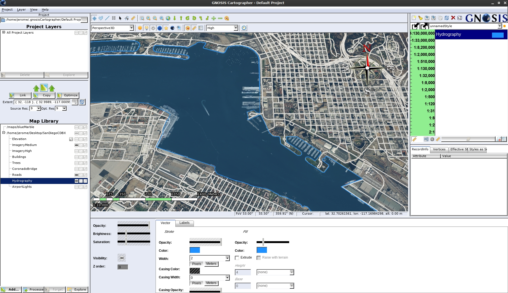

[#Ecere_CDBX2,reftext='{figure-caption} {counter:figure-num}']
.Imagery and 3D Terrain from San Diego CDB X prototype configured with 5-LODs per GeoPackage visualized using new GNOSIS CDB X data store in GNOSIS Cartographer.
image::images/Ecere/cdbx2.jpg[width=800,align="center"]

[#Ecere_CDBX3,reftext='{figure-caption} {counter:figure-num}']
.San Diego CDB X prototype configured with 5-LODs per GeoPackage served directly in GNOSIS Map Server using new CDB X data store.
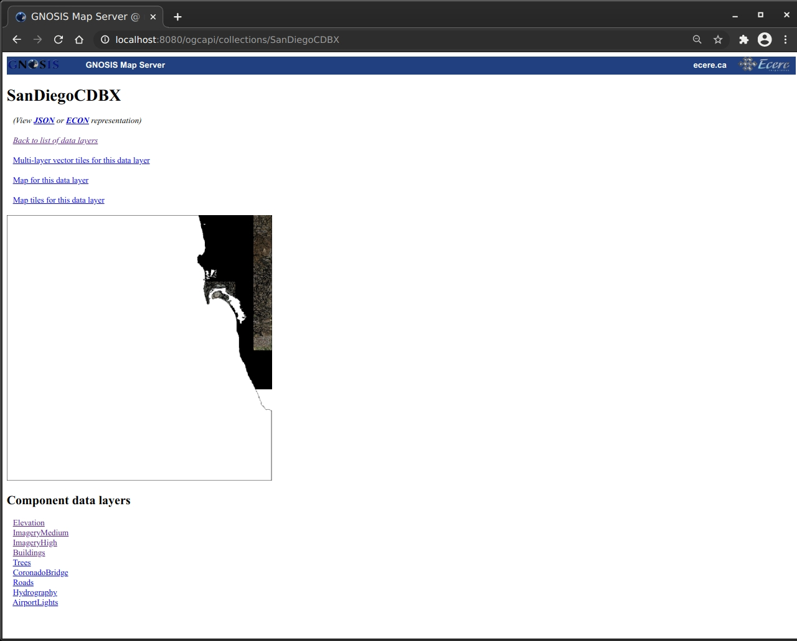

[#Ecere_CDBX4,reftext='{figure-caption} {counter:figure-num}']
.High resolution imagery from San Diego CDB X prototype configured with 5-LODs per GeoPackage served directly in GNOSIS Map Server using new CDB X data store.
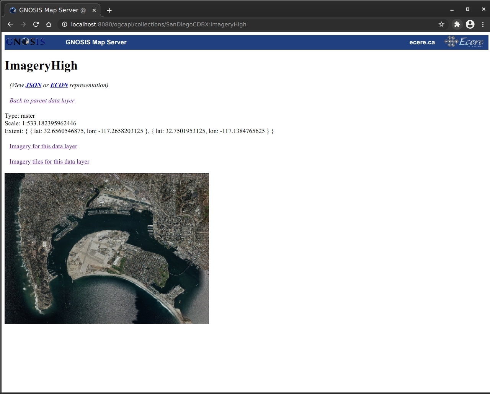

[#Ecere_CDBX5,reftext='{figure-caption} {counter:figure-num}']
.Elevation data from San Diego CDB X prototype configured with 5-LODs per GeoPackage served directly in GNOSIS Map Server using new CDB X data store.
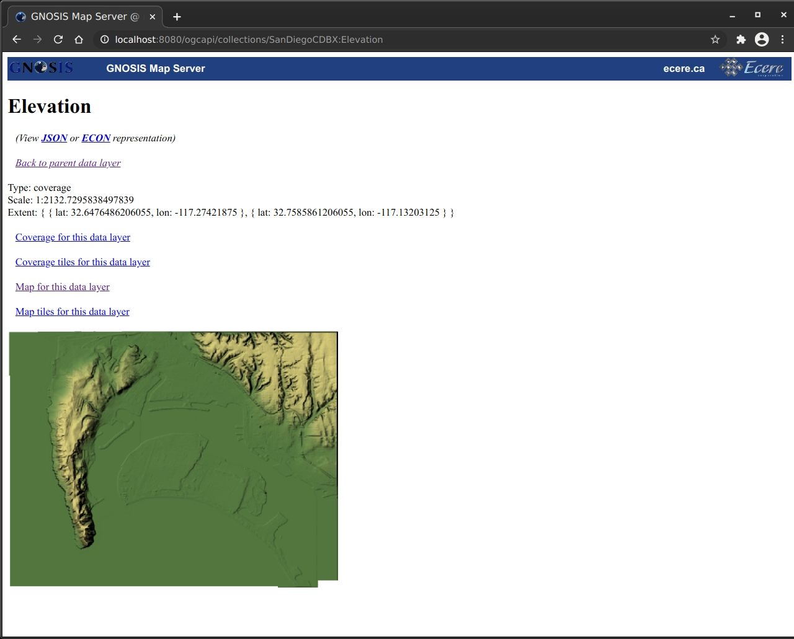

==== Configuration of data layers and zoom levels grouping

A key aspect of the proposed CDB X GeoPackage store is a configurable and deterministic system to partition very large datasets. This allows a global data at high resolution to be particioned into multiple GeoPackages, allowing the system to balance the number of files with the size of each file.
In one configuration, a single GeoPackage may contain the entire CDB content for a small area, making it easy to pre-load on mobile devices,
e.g. for a specific mission.
In another configuration, an individual GeoPackage may contain only a particular data layer, such as e.g. terrain elevation, satellite imagery or 3D models.

A decision can also be made whether data should be split into multiple GeoPackages based on geographic location or not.
When such a split is desired, each GeoPackage can still regroup multiple data tiles within the same extent.
One purpose of tiles is to ensure a deterministic amount of data being loaded at any given time for any camera location.
For this reason, tiles have an associated "zoom level" (a "tile matrix" in the 2D Tile Matrix Set standard), and tiles of lower zoom levels
would contain data at lower resolution but cover a larger geographic extent.
The grouping of multiple tiles inside a single GeoPackage is therefore decided by configuring how many zoom levels of tiles will be contained within a single GeoPackage tile pyramid.
The GeoPackages file and directory names will be identified by the lowest resolution tile contained within, and will contain all tiles within the extent of
that tile for the next (more detailed) zoom levels up to that configured maximum number of grouped zoom level.
The grouping of zoom level starts from the maximum level so as to minimize the file count, so that if the total number of zoom levels is not divisible
by the zoom level grouping, the GeoPackages starting grouping tiles at level 0 will contain fewer zoom levels.
Details can be found in the https://github.com/sofwerx/cdb2-eng-report/blob/master/11-tiling-coverages.adoc[Tiling section] of the CDB X Tech Sprint Discussion Paper (OGC document number 20-092).

During the Sprint, Ecere implemented the capability to present a CDB X GeoPackage data store as a single data source with nested data layers, each representing
components such as terrain elevation, satellite imagery or 3D models, supporting any of the possible configurations of how data layers and tiles are grouped.
The configuration is read from the proposed `cdb.json` file describing how the data is packaged. These data sources can then be visualized in GNOSIS Cartographer,
or distributed from GNOSIS Map Server as either 3D Tiles tilesets (with support for the GeoVolumes API) or through OGC API - Tiles, including 3D extensions
for retrieving 3D models. Ecere developed a new dedicated data store driver for CDB X to be able to access data as needed from different GeoPackages based on
different configurations and manage the use of multiple databases at once. The GNOSIS GeoPackage driver was also refactored to facilitate code re-use with
this new CDB X data store.

==== GeoPackage 3D Models extension

A second important aspect of the proposed CDB X GeoPackage store is an extension for storing 3D models inside GeoPackages.
Those 3D models may be stored in a shared 3D models table and instanced at multiple geographic locations, which is particularly useful for geotypical models
such as trees making up a forest.
They may also be batched 3D models, best suited for geospecific models, where all 3D models within a tile are stored inside a single tile blob of a
GeoPackage tiles table record.
In either case, the format of the model may be OpenFlight or glTF, or an alternate format such as https://github.com/ecere/E3D-spec[E3D] in the case of some of the Ecere experiments.
In the instancing approach, either regular vector point features (encoded as Well Known Binary) or GeoPackage vector tiles would contain the geographic
coordinates allowing geo-referencing of the 3D model, and optionally additional attributes orienting and/or scaling the model, as in the OGC CDB 1.x standard.
In the batched 3D models approach, the origin of the 3D model is the center of the tile at the ellipsoid height.
The 3D model is oriented relative to the tangent of the Earth surface at the geo-referencing position so that:

- the axis of the 3D model extending towards the right of the model points Eastwards,
- the axis of the 3D model extending towards the top of the model points upwards away from the center of the Earth, and
- the axis of the 3D model extending towards the back of the model points Northwards.

In the case of instanced models, any specified rotation is relative to this orientation.

A positive rotation specified outside of the model itself is counter-clockwise when looking in the positive direction of the axis around which the rotation is performed.
For roll, this follows the left-handed coordinate system rules as they align with the cardinal direction signs,
i.e. a positive roll rotating around the South-North axis banks counter-clockwise to the left.

During the Sprint, Ecere migrated the https://github.com/ecere/geopackage/tree/master/spec/3d-models[draft specifications for this 3D models extension]
(developed during the CDB X tech sprint) to a fork of the official GeoPackage repository. Work is ongoing to improve these specifications to take the
form of formal requirements and use OGC templates for specifications. Ecere also began implementing support for directly accessing those 3D models in
the GNOSIS GeoPackage and CDB X drivers, so that they can be visualized in GNOSIS Cartographer and published from GNOSIS Map Server.

=== 3D Tiles distribution

==== Generating tilesets

Ecere improved the generation of 3D Tiles tilesets in its GNOSIS Map Server.
A sample of the newly generated 3D Tiles tileset is available for the San Diego buildings
https://maps.ecere.com/ogcapi/collections/SanDiegoCDB:Buildings/3DTiles/tileset.json[here].
One major improvement was generating 3D Tiles for data at lower resolution levels and associating a correct geometric error to each level.
This enabled visualization clients such as the CesiumJS library to perform better while loading data for a larger geographic area.
Models further away can be presented at lower resolution, while those closer to the camera can be displayed at full resolution.
Lower resolution tiles may also contain fewer models than higher resolution ones.
The 3D Tiles tilesets generated by the GNOSIS Map Server leverage the _OGC API - Tiles_ end-points and the GNOSIS Global Grid tile matrix set.
Therefore the geometry inside each batched 3D models (`.b3dm`) 3D Tile is oriented relative to the tangent of the Earth surface at the center of the tile so that:

- the axis of the 3D model extending towards the right of the model points Eastwards,
- the axis of the 3D model extending towards the top of the model points upwards away from the center of the Earth, and
- the axis of the 3D model extending towards the back of the model points Northwards.

The JSON tileset description then provides transformation matrices re-orienting the models in the Earth Centered Earth Fixed (ECEF) 3D Cartesian system expected by _3D Tiles_.
Ecere suggests that such a setup could be one kind of implicit tiling schemes supported by _3D Tiles Next_, based on the _2D Tile Matrix Set and
Tileset Metadata_ standard, where a client would not require a JSON tileset description at all, and tiles could be directly accessed in a deterministic manner,
as in CDB.

It was particularly difficult to correctly populate these transformations, especially as each level is relative to the parent tile's transform. Each level may or may not provide a content payload and additional rules determine the mapping of glTF model axes to 3D Tiles.

[CesiumJS-Prevents-Refinement]
A major challenge encountered had to do with the presence of one of parent tiles in a hierarchy not having an associated content payload.
In this case, setting the refinement method to `REPLACE` prevented refinement of the tileset for CesiumJS,
with the result that more detailed levels would never be requested.
CesiumJS appears to not consider that all children were refined since one of them had no content specified at
a particular level and its geometric error was not suitable for refinement yet, and as a result none of its siblings tile (already suitable
for refinement based on their geometric error) would be refined either. Various attempts at tweaking the refinement mode at different levels of the hierarchy
and figuring out the proper interpretation of the specifications were made but to no avail.
A previously reported https://github.com/CesiumGS/cesium/issues/9356[CesiumJS issue] was discovered that seems to describe this exact problem. It is not clear
if this is a bug in the code or the 3D Tiles specifications not properly explaining this behavior.
To work around this issue, Ecere added a `.b3dm` file with empty content for those parent tiles with no associated content and this solved the issue:
```json
  "content" : { "uri" : "/ogcapi/empty.b3dm" },
```
Since the client behaves as expected with this awkward work-around, Ecere's opinion is that the behavior of the CesiumJS implementation should be fixed
to reflect the likely interpretation of the 3D Tiles specifications.

While the generated tilesets, like the source CDB data, re-used shared textures with the same external URLs for different models, it was noted that the
CesiumJS implementation does not yet seem optimized to take this into account. This may result in a very significant unnecessary overhead in texture memory
usage which was also highlighted by other participants as a major challenge in distributing and accessing content 3D Tiles generated from CDB.

[#Ecere_CesiumJS1,reftext='{figure-caption} {counter:figure-num}']
.Using CesiumJS to visualize the generated San Diego 3D Tiles tilesets.
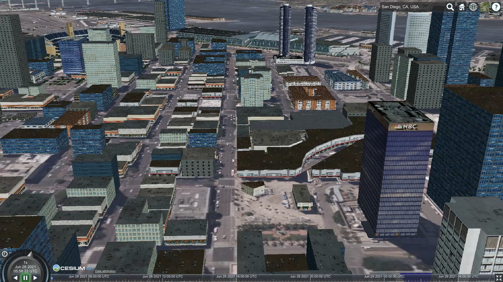

[#Ecere_CesiumJS2,reftext='{figure-caption} {counter:figure-num}']
.Using CesiumJS to visualize a second view of the generated San Diego 3D Tiles tilesets.
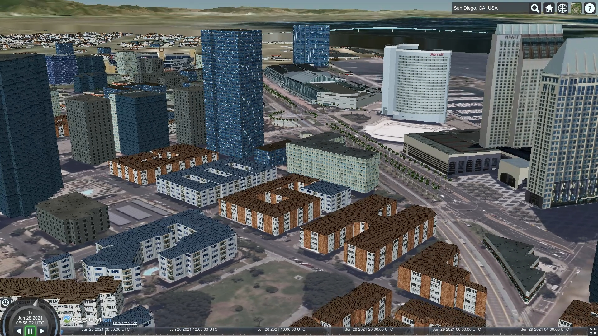

[#Ecere_CesiumJS3,reftext='{figure-caption} {counter:figure-num}']
.Using CesiumJS to visualize a third view of the generated San Diego 3D Tiles tilesets.
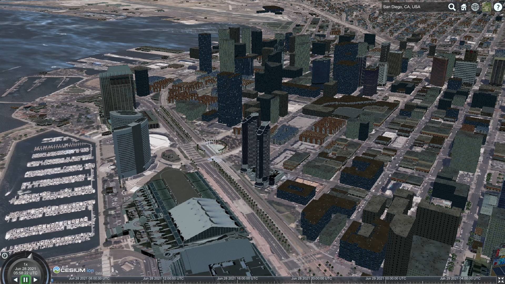

[#Ecere_CesiumJS4,reftext='{figure-caption} {counter:figure-num}']
.Using CesiumJS to visualize a top-down view with many models of the generated San Diego 3D Tiles tilesets.
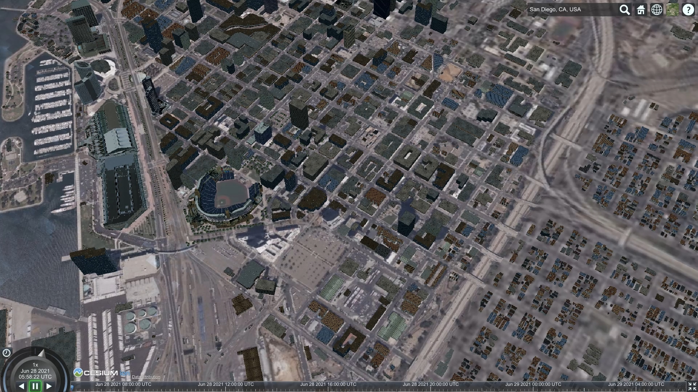

[#Ecere_CesiumJS5,reftext='{figure-caption} {counter:figure-num}']
.Using CesiumJS to visualize a top-down view with fewer models (relative to <<Ecere_CesiumJS4>>) of the generated San Diego 3D Tiles tilesets.
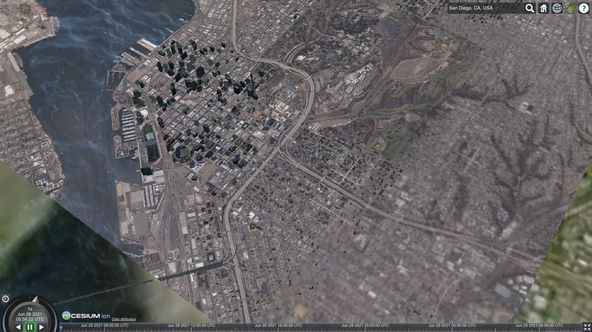

[#Ecere_CesiumJS6,reftext='{figure-caption} {counter:figure-num}']
.Using CesiumJS to visualize a top-down view with minimal  models (relative to <<Ecere_CesiumJS4>> and <<Ecere_CesiumJS5>>) of the generated San Diego 3D Tiles tilesets.
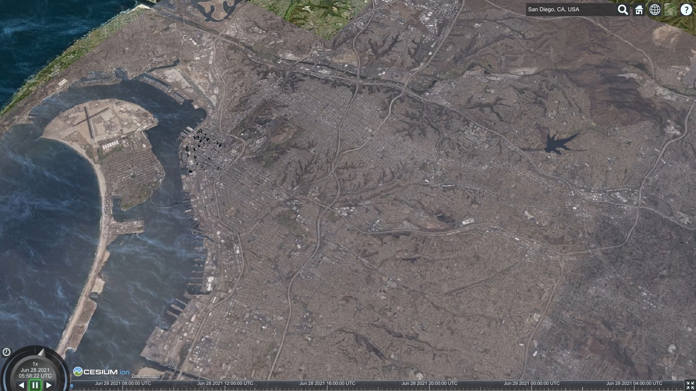

==== Client visualizing _3D Tiles_

Ecere improved its _3D Tiles_ client to better handle tilesets generated using different approaches, such as where transforms are specified.
This was necessary to properly visualize the new tilesets generated by the GNOSIS Map Server which now contains transforms at different levels
of the hierarchy. The variability in how transforms are specified, such as differences between tilesets generated prior to 3D Tiles version 1.0,
the RTC extension, and the optional presence of transforms at different levels of the hierarchy or at the root of the tileset, the fact that transforms are
relative to parent transforms as well as an implied change of orientation between glTF and 3D Tiles makes properly handling transformations quite difficult.

Multiple datasets were used for validating these improvements, including the new San Diego tilesets generated by the GNOSIS Map Server, the New York
OpenStreetMap 3D buildings from the 3D Containers & Tiles pilot and the OGC Testbed 13 Berlin dataset from Virtual City Systems. More testing with
additional datasets is planned to ensure the logic is now correct.

Ecere also attempted to visualize the data provided by the Steinbeis _GeoVolumes_ server; however, the GNOSIS client was not able to handle the coordinates
which seemed to be specified in a projection with no clear indication of how the geo-referencing should be done.

=== _OGC API - Tiles_ distribution

In previous initiatives, including the https://docs.ogc.org/per/18-025.html[OGC Testbed 14 CityGML and Augmented Reality],
https://docs.ogc.org/per/20-029.html[3D Containers and Tiles pilot], and last year's http://docs.ogc.org/per/20-087.html[ISG Sprint],
Ecere prototyped and demonstrated a simple approach to deliver 3D content by leveraging and extending the _OGC API - Tiles_ specifications.
In this year's sprint, Ecere further improved support for this approach in both its GNOSIS Map Server and its GNOSIS Cartographer visualization client.
Additionally, Ecere developed a new https://docs.opengeospatial.org/DRAFTS/17-083r3.html#annex-extending-additional-dimensinos[informative annex]
 for the _2D Tile Matrix Set & TileSet Metadata_ standard extending its capabilities to support content
of higher dimensions, such as 3D content. This annex will form a basis for standardizing temporal and 3D extensions for _OGC API - Tiles_.
Furthermore, as a result of an increased appreciation of the simplicity and interoperability of this approach,
the charter for the _GeoVolumes_ standard working group was expanded to cover the development of such extensions to _OGC API - Tiles_
as a mechanism to deterministically access 3D data for a specific area of interest, in a manner agnostic to the format of the data.

Extensions specific to 3D models would also be developed for both:

- points vector tiles referencing and instancing shared models (available from a new `.../models/{modelId}` resources path within the OGC API _collection_), which
can also contain additional properties to orient and scale individual models, best suited for geotypical models,

- batched 3D models where a tile's payload batches all 3D models contained within the tile's extent, best suited for geospecific models,
which are oriented relative to the tangent of the Earth surface at the center of the tile so that:

   ** the axis of the 3D model extending towards the right of the model points Eastwards,
   ** the axis of the 3D model extending towards the top of the model points upwards away from the center of the Earth, and
   ** the axis of the 3D model extending towards the back of the model points Northwards.

A positive rotation specified outside of the model itself is counter-clockwise looking in the positive direction of the axis around which the rotation is performed.
For roll, this follows the left-handed coordinate system rules as they align with the cardinal direction signs,
i.e. a positive roll rotating around the South to North axis banks counter-clockwise to the left.

Both approaches could also re-use textures also available from a new `.../textures/{textureId}` resources path within the OGC API _collection_.

For shared 3D models, supported formats may include glTF, OpenFlight, or alternatives such as the open https://github.com/ecere/E3D-spec[E3D model format] developed by Ecere.
For geospecific tiles payloads, supported formats may additionally include _3D Tiles_ formats such as `.b3dm`, and may also be directly linked
as the `content` for defining _3D Tiles_ tilests.

The imagery and elevation components from CDB 1.x or CDB X data stores can be delivered without the need for an extension, as map tilesets
and coverage tilesets respectively.

[#Ecere_SD1,reftext='{figure-caption} {counter:figure-num}']
.A composite visualization of the San Diego CDB dataset in GNOSIS Cartographer client. High altitude view showing Gaia Sky in color from ESA, Visible Earth Blue Marble from NASA, and elevation data from Jonathan de Ferranti's ViewFinderPanorama (including data from SRTM, NASA / USGS).
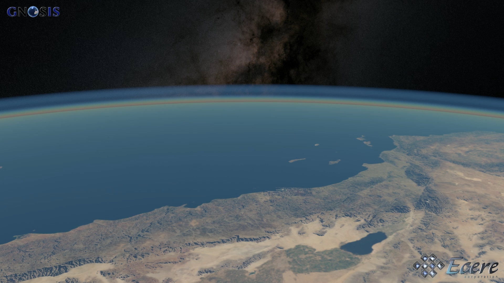

[#Ecere_SD2,reftext='{figure-caption} {counter:figure-num}']
.A composite visualization of the San Diego CDB dataset in GNOSIS Cartographer client at lower elevation relative to <<Ecere_SD1>>.
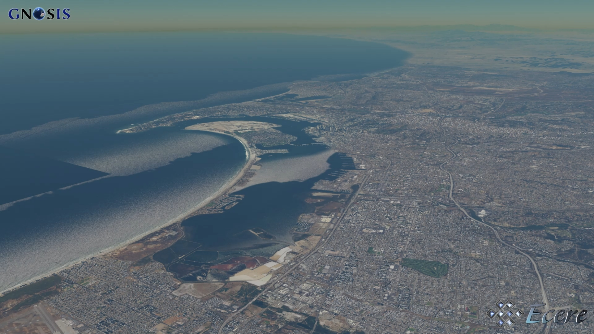

[#Ecere_SD3,reftext='{figure-caption} {counter:figure-num}']
.A composite visualization of the San Diego CDB dataset in GNOSIS Cartographer client showing all of San Diego Bay.
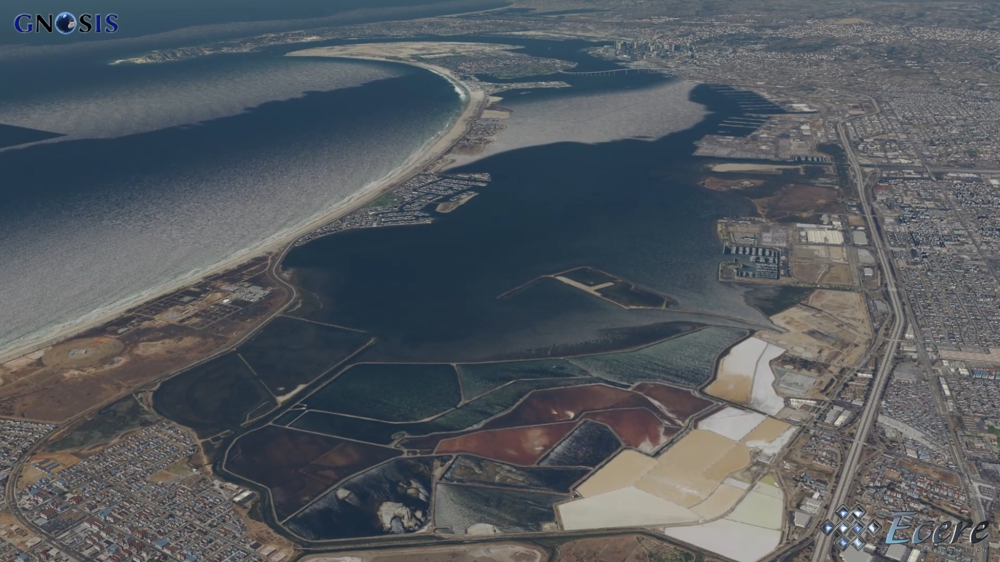

[#Ecere_SD4,reftext='{figure-caption} {counter:figure-num}']
.A composite visualization of the San Diego CDB dataset in GNOSIS Cartographer client showing Coronado Cays.
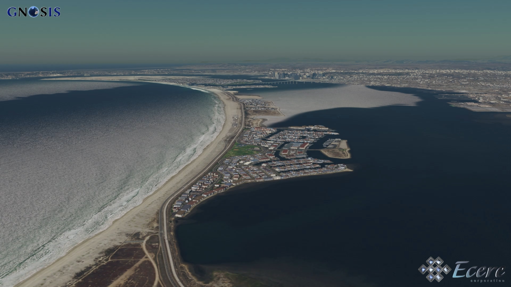

[#Ecere_SD5,reftext='{figure-caption} {counter:figure-num}']
.A composite visualization of the San Diego CDB dataset in GNOSIS Cartographer client with downtown San Diego in the background.
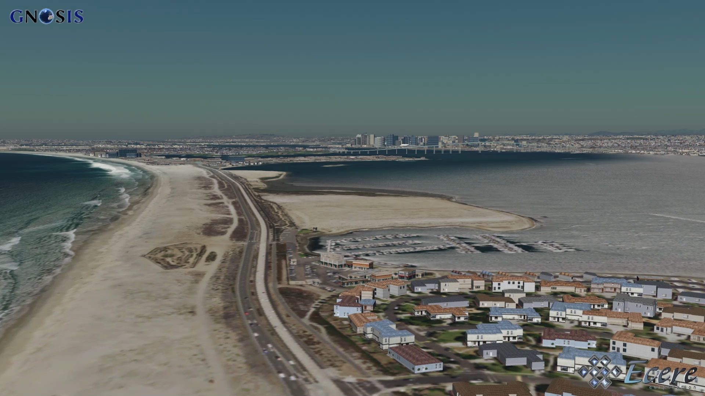

[#Ecere_SD6,reftext='{figure-caption} {counter:figure-num}']
.A composite visualization of the San Diego CDB dataset in GNOSIS Cartographer client showing Coronado Bridge.
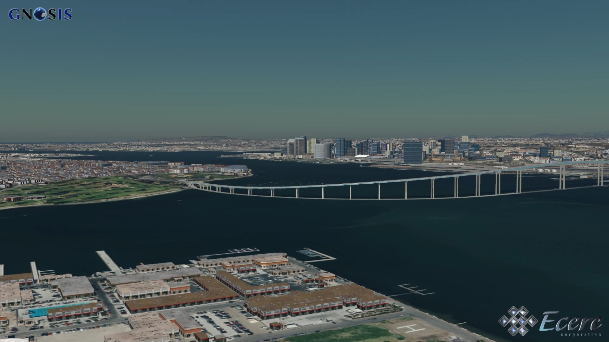

[#Ecere_SD7,reftext='{figure-caption} {counter:figure-num}']
.A composite visualization of the San Diego CDB dataset in GNOSIS Cartographer client showing Petco Park.
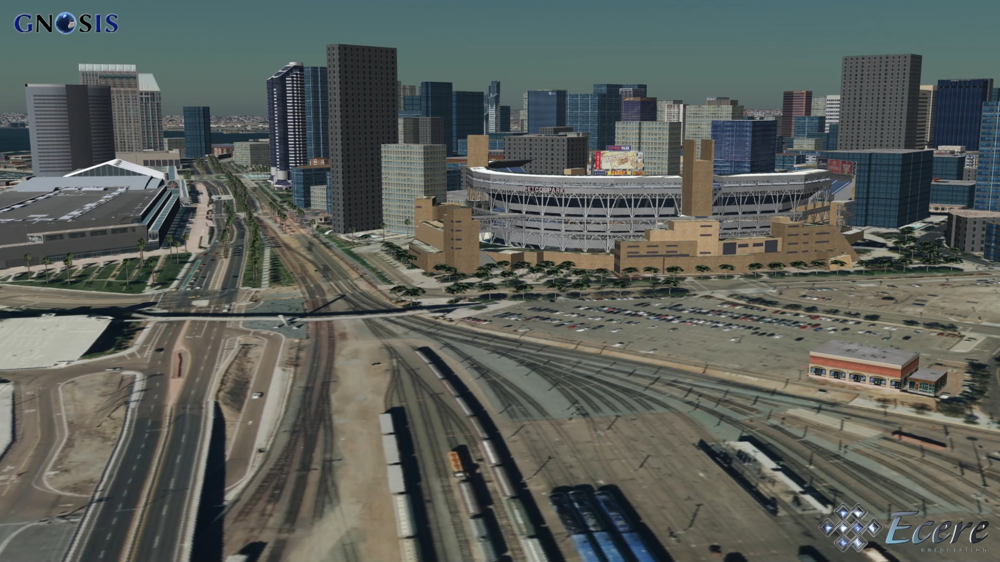

[#Ecere_SD8,reftext='{figure-caption} {counter:figure-num}']
.A composite visualization of the San Diego CDB dataset in GNOSIS Cartographer client showing Children's Park.
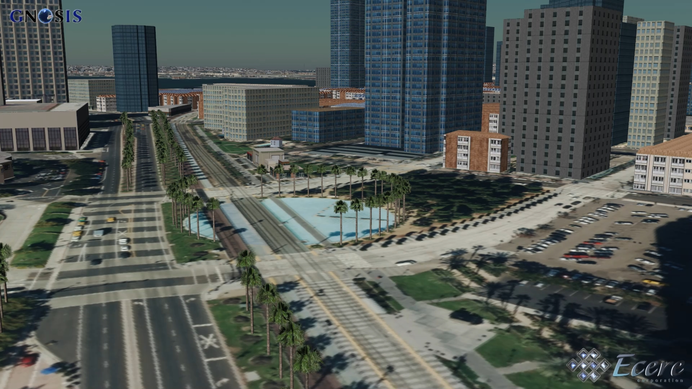

[#Ecere_SD9,reftext='{figure-caption} {counter:figure-num}']
.A composite visualization of the San Diego CDB dataset in GNOSIS Cartographer client showing buildings in downtown San Diego.
image::images/Ecere/gnosis-sandiego9.jpg[width=800,align="center"]

[#Ecere_SD10,reftext='{figure-caption} {counter:figure-num}']
.A composite visualization of the San Diego CDB dataset in GNOSIS Cartographer client showing a view from downtown to the eastern suburbs.
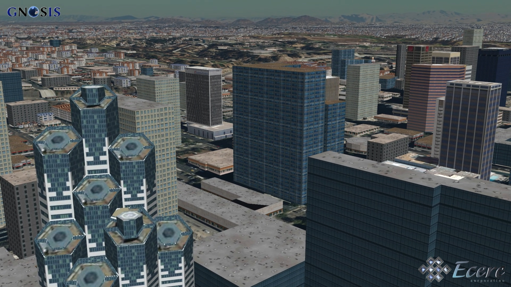

[#Ecere_SD11,reftext='{figure-caption} {counter:figure-num}']
.A composite visualization of the San Diego CDB dataset in GNOSIS Cartographer client showing a view to the south of Children's Park.
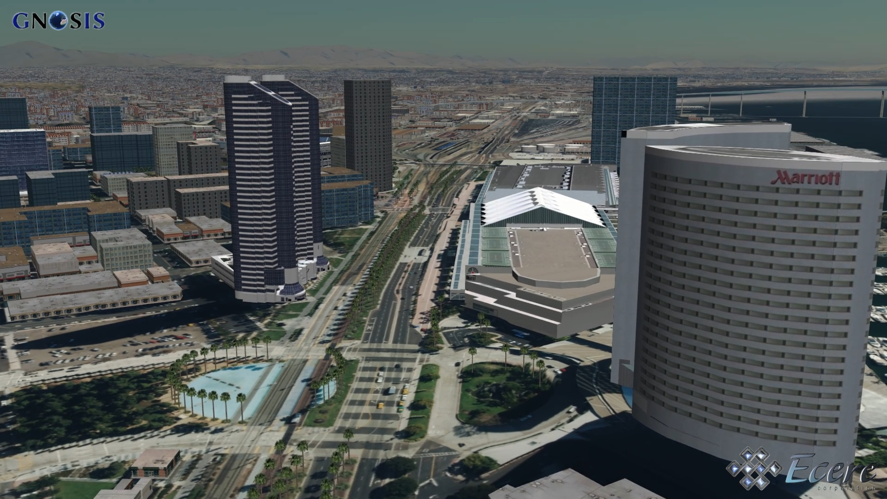

[#Ecere_SD12,reftext='{figure-caption} {counter:figure-num}']
.A composite visualization of the San Diego CDB dataset in GNOSIS Cartographer client showing San Diego Bay and Coronado.
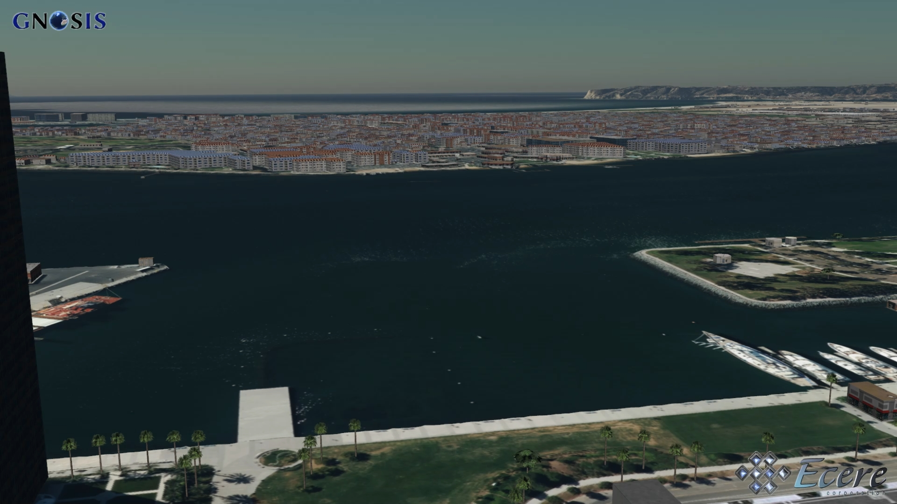

[#Ecere_SD13,reftext='{figure-caption} {counter:figure-num}']
.A composite visualization of the San Diego CDB dataset in GNOSIS Cartographer client showing housing on Coronado.
image::images/Ecere/gnosis-sandiego13.jpg[width=800,align="center"]

[#Ecere_SD14,reftext='{figure-caption} {counter:figure-num}']
.A composite visualization of the San Diego CDB dataset in GNOSIS Cartographer client showing North Island Naval Air Station.
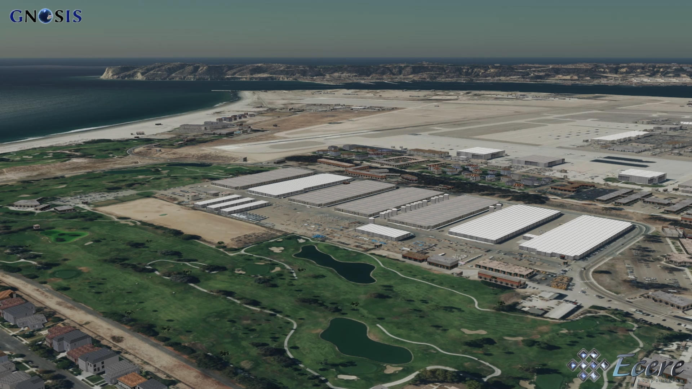

[#Ecere_SD15,reftext='{figure-caption} {counter:figure-num}']
.A composite visualization of the San Diego CDB dataset in GNOSIS Cartographer client showing Point Loma.
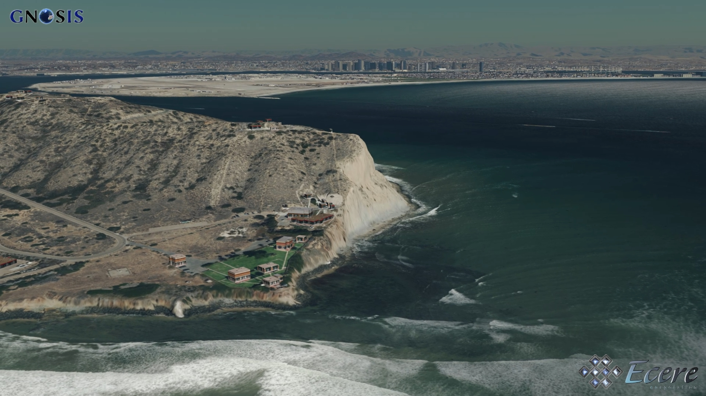

[#Ecere_SD16,reftext='{figure-caption} {counter:figure-num}']
.A composite visualization of the San Diego CDB dataset in GNOSIS Cartographer client showing Sam Diego International Airport.
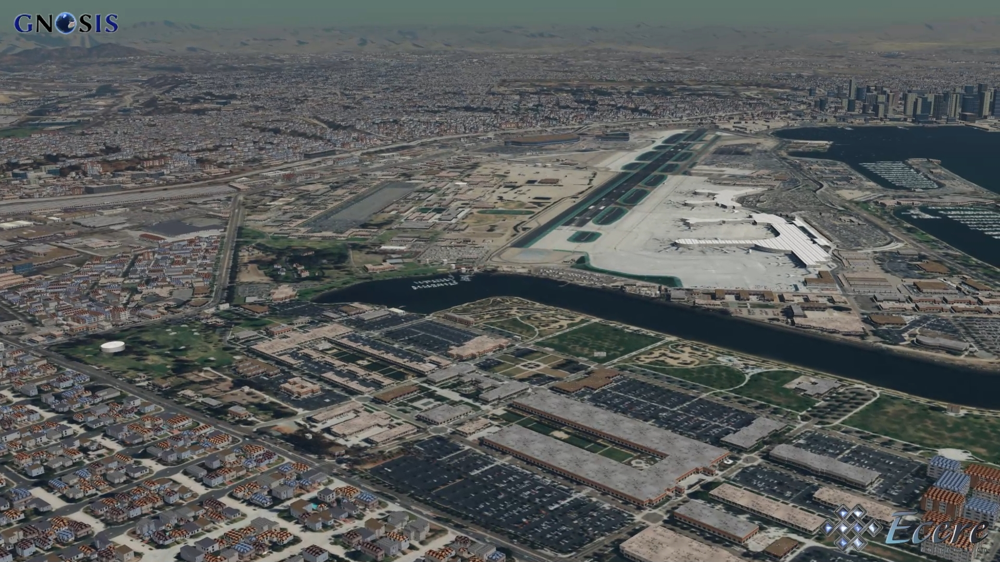

=== Interoperable 3D model formats

In collaboration with Steinbeis, Ecere initiated work towards demonstrating the visualization of integrated indoor and outdoor geospatial data.
Leveraging the advantages of tiling, Ecere's GNOSIS geospatial visualization Software Development Kit can support visualization of data from a global scale
to local scale at high resolution, such as for indoor Augmented Reality scenarios.

Experiments focused on visualization of a 3D model of a Hochschule für Technik (HfT) Stuttgart building, including interior details, integrated within
data from its surrounding geographic area, such as buildings sourced from OpenStreetMap data.

[#Ecere_HfT1,reftext='{figure-caption} {counter:figure-num}']
.3D Model of Hochschule für Technik (HfT) Stuttgart provided by Steinbeis in COLLADA as visualized in Ecere's 3D Model viewer.
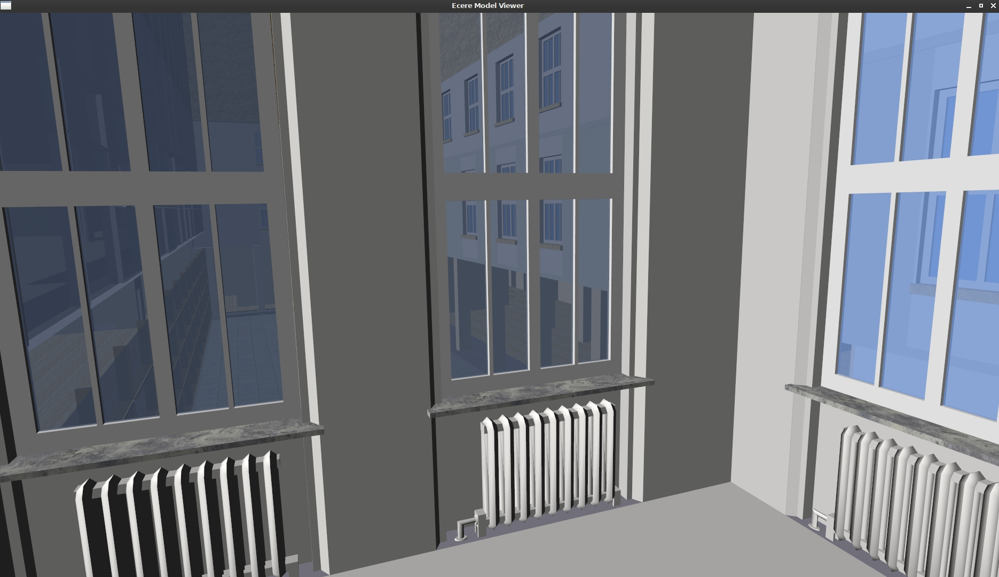

[#Ecere_HfT2,reftext='{figure-caption} {counter:figure-num}']
.A global view of the Earth in Ecere's GNOSIS Cartographer in which HfT 3D Model was integrated with other geospatial data. This view includes Gaia Sky in color from ESA, Visible Earth Blue Marble from NASA and elevation data from Jonathan de Ferranti's ViewFinderPanorama (including data from SRTM, NASA / USGS).
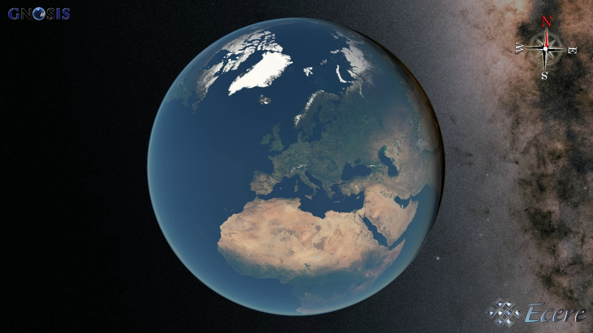

[#Ecere_HfT3,reftext='{figure-caption} {counter:figure-num}']
.This is an intermediate zoom into Europe with a view of the Alps.
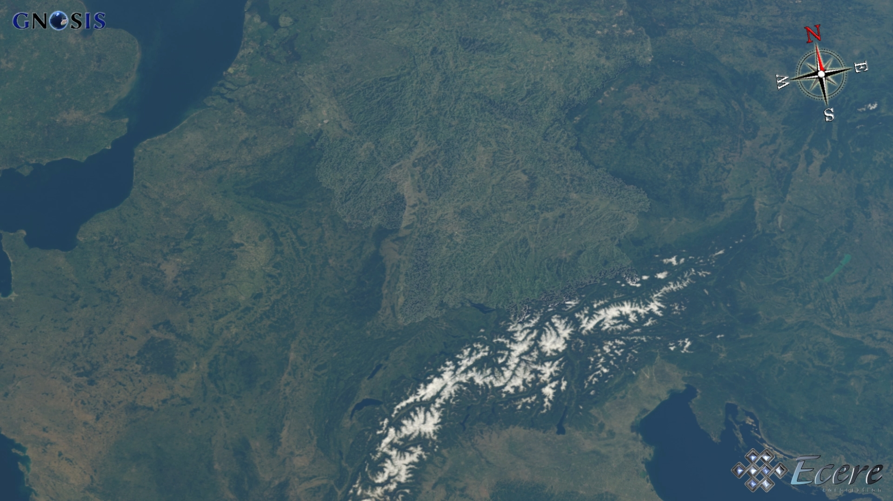

[#Ecere_HfT4,reftext='{figure-caption} {counter:figure-num}']
.An aerial view of Germany's Baden-Wuerttemberg region (data Copyright &#169; OpenStreetMap contributors) showing the placement of higher resolution HfT Stuttgart.
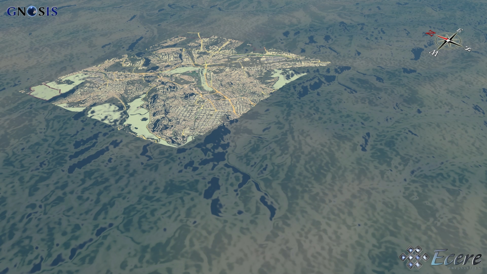

[#Ecere_HfT5,reftext='{figure-caption} {counter:figure-num}']
.A view of 3D buildings in Stuttgart from altitude.
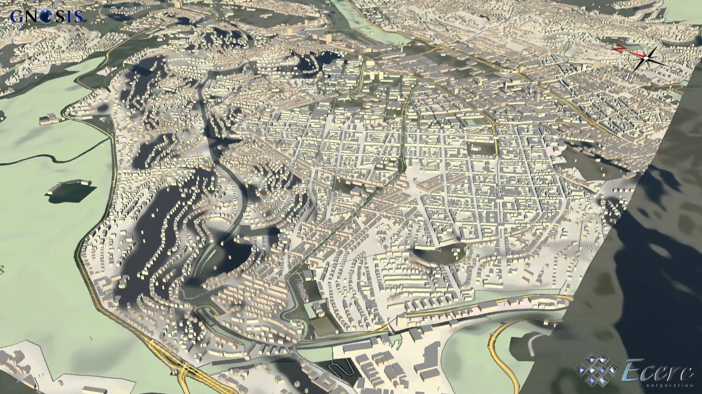

[#Ecere_HfT6,reftext='{figure-caption} {counter:figure-num}']
.A closer view of 3D buildings. The HfT building models were provided by Steinbeis.
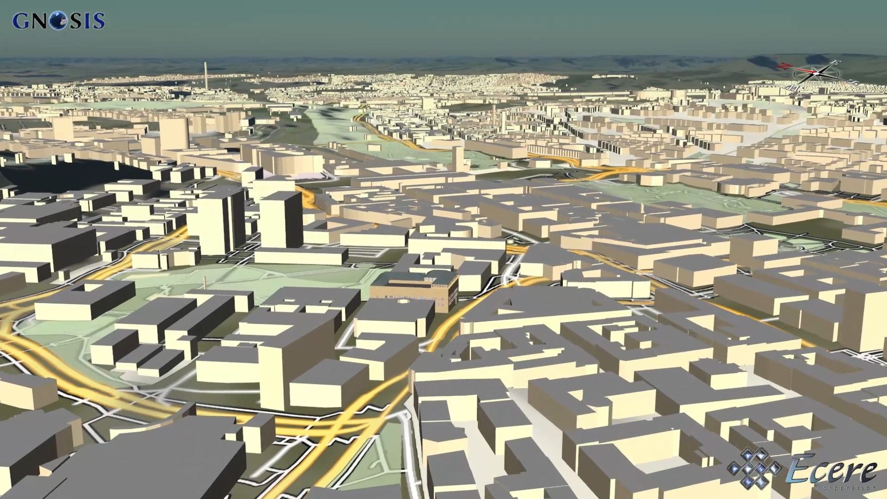

[#Ecere_HfT7,reftext='{figure-caption} {counter:figure-num}']
.A rooftop view close to HfT buildings.
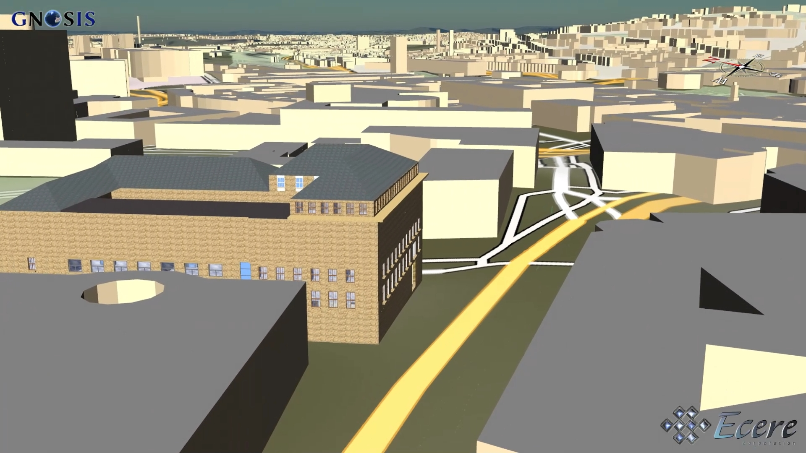

[#Ecere_HfT8,reftext='{figure-caption} {counter:figure-num}']
.One of many View HfT buildings provided by Steinbeis.
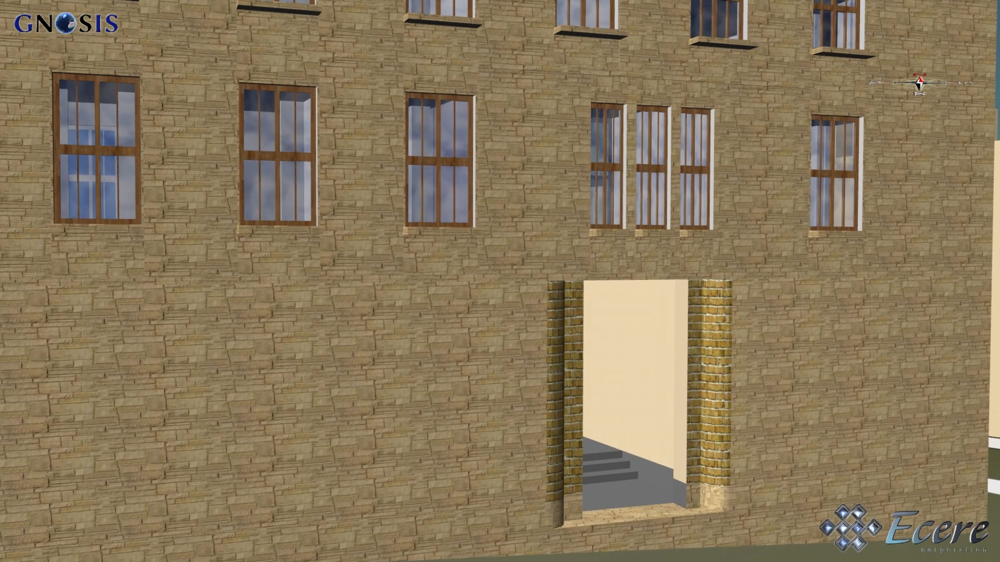

[#Ecere_HfT9,reftext='{figure-caption} {counter:figure-num}']
.The first view of a staircase inside an HfT building.
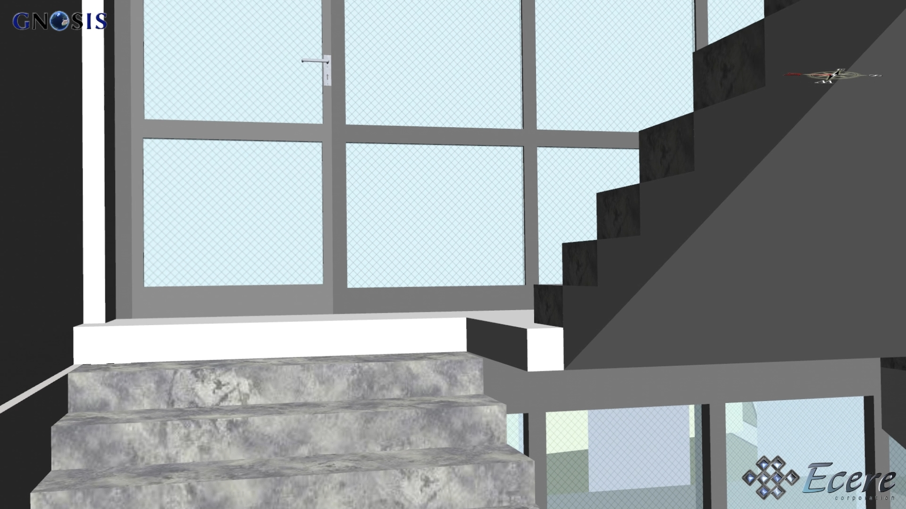

[#Ecere_HfT10,reftext='{figure-caption} {counter:figure-num}']
.The second view of a different staircase inside an HfT building.
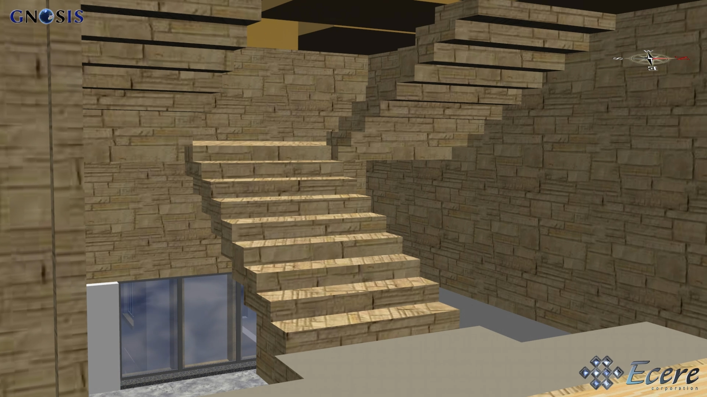

'''

Since, as described previously, the GNOSIS client could not readily display _3D Tiles_ tilesets retrieved from the Steinbeis GeoVolumes server, the participants
sought an alternative way to achieve interoperability. Firstly, Steinbeis provided a glTF model exported from the Sketchup software in which the model was
originally produced. Unfortunately, this glTF export proved to have incorrect normals that would result in incorrect lighting of surfaces. Attempts to display
that glTF model however led to Ecere making some improvements to its importing module for glTF which leverages the https://www.assimp.org/[Open Asset import library] (_libassimp_),
as well as to libassimp itself. In a following attempt to achieve interoperability, Steinbeis provided a COLLADA export from Sketchup, which is known to
usually give good results. In this attempt, normals turned out fine, but for an unknown reason (which could also be an export issue or a simple mistake
during the export process, such as leaving some objects hidden at exporting time) some floor surfaces ended up missing from the exported COLLADA model.
The takeaway from these experiments is that improving widely used open-source libraries to import and export glTF 3D models might lead to better interoperability.

Ecere's contributions to the https://github.com/assimp/assimp[libassimp] glTF 2 driver made as part of this sprint included:

- Fixes to build for C compiler (https://github.com/assimp/assimp/pull/3966[PR 3966])
- Improved support for opacity (https://github.com/assimp/assimp/pull/3967[PR 3967])

As part of these interoperability experiments during the sprint, Ecere produced both binary glTF and https://github.com/ecere/E3D-spec[E3D] versions of the HfT models
provided by Steinbeis.

In addition, Ecere realized the need to improve aspects of materials and textures management in its open-source cross-platform https://ecere.org[Ecere SDK]
and the https://github.com/ecere/ecere-sdk/tree/latest/ecere/src/gfx/3D/models/e3d[importing and exporting driver] for the https://github.com/ecere/E3D-spec[E3D model format], which remains ongoing development work happening on the
https://github.com/ecere/ecere-sdk/tree/materialsReview[materialsReview] branch at the time of this report.
Other improvements to the Ecere driver for libassimp included correctly handling hierarchical transforms and translucency.
Proper support for translucent 3D models integrated in Ecere's GNOSIS visualization SDK remains ongoing development work at the time of this report.

Given the limited time allocated to the sprint (two weeks interspersed by an OGC Members Meeting), improving and demonstrating support for Virtual and
Augmented Reality is also the subject of ongoing and future development work.

