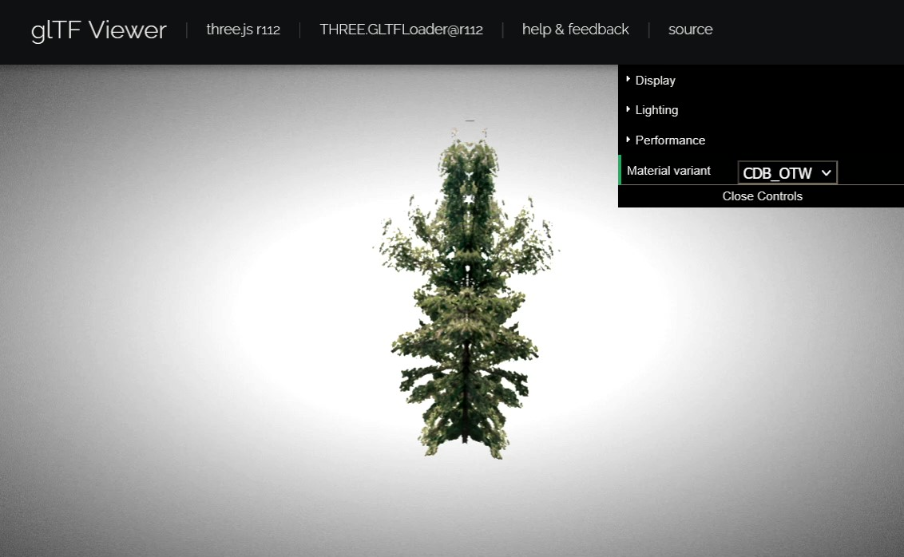
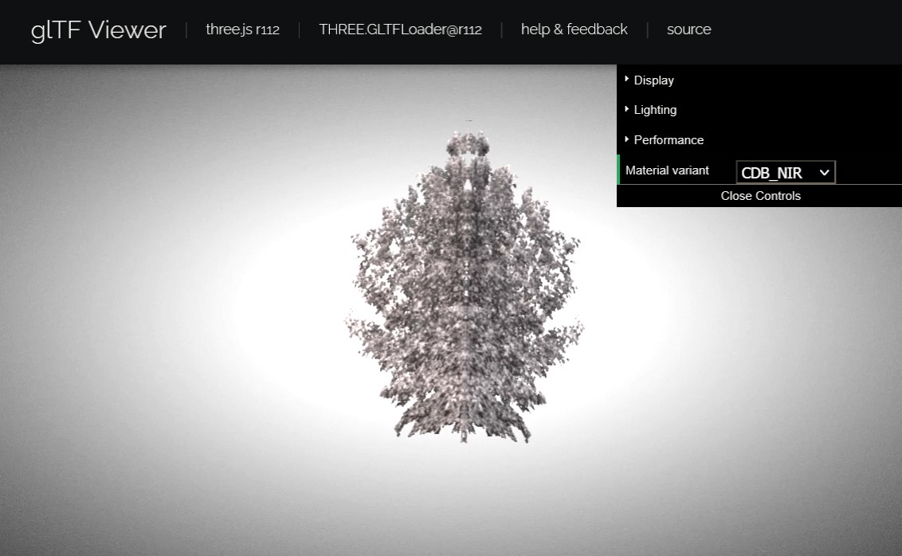

== Component Implementation: FlightSafety

=== Introduction

==== Company Introduction

FlightSafety International is a professional aviation training company, that supplies flight simulators, visual systems, and displays for commercial, government, and military organizations.  FlightSafety has deep experience with both CDB and OpenFlight formats, with the ability to both create and consume data in these formats.  FlightSafety has used OpenFlight for decades for models and terrain.  Also, in support of USSOCOM, FlightSafety implemented CDB as early as 2006.  FlightSafety continues to support the evolution of CDB through Interoperability Experiments and Tech Sprints.

==== Scenario Plan

FlightSafety chose to participate in the ISG Year 2 Sprint by investigating Scenario 4, identifying and defining missing CDB functionality in glTF.  Previous work had focused on comparisons between features of OpenFlight and glTF.  But CDB only uses a subset of OpenFlight nodes.  In particular, it does not make use of the more esoteric nodes that lack straightforward conversions to glTF.  In addition, CDB details how to use the existing OpenFlight nodes and attributes to implement typical simulation features and concepts, which are not 1-to-1 conversions to glTF.

Also, there are additional layers in a CDB to support use cases that do not involve visible spectrum lighting, such as Infrared and Radar wavelengths.  FlightSafety is interested in the practicality of supporting these use cases.

FlightSafety proposed three areas of investigation:

1. How to preserve CDB attribution and conceptual features in a glTF model, especially in CDB Moving Models.  This covers CDB concepts like named zones, damage states, attach points, configurations, motion blur textures, and other semantic attribution.  

1. How to encode and store multi-spectral textures of wavelengths that are primarily reflective such as Near Infrared and Short Wave Infrared wavelengths.  These are used for NVG (Night Vision Goggle simulation and/or stimulation) and SWIR sensors.

1. How to encode and store material data.  This involves storing the underlying material property information.  This data is used for Radar and sensor systems such as Thermal IR (FLIR or EOS).

There are basically three uses of OpenFlight within a CDB.  All uses of OpenFlight need to be looked at when proposing using glTF models in a CDB.

1. CDB Static Models - GeoSpecific and GeoTypical 3D models that are anchored in a specified location within the CDB

1. CDB Moving Models - 3D Models that are not anchored onto the terrain or in a specified location in the CDB

1. CDB Tiled 2D dataset - Geometry that is layered or projected onto the terrain skin, to provide higher detail than terrain and imagery alone

==== Limits of Investigation

FlightSafety did not investigate the conversion of all the CDB to glTF.  We find that there is additional flexibility with using the original CDB datasets to create runtime formats (like glTF or other more runtime focused formats), without indicating how those datasets are to be used.  The ability to mix and match different datasets and different levels of detail from a CDB creates the flexibility to support simulation systems with different capabilities and/or use cases.

Also, due to the limited time frame of this effort, not all of the proposed glTF extensions were tested and verified to fully replace specific CDB 3D model functionality.

=== CDB Model Attribution

==== Background

The Interoperable Simulation and Gaming Year 2 Sprint proposal, in https://portal.ogc.org/files/?artifact_id=96942#AnnexA[Appendix A: Modeling Formats Comparison], produced a table of similarities and differences between OpenFlight and glTF.  The focus here was on arbitrary OpenFlight features.  CDB does not use pure OpenFlight, but rather a profile of the OpenFlight specification, as seen in https://docs.ogc.org/bp/16-009r5.html[Volume 6] of the CDB standard.  There are features and nodes in OpenFlight that CDB does not use, and there are portions of OpenFlight that are narrowly defined to make different features more interoperable.  For some model use cases, preserving the functionality of a CDB 3D model is more than just preserving the structure in glTF.

==== Proposed glTF Solution

The first step in this investigation was to identify the features and concepts that are unique to how CDB uses OpenFlight.  Next, each feature or concept is described as to how it is used, and a glTF extension is proposed to implement the feature or concept.

[#table_cdb_features,reftext='{table-caption} {counter:table-num}']
.Table of CDB Features Implemented in OpenFlight vs glTF
[cols="10e,20,30,50,10",width="90%",options="header",align="center"]
|===
| CDB Feature Category
| CDB Feature
| CDB Model Type
| Description
| Proposed glTF Extension

| **Zones**
| https://github.com/opengeospatial/cdb-volume-6/blob/master/clause_6_5_ModelZones.adoc[**Zone**]
| All CDB Models
| Metadata on Group nodes, used to provide a hierarchical naming scheme for other features in this table, such as switches, DOFs, etc.
| https://github.com/KhronosGroup/glTF/tree/master/extensions/2.0/Khronos/KHR_xmp_json_ld[KHR_xmp_json_ld]

2+| https://github.com/opengeospatial/cdb-volume-6/blob/master/clause_6_6_ModelPoints.adoc[**Points**] Category 3+| Identifies a location on a model that is of interest to at least one CDB consumer.  Similar to zones, but typically is not visually modeled.

|
| https://github.com/opengeospatial/cdb-volume-6/blob/master/clause_6_6_ModelPoints.adoc#model-dis-origin[**Model DIS Origin Point**]
| Moving Models
| Model origin used with DIS/HLA, which can be different than the modeled origin | https://github.com/KhronosGroup/glTF/tree/master/extensions/2.0/Khronos/KHR_xmp_json_ld[KHR_xmp_json_ld]

|
| https://github.com/opengeospatial/cdb-volume-6/blob/master/clause_6_6_ModelPoints.adoc#model-viewpoint[**Model Viewpoint**]
| All models
| Viewpoint from a model (aircraft pilot's seat, ship's navigation post, etc)
| https://github.com/KhronosGroup/glTF/tree/master/specification/2.0#cameras[Cameras]

|
| https://github.com/opengeospatial/cdb-volume-6/blob/master/clause_6_6_ModelPoints.adoc#model-attach-point[**Attach Point**]
| Primarily Moving Models, Power Line Pylons
| Position on a model that other models can be attached to (e.g. fighter aircraft with points to attach munitions or fuel tanks).  Includes power line attach points for a power pylon.
| https://github.com/KhronosGroup/glTF/tree/master/extensions/2.0/Vendor/AGI_articulations[AGI_articulations]

|
| https://github.com/opengeospatial/cdb-volume-6/blob/master/clause_6_6_ModelPoints.adoc#model-anchor-point[**Anchor Point**]
| Moving Models
| Counterpoint of the **Attach Point**, point where this model can be attached to another model
| https://github.com/KhronosGroup/glTF/tree/master/extensions/2.0/Vendor/AGI_articulations[AGI_articulations]

|
| https://github.com/opengeospatial/cdb-volume-6/blob/master/clause_6_6_ModelPoints.adoc#model-center-of-mass[**Center of Mass**]
| Moving Models
| Center of mass of a model
| https://github.com/KhronosGroup/glTF/tree/master/extensions/2.0/Khronos/KHR_xmp_json_ld[KHR_xmp_json_ld]

| https://github.com/opengeospatial/cdb-volume-6/blob/master/clause_6_7_ModelConforming.adoc[**Model Conforming**]
| **Model Conforming**
| Static Models, 2D Tiled Models
| A set of modes used to place or project model geometry onto the terrain
| https://github.com/KhronosGroup/glTF/tree/master/extensions/2.0/Khronos/KHR_xmp_json_ld[KHR_xmp_json_ld]

| https://github.com/opengeospatial/cdb-volume-6/blob/master/clause_6_8_ModelLevelsOfDetail.adoc[**Level of Detail**]
| ** Level of Detail**
| Static and Moving Models
| Provides device level control of rendering/processing load and memory footprint
| https://github.com/KhronosGroup/glTF/tree/master/extensions/2.0/Vendor/MSFT_lod[MSFT_lod] - _<<lod_note,See LOD Note Below>>_

2+| https://github.com/opengeospatial/cdb-volume-6/blob/master/clause_6_9_ModelSwitchNodes.adoc[**Switch**] Category
3+| Implemented in an OpenFlight **Switch** node.  Used to control the state of Model Components (zones and points), based on one or a set of masks that enable or disable child nodes.

|
| https://github.com/opengeospatial/cdb-volume-6/blob/master/clause_6_9_ModelSwitchNodes.adoc#articulations[**Articulations**]
| Moving Models
| Used when articulated parts are implemented for only a few set positions (e.g. aircraft flaps)
| No direct conversion, but glTF animations can accomplish the same effect.

|
| https://github.com/opengeospatial/cdb-volume-6/blob/master/clause_6_9_ModelSwitchNodes.adoc#damage-states[**Damaged States**]
| Static and Moving Models
| Select one of multiple modeled representations of a model with different amounts of damage (0-100% damaged)
| <<switch_note,See Switch Note Below>>

|
| https://github.com/opengeospatial/cdb-volume-6/blob/master/clause_6_9_ModelSwitchNodes.adoc#temporal-anti-aliasing[**Motion Blur Textures**]
| Moving Models
| Provides temporal anti-aliasing on rotating parts (such as rotors or propellers) to reduce strobing effects.  These are special textures that are semi-transparent.
| https://github.com/KhronosGroup/glTF/tree/master/extensions/2.0/Khronos/KHR_materials_variants[KHR_materials_variants] along with glTF Animation

2+| https://github.com/opengeospatial/cdb-volume-6/blob/master/clause_6_10_ModelArticulations.adoc[**Articulations**]
3+| Implemented in an OpenFlight **DOF** node.  Gives a system control over all 9 degrees of freedom: translation, rotation, scaling on all 3 axis.  One allowed per zone for unique naming and control of the DOF.

|
| https://github.com/opengeospatial/cdb-volume-6/blob/master/clause_6_10_ModelArticulations.adoc#definition[**Articulated Part**]
| Moving Models
| Allows a simulation (DIS or other) to control an articulation on a model
| https://github.com/KhronosGroup/glTF/tree/master/extensions/2.0/Vendor/AGI_articulations[AGI_articulations]

|
| https://github.com/opengeospatial/cdb-volume-6/blob/master/clause_6_10_ModelArticulations.adoc#rotating-parts[**Rotating Part**]
| Static or Moving Models
| An articulation that can be animated/rotated automatically in the environment.
| glTF Animations

| https://github.com/opengeospatial/cdb-volume-6/blob/master/clause_6_12_ModelAttributes.adoc[**Attribution**]
| ** Attribution**
| All Model Types
| General mechanism using structured XML comments to add attribution to portions of a 3D model
| https://github.com/KhronosGroup/glTF/tree/master/extensions/2.0/Khronos/KHR_xmp_json_ld[KHR_xmp_json_ld]

| https://github.com/opengeospatial/cdb-volume-6/blob/master/clause_6_14_ModelDescriptorMetadataDatasets.adoc#model-configurations[*Model Configuration*]
|
| Moving Models
| Allows the selection and use of one of a set of possible equipment and/or ordinance loads for a Moving Model.
| Keep in CDB XML Metadata file.  _<<configuration_note,See Configuration Note Below>>_

|===

There are a large variety of texture types in a CDB.  Below, in <<table_cdb_textures>>, is a complete listing of texture types and their uses, along with proposed glTF replacements.

[#table_cdb_textures,reftext='{table-caption} {counter:table-num}']
.Table of CDB Texture Types vs glTF
[cols="10e,20,50,10",width="90%",options="header",align="center"]
|===
| CDB Texture Class
| CDB Texture Type
| Description
| Proposed glTF Extension

2+| https://github.com/opengeospatial/cdb-volume-6/blob/master/clause_6_13_ModelTextures.adoc#base-texture-layer[**Model Textures - Base**]
2+| Textured appearance of a model

|
| https://github.com/opengeospatial/cdb-volume-6/blob/master/clause_6_13_ModelTextures.adoc#base-texture-layer[**Year Round Texture**]
| Base appearance of a model
| glTF Materials

|
| https://github.com/opengeospatial/cdb-volume-6/blob/master/clause_6_13_ModelTextures.adoc#model-skin-textures[**Time of Year Texture**]
| Time of Year appearance either Quarterly or Monthly.
| https://github.com/KhronosGroup/glTF/tree/master/extensions/2.0/Khronos/KHR_materials_variants[KHR_materials_variants]

|
| https://github.com/opengeospatial/cdb-volume-6/blob/master/clause_6_13_ModelTextures.adoc#model-skin-textures[**Paint Scheme Texture**]
| Textured Paint Schemes (Paint color, Camouflage, Airline Livery)
| https://github.com/KhronosGroup/glTF/tree/master/extensions/2.0/Khronos/KHR_materials_variants[KHR_materials_variants]

|
| https://docs.opengeospatial.org/is/17-080r2/17-080r2.html[**Multi-Spectral Texture Layer**]
| CDB Extension of Base Textures, covering non-visual reflective textures in the Near Infrared and Short Wave Infrared bands.
| https://github.com/KhronosGroup/glTF/tree/master/extensions/2.0/Khronos/KHR_materials_variants[KHR_materials_variants]

2+| https://github.com/opengeospatial/cdb-volume-6/blob/master/clause_6_13_ModelTextures.adoc#subordinate-texture-layer[**Model Textures - Subordinate**]
2+| Provides additional detail to the Base texture

|
| https://github.com/opengeospatial/cdb-volume-6/blob/master/clause_6_13_ModelTextures.adoc#model-light-maps[**Light Map**]
| Emissive texture map representing color and intensity of light being emitted or reflected
| https://github.com/KhronosGroup/glTF/tree/master/specification/2.0#additional-maps[glTF Emissive Map]

|
| https://github.com/opengeospatial/cdb-volume-6/blob/master/clause_6_13_ModelTextures.adoc#model-night-maps[**Night Map**]
| Used in conjunction with Light Maps to simulate light sources inside a model
| https://github.com/KhronosGroup/glTF/tree/master/specification/2.0#additional-maps[glTF Emissive Map]

|
| https://github.com/opengeospatial/cdb-volume-6/blob/master/clause_6_13_ModelTextures.adoc#model-tangent-space-normal-maps[**Tangent-Space Normal Map**]
| Tangent-Space Normal map
| https://github.com/KhronosGroup/glTF/tree/master/specification/2.0#additional-maps[glTF Normal Map]

|
| https://github.com/opengeospatial/cdb-volume-6/blob/master/clause_6_13_ModelTextures.adoc#model-detail-texture-maps[**Detail Texture Maps**]
| Method of adding high-frequency (spatial) details to a low-frequency image.
| No direct glTF equivalent

|
| https://github.com/opengeospatial/cdb-volume-6/blob/master/clause_6_13_ModelTextures.adoc#model-contaminant-and-skid-mark-textures[**Contaminant and Skid Mark Textures**]
| Historical method of controlling the appearance of airport runways and surfaces.
| No direct glTF equivalent

|
| https://github.com/opengeospatial/cdb-volume-6/blob/master/clause_6_13_ModelTextures.adoc#model-cubic-reflection-maps[**Cubic Reflection Map**]
| Reflection map
| https://github.com/KhronosGroup/glTF/tree/master/extensions/2.0/Vendor/EXT_lights_image_based[EXT_lights_image_based]

|
| https://github.com/opengeospatial/cdb-volume-6/blob/master/clause_6_13_ModelTextures.adoc#model-gloss-maps[**Gloss Map**]
| Describes whether a surface is matte or gloss.
| https://github.com/KhronosGroup/glTF/tree/master/specification/2.0#metallic-roughness-material[glTF metallicRoughnessTexture]

2+| https://github.com/opengeospatial/cdb-volume-6/blob/master/clause_6_13_ModelTextures.adoc#model-material-textures[*Material Textures*]
| Texture map of the underlying surface material, independent of the visual appearance.
| https://github.com/CesiumGS/glTF/tree/3d-tiles-next/extensions/2.0/Vendor/EXT_feature_metadata/1.0.0[*EXT_feature_metadata*] - Feature ID Texture

|===

Due to time constraints, not all of the proposed extensions could be tested or evaluated.  There remains work to ensure that all of the CDB features and concepts can be converted into glTF features and extensions.  Also, since the goal of CDB is interoperability, it would be unwise to choose a specific implementation without multiple organizations evaluating the suitability of the extension to their use cases.

===== Notes

* [[lod_note]] _Levels of Detail_:  The MSFT_lod extension does not define what constitutes a "screen" for the purposes of screen coverage calculation.  CDB would need to define what a "screen" is for purposes of conversion to significant size.  One possible definition would be that a screen is considered Full HD (1080p or 1,920x1,080), so that a scaling between this screen definition and screens that are higher (e.g. WQXGA or 4K) or lower resolution (e.g. VGA or 720p) can be used.

* [[configuration_note]] _Model Configurations_:  Currently, the model configuration data is stored globally in the Metadata directory as an XML file.  One option is to keep the location and format.  Another option is to encode this information into the model itself, using the https://github.com/KhronosGroup/glTF/tree/master/extensions/2.0/Khronos/KHR_xmp_json_ld[KHR_xmp_json_ld] extension.

* [[switch_note]] _Switches_:  There are no direct glTF features or extensions that work in the general case for switches.  If an entire model was to switch geometry, a new scene in glTF would work.  But most use cases have only portions of the mesh changing, like a damaged wing.  So this solution is not considered complete enough for CDB conversion.

==== Recommendations

1. Create a new glTF extension to support mesh switching that can be used for Damaged States and simple geometry switching.  This probably involves extending glTF nodes, to allow switching between a default set of child nodes and alternative sets (masks) of child nodes.  Since nodes are referenced by index, this would be a lightweight extension.

1.  Additional testing of the proposed extensions is needed, to see if they cover the capabilities of CDB using OpenFlight.  In addition, interoperable experiments are recommended to ensure that these extensions are effective for all users.

1. There are a number of CDBs that are available for OGC members to use for testing purposes.  However, there are no CDB Moving Models that can work as test cases for all features.  Creating some standardized models available would make this work easier.

=== Multi-Spectral Model Textures

==== Background

Most near infrared and short-wave infrared energy in an environment is produced by the sun, as part of its solar black body radiation.  The exceptions are typically very hot materials (e.g. aircraft engines, exhaust) or man-made emitters of these wavelengths (e.g. TV remotes, military NVG lights).

CDB accommodates these wavelengths using the Multi-Spectral Imagery Extension to CDB.  This extension provides additional textures that can be used in cases where near infrared or short wave infrared portions of the electromagnetic spectrum are needed.  In this case, the extension is using the same technique that CDB uses for seasonal and quarterly texture and imagery, as well as paint and camouflage schemes for moving models.

==== Proposed glTF Solution

The conversion of this data to glTF was relatively straightforward.  There is a glTF extension developed for commercial applications, https://github.com/KhronosGroup/glTF/tree/master/extensions/2.0/Khronos/KHR_materials_variants[KHR_materials_variants], that works well for this use case.  It allows for switching textures on a model based on a name, where the set of textures use the exact same texture mapping.  This approach should also handle the quarterly and seasonal texture representations, as well as paint and camouflage texture skins.  <<table_material_labels>> shows some of the different texture types that can be added to a 3D model.

[#table_material_labels,reftext='{table-caption} {counter:table-num}']
.Table of Texture Types
[cols="60e,^40m",width="50%",options="header",align="center"]
|===
|Variant Type | Labels

| Year Round Texture
| CDB_Base

| Monthly Texture
| CDB_January CDB_February CDB_March CDB_April CDB_May CDB_June CDB_July CDB_August CDB_September CDB_October CDB_November CDB_December

| Quarterly Texture
| CDB_Q1 CDB_Q2 CDB_Q3 CDB_Q4

| Multi-Spectral
| CDB_NIR CDB_SWIR

| Uniform Paint Scheme
| CDB_Paint_Gray CDB_Paint_White CDB_Paint_Green CDB_Paint_Black

| Camouflage Paint Scheme
| CDB_Camo_Desert CDB_Camo_Winter CDB_Camo_Forest CDB_Camo_Generic CDB_Camo_Urban

| Airline Paint Scheme
| CDB_Airline_AAH CDB_Airline_AAL CDB_Airline_AAR
|===

There is a concern that encoding multiple texture layers into a single binary glTF model could lead to non-optimal solutions.  Consider, for example, a model that uses a large number of different material variants.  For most use cases, there would be no need to load all of these texture layers, thus it might be best to reduce the file size and I/O load of the CDB client.  Another example would be several models sharing a texture.  Encoding these into a binary glTF file would use more storage than necessary.  Most of these concerns can be addressed by using glTF texture URIs, rather than encoding the texture directly into the glTF.

===== Experimentation

FlightSafety created some sample glTF models using the KHR_materials_variants extension.  The images below are being rendered by the Don McCurdy glTF viewer, showing 3D models that are using the materials variants extension.  <<img_tree_visual>> is a 3D model showing typical visual texture.  <<img_tree_nvg>> is a 3D model showing the Near Infrared texture that would be used for Night Vision Goggle training.

[#img_tree_visual,reftext='{figure-caption} {counter:figure-num}']
.A model with visual texture

[#img_tree_nvg,reftext='{figure-caption} {counter:figure-num}']
.A model with Near Infrared texture

[NOTE]
.This should be pointed out that the geometry in these two models is different and not the result of different applied textures._
===============================================
===============================================

==== Recommendations

These items are recommendations for representing optional texture layers for glTF models to support current CDB capabilities:

1. CDB glTF models should support the KHR_materials_variants extension, if there is more than the default base texture for a model.  This can include quarterly or seasonal representations, uniform paint schemes, camouflage paint schemes, airline paint schemes, or Near Infrared reflectance, or Short-Wave Infrared reflectance textures.

1. The material names for the different variants should conform to a naming convention in CDB.  For example, the material variant for Near Infrared texture should always be CDB_NIR.  More examples are in <<table_material_labels>>.

1. Textures, other than the base texture, should not be encoded into the glTF model.  Any non-base texture, or a texture that is reused in other models, should be referenced via a URI into the CDB, so that the client or renderer can access only the set of textures necessary.

=== Model Material Textures

==== Background

There are certain use cases that cannot be covered solely by visual appearance or reflectance of specific bands of electromagnetic solar radiation.  Some of these use cases include thermal Infrared where a sensor is detecting the temperature of an object, and Radar where an emitter is producing pulses of energy that reflect off objects partly based on the physical material of that object.

CDB allows for the storage of material data for both the terrain (Raster Materials) and for 3D models (Model Material Texture).  In both cases, the material storage is similar.  CDB supports a material texture that contains a single channel/band of index values (note: Raster Materials supports multiple layers of data), and an XML file that contains a Composite Material Table that maps the index into either a simple material (such as glass), a mixture of materials (such as 40% brick and 60% wood), or a complex arrangement of materials (such as a steel drum, with water inside, and painted on the outside).

A CDB consumer can then use the material data, along with other non-static simulation information, to create a sensor representation.  For example, material information plus atmospheric data (temperature and humidity), plus knowing the amount of solar irradiance (or lack thereof in the case of shadows) on the surface, can allow a device to simulate a thermal irradiance texture for the simulation.  Similarly, a Radar simulation can use the material information along with a surface's orientation to simulate the reflection of Radar energy.

==== Proposed glTF Solution

We used a proposed glTF extension called https://github.com/CesiumGS/glTF/tree/3d-tiles-next/extensions/2.0/Vendor/EXT_feature_metadata/1.0.0[EXT_feature_metadata] to encode material data in a glTF model.  The https://github.com/CesiumGS/glTF/tree/3d-tiles-next/extensions/2.0/Vendor/EXT_feature_metadata/1.0.0#feature-id-textures[Feature ID Textures] feature allows for placing a metadata texture on a surface, along with a metadata table.  The value in the texture is an index into a table.

We were able to encode everything from a CDB Composite Material Table into this metadata table, with only one slight difference.  A CDB allows for a primary substrate (main material), an optional surface substrate (like paint), and optional secondary substrates that act like multiple material layers behind the primary material.  In practice, we have not required more than one secondary material, so we limited our material table to only a single secondary substrate.

The new JSON composite material table consists of entries that have:

* A Name
* An Index
* An array of the primary substrate materials (referenced by enumeration)
* An array of the primary substrate weights (by percentage)

Optionally, the following can also be included:

* An array of the surface substrate materials (referenced by enumeration)
* An array of the surface substrate weights (by percentage)
* The primary substrate thickness (in meters)
* An array of the secondary substrate materials (referenced by enumeration)
* An array of the secondary substrate weights (by percentage)
* The secondary substrate thickness (in meters)

.Example Material Table Schema
[source,json]
----
  "extensions": {
    "EXT_feature_metadata": {
      "schema": {
        "classes": {
          "compositeMaterials": {
            "properties": {
              "name": {
                "type": "STRING"
              },
              "index": {
                "componentType": "UINT8"
              },
              "primarySubstrate": {
                "type": "ARRAY",
                "componentType": "ENUM",
                "enumType": "baseMaterials"
              },
              "primarySubstrateWeights": {
                "type": "ARRAY",
                "componentType": "UINT8"
              }
            }
          },
          "cdbCompositeMaterialIndex": {
            "properties": {
              "index1": {
                "type": "UINT8",
                "normalized": false
              }
            }
          }
        }
      },
      "enums": {
        "baseMaterials": {
          "valueType": "UINT8",
          "values": [
            {
              "name": "BM_WOOD",
              "description": "Wood for building doors",
              "value": 0
            },
            {
              "name": "BM_BRICK",
              "description": "Brick for building exterior walls",
              "value": 1
            },
            {
              "name": "BM_GLASS",
              "description": "Glass for building windows",
              "value": 2
            }
          ]
        }
      }
    }
  }
----

The actual table would then be encoded into a glTF bufferView object.  For illustrative purposes, the following JSON would represent how the metadata table would look like to represent a CDB Composite Material Table.

.Example Composite Material Table
[source,json]
----
        "featureTables": {
            "compositeMaterialsTable": {
            "count": 3,
            "class": "compositeMaterials",
            "properties": {
             /*
              * These values are for illustrative purposes only. When actually implementing this
              * extension, the values must be stored in binary form and point to a glTF bufferView.
              */
              "name": [
                "DOOR",
                "EXTERIOR_WALL",
                "WINDOW"
              ],
              "index": [
                0,
                1,
                2
              ],
             "primarySubstrate": [
                [0],
                [1],
                [0, 2]
              ],
              "primarySubstrateWeights": [
                [100],
                [100],
                [10, 90]
              ]
            }
          }
        }
----

===== Experimentation

FlightSafety created a sample building model, using the EXT_feature_metadata extension to store the material data as a table within the model.  This model is being rendered in CesiumJS in <<img_materials>>.  This was created with help from Cesium.

[#img_materials,reftext='{figure-caption} {counter:figure-num}']
.A model with material texture
image::images/FlightSafety/MaterialTable.jpg[width=600,align="center"]

[NOTE]
._At the time of review, this image was not on GitHub. I uploaded my local copy. Please check to make sure this image is correct._
===============================================
===============================================

==== Recommendations

These items are recommendations for representing CDB material textures for glTF models to support current CDB capabilities:

1. CDB glTF models should encode materials using the EXT_feature_metadata extension if there is material data for the model.

1. A standardized table format should be used.  The above table schema can be that standard, if the additional optional fields are implemented.

1. Maintain the current list of CDB materials for easier transformations between CDB OpenFlight and glTF.

=== FlightSafety glTF Implementation

FlightSafety implemented a simple glTF model loader for FlightSafety's VITAL 1150 Image Generator, to help test the feasibility of using glTF models in a CDB.  Below are images of the Space Shuttle Discovery model sitting at the end of runway 4R at the Honolulu International Airport, in a CDB of Hawaii.

[#img_shuttle1,reftext='{figure-caption} {counter:figure-num}']
.A glTF model in FlightSafety's VITAL 1150
image::images/FlightSafety/Shuttle_behind.jpg[width=600,align="center"]

[NOTE]
._At the time of review, the above image was not on GitHub. I uploaded my local copy. Please check to make sure this image is correct._
===============================================
===============================================

[#img_shuttle2,reftext='{figure-caption} {counter:figure-num}']
.A glTF model in FlightSafety's VITAL 1150 at evening
image::images/FlightSafety/Shuttle_evening.jpg[width=600,align="center"]

==== Observations

Converting a glTF model to work in the FlightSafety VITAL 1150 Image Generator was relatively straightforward.  The node and mesh structure, materials and textures, all work well.  Some observations:

* glTF models use a different coordinate reference system than OpenFlight or 3dsMax.  They also use a slightly different texture mapping.  Both of these are straightforward to adjust for.

* The Physically Based Rendering (PBR) approach of glTF materials (metalness) is different than OpenFlight's extended material palette (specular), but there are workflows that can convert from one to the other.

* Most models tested had their textures packed into a texture atlas.  This was probably because they were conversions from other model formats, and packing the textures was done for rendering performance.  Using a texture atlas will make the data repository use case of CDB more difficult, as making modifications to the model's texture or geometry could become nearly impossible.
** See <<img_texture_atlas>> for the visual effect of a texture atlas on the model imported into VITAL 1150.
** See the 2020 https://github.com/sofwerx/cdb2-eng-report[3D Geospatial Tech Sprint OGC CDB 2.0] Engineering Report from SOFWERX on the different use cases needed by USSOCOM for the next major revision of CDB.

[#img_texture_atlas,reftext='{figure-caption} {counter:figure-num}']
.Texture Atlasing in glTF Model Conversions
image::images/FlightSafety/Orbiter_Space_Shuttle_OV-103_Discovery-150k-4096_0.jpg[width=600,align="center"]

=== Conclusions

* glTF encoded 3D models can be a good option for future versions of CDB.  The models are well organized and easily extendable.

* glTF models can be used with a variety of sensor systems.  Further performance profiling would be needed for Radar and Thermal IR, as simulating these sensors relies more on computations based partly on the simulation environment and atmosphere, rather than pure rendering.

[NOTE]
._Texture atlasing looks to be the the same as UV mapping textures to a mesh? The UV mapping is done all the time and models that do not use that are generally considered faulty._
===============================================
===============================================

* Creating models with a texture atlas would not be a good choice for the data repository profile of CDB.  In this case, either a conversion to glTF without the texture atlas, or storing the original model's format is a better choice.

* FlightSafety would not recommend using glTF models as a replacement for CDB Moving Models (models that are not anchored in a specific location), without additional interoperability experimentation.  One goal of CDB is interoperability, and that can not be determined by a single organization.

=== Future Work

* More extensive testing of the proposed extensions in <<table_cdb_features>>.  There was not enough time to test all of the proposed feature replacements, and more than one organization should participate and attempt to use a set of shared models.

* More testing on the approach for encoding material data.  Additional work should be done to convert the material table and material ID texture into an Infrared irradiance and a simulated sensor representation.

* Work to determine if CDB specific extensions for glTF need to be developed, particularly for handling switch beads that modify the mesh geometry that is rendered.  One other extension that might be needed is a Level of Detail extension that is more generic than the MSFT_lod extension.

