== Component Implementation: SimBlocks.io

=== Subject

This Sprint Report reviews the participation of SimBlocks.io in the OGC Interoperable Simulation and Gaming Sprint Year 2, which was held from June 2 through July 6, 2021.

=== Summary

The purpose of the OGC Interoperable Simulation and Gaming Sprint Year 2 was to advance the use of relevant OGC and Khronos standards in the modeling and simulation community. In support of these goals, SimBlocks.io focused on support the CDB and GeoPackage standards in commonly used real-time 3D game engines, including Unity and Unreal. The SimBlocks team submitted a proposal in April 2021 in response to an open call for participation in the sprint and was accepted in May. SimBlocks is an Associate Small Company Member of the Open Geospatial Consortium. 

=== Previous Work

The SimBlocks.io team specializes in connecting commercial gaming technologies with real-time 3D geospatial visualization applications by supporting industry standards for geospatial terrain, 3D models, and communication interoperability. SimBlocks previously participated in the OGC ISG Sprint 1, where SimBlocks integrated 3D Tiles and glTF model content from several vendors providing OGC GeoVolumes-compliant servers.  

SimBlocks has created a whole-earth visualization plugin for the COTS Unity game engine capable of rendering the entire globe at any location at multiple levels of detail for imagery and elevation data. The One World SDK for Unity can consume geospatial data from cloud providers using web services technologies to process imagery, elevation data, and vector data. SimBlocks has tested ingesting data over web services including as Microsoft Bing Maps, OpenStreetMap, and a CDB web service provider. The One World SDK for Unity also supports high-detailed content insets using a variety of modeling formats, including OpenFlight, CDB, and have prototyped support for GeoPackage. Due to the rapidly increasing interest in visualizing geospatial data using real-time 3D game engines, SimBlocks recently made the https://github.com/SimBlocks/OneWorldSDKforUnity[One World SDK for Unity] open-source to increase its accessibility across a large user-base.

In addition to supporting Unity, SimBlocks has developed two tools to view CDB content in Unreal. The CDB Datasmith Exporter enables users to quickly export a desired CDB area into the Datasmith format, which can then be loaded and edited in the Unreal Editor, which is ideal for use cases where the area of interest is small and the user desires to manipulate or add to the terrain. The second tool SimBlocks has developed is the CDB Runtime Publisher SDK for Unreal, which enables developers to dynamically stream CDB content at runtime through a software plugin on top of the Unreal Engine. This SDK is ideal for viewing large CDBs and in use cases where the underlying CDB is frequently updated.

Although both of these tools are proprietary software developed by SimBlocks, they both leverage open-source software for reading and visualizing CDB, including osgEarth, OpenSceneGraph (OSG), and improvements made by other vendors. Evaluation of any enhancements to these existing open-source libraries can be made public consistent with their licenses.

=== Architecture

The software architecture supports showing CDB content in the Unity and Unreal game engines. To support Unity, the CDB terrain is converted into GeoPackage and then streamed at runtime through a GoePackage Streaming plugin implemented by SimBlocks. These high-fidelity content insets are placed on top of the One World SDK global terrain. To support Unreal, the CDB terrain is exported to an Unreal-specific Datasmith format, which can be loaded directly into the Unreal Editor. 

[#img_SimBlocks-1,reftext='{figure-caption} {counter:figure-num}']
.The software architecture of the SimBlocks.io CDB data exporter for Unity and Unreal.
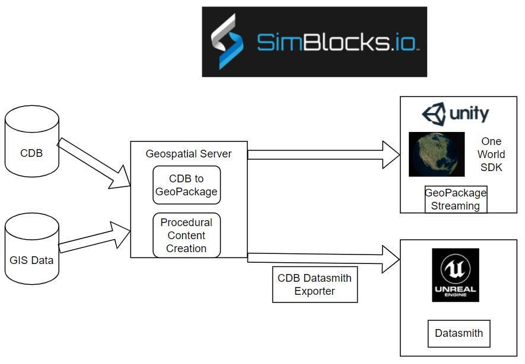

=== Proposed Activities

==== Batch Data Conversion (Scenario 1B)

Prototype large scale batch conversion of CDB to GeoPackage and the conversion of OpenFlight models within CDB to glTF binary encodings within GeoPackage. The terrains and models will then be visualized within the Unity and Unreal game engines. Results from this effort may inform the next version of CDB. 

Prototype CDB conversion to GeoPackage containers as recommended by the 3D Geospatial Series Tech Sprint II –OGC CDB 2.0 held last year. In order to meet the timing goals and funding limitations of the Tech Sprint SimBlocks will incorporate this capability using an internally developed libraries for content conversion and creation. 

Define an xml structure that describes the GeoPackage structure to be created to allow varying packaging of the GeoPackage output from the CDB. Items such as tiling structure and layer content of the output GeoPackage files that are output as well as model formats stored. OpenFlight models will be read and stored as glTF buffers in GeoPackage. While the San Diego CDB will at least be supported in this effort, if other open CDB data stores are contributed for this Sprint they may be considered as well. 

Integrate with Unreal Engine through a SimBlocks developed CDB Runtime Publisher SDK as a part of its capabilities to support CDB in Unreal Engine.

Integrate with Unity. SimBlocks will integrate the loading of GeoPackage on top of the One World SDK for Unity to enable visualizing geospecific 3D content on top of a world-wide base terrain. 

==== Scenario 3

Leverage a procedural city generation capability that SimBlocks has developed to quick create 3D content from source data including imagery, elevation, and building footprints. 

Proposes to add transportation elements procedurally to this database using additional openly available and sharable data sources which will then be added to the GeoPackage. 

The current SimBlocks generation tool has focused on geotypical and geospecific 3D buildings. SimBlocks will enhance the tool to support transportation features to support traffic simulation on roads and rails. As well as, use several 3D entity models representing cars, trucks, trains, and aircraft in a real-time traffic simulation and explain how articulations and animations are supported in the models. SimBlocks preference will be to use existing OpenFlight models. Additionally, there will be integration of historical flight information to show an aircraft flying over the city.

=== Accomplishments

SimBlocks accomplished much of but not all of the planned goals.

1. Conversion of CDB content into GeoPackage keeping OpenFlight Models.

2. Conversion of CDB content into GeoPackage using glTF binary as model format.

3. 3d content creation directly into GeoPackage using glTF binary as the model format.

4. Capture performance metric of format choices using OSG software.

5. GeoPackage playback using the Unity Game Engine.

6. GeoPackage content conversion into Unreal Engine.

7. The SimBlocks team now has a much better understanding of glTF.

8. Utilize Unity’s “Advanced” Mesh API for better runtime performance.

9. Major software upgrade to improve support for CDB and GeoPackage in Unity.

==== Austin in Unity
[#img_SimBlocks-2,reftext='{figure-caption} {counter:figure-num}']
.These images show three cities (Austin, Paris, and San Diego) rendered in three different rendering engines (Unity, Unreal Engine, and OpenSceneGraph). This first image is Austin showing in Unity.
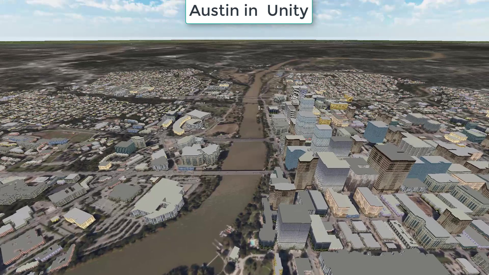

==== Paris in Unity
[#img_SimBlocks-3,reftext='{figure-caption} {counter:figure-num}']
.The second image is Paris in Unity.
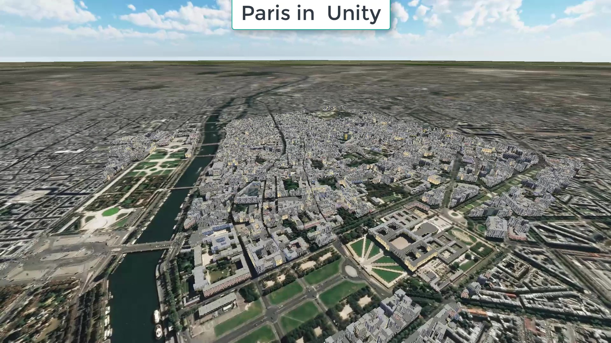

==== Austin in Unreal
[#img_SimBlocks-4,reftext='{figure-caption} {counter:figure-num}']
.The next two images were rendered with the Unreal Engine. This one is Austin.
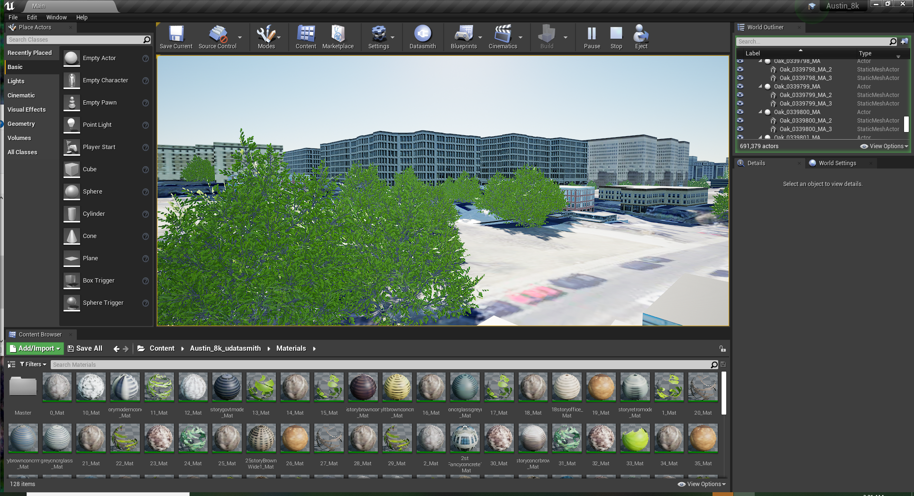

==== San Diego in Unreal
[#img_SimBlocks-5,reftext='{figure-caption} {counter:figure-num}']
.The penultimate image of this set is San Diego rendered in Unreal Engine.
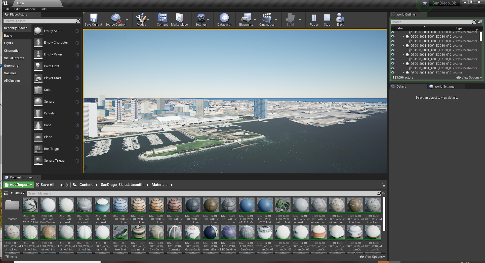

==== San Diego GeoPackage in OpenSceneGraph
[#img_SimBlocks-6,reftext='{figure-caption} {counter:figure-num}']
.OpenceneGraphi was also used to render downtown San Diego and Coronado Bridge.
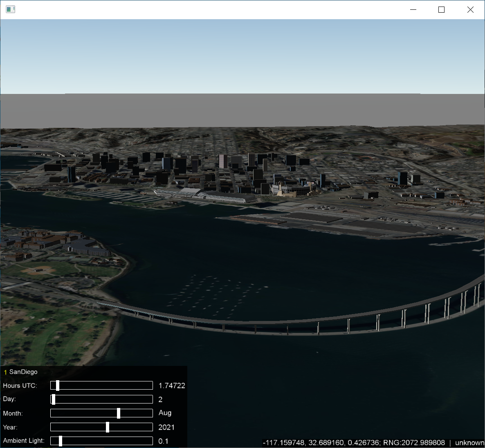

=== Methodology
==== Converting CDB into GeoPackage with OpenFlight Models
===== GeoPackage Structure Overview

The GeoPackage output created from CDB under this topic can represent either GeoPackage tiles created relative to a CDB Level of Detail’s (LOD) tiling structure or generated around some arbitrary bounds that cover an Area of Interest (AOI). In this structure if it is tiled based on a CDB’s level of detail the CDB LOD chosen selects the tiling structure for the GeoPackage Tiles coverage. All levels of detail contained within a CDB are written to the GeoPackage tile that covers the content area of the GeoPackage. For example, using the San Diego CDB (see **Appendix C**) US R6 represents the LOD level 3 data which covers the San Diego Harbor and Coronado Bridge.

[#img_SimBlocks-7,reftext='{figure-caption} {counter:figure-num}']
.San Diego CDB LOD 3 Image Tile U5 R6 is shown. The tiles extents are from Latitude 32.625 to 32.75 and Longitude -117.125 to -117.25.
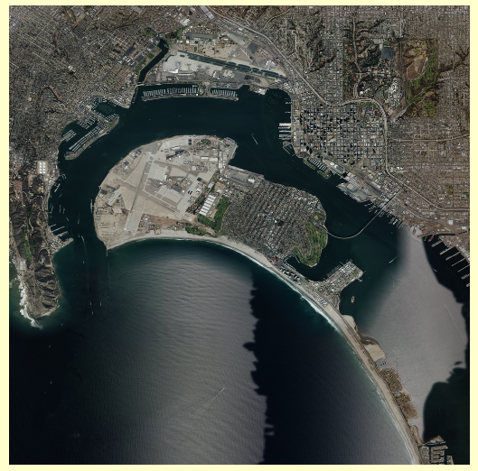

===== CDB Imagery Layer
When examining the San Diego CDB the highest resolution imagery found in the coverage for this tile is LOD 9. The sample spacing for LOD 9 of CDB at latitude 32 deg. is ~0.2173 m per pixel (1.9073e-6 Deg.). This gives us a raster size of 65536 x 65536 (64 LOD 9 tiles) which is written to the GeoPackage into the layer Imagery_S001_T001 at the CDB LOD 9 resolution.

===== CDB Elevation Layer
When examining the elevation content in the CDB for the highest resolution it is seen that the highest resolution coverage is CDB LOD 7. The sample spacing for LOD 7 of this CDB at 32.0 degrees North is 0.8493 m per pixel (7.6294e-6 degrees). This gives us a raster image size of 16384 x 16384 (16 LOD 7 tiles) which is written to the GeoPackage into the layer Elevation_S001_T001 at the CDB LOD 7 resolution.

===== CDB GeoSpecific Model Layers
The GeoSpecific model layers considered in this sprint were the 100_GSFeature and 300_GSModelGeometry layers. For the 101_GSFeature layer the contents of each LOD contained by the area represented by the GeoPackage tile were written as a layer into the GeoPackage. The CDB model layers as referenced in the San Diego GeoPackage use an instance dataset and a class dataset (i.e., files) containing S001_T001 in this layer refer to the instance parameters while files containing S001_T002 contain the class reference information for the entries in the instance layer. The class layer information is referenced using value contained the string attribute CNAM. In this experiment instance and class information were merged, creating an instance layer with both the instance and class attributes. In the image below the vector layers for both the GeoSpecific and GeoTypical model layers are shown. Model instances that reside in LOD layers less than 0 have been included in the LOD 0 layers. Layers 100_GSFeature_…L00 through 100_GSFeatue …L04 and 300_GSModelGeometry…_L00 through 300_GSModelGeometry…L04 contain the models and model references for the GeoPackage tile respectivly. The 300_GSModelGeometry layers contain the tiled model geometry for the CDB Tiles represented as zip archives and are written into the GeoPackage with a mime type of application-zip. The access to the 300_GSModelGeometry layer uses the CDB U and R numbers of the corresponding CDB tile data in the SQL query to read the model tile zip fie. This also places the requirement on the software accessing the reference information to query the layer using the geospatial extents of the CDB tile being referenced.

[#img_SimBlocks-8,reftext='{figure-caption} {counter:figure-num}']
.GeoSpecific and GeoTypical Model layers shown in the tiled GeoPackage
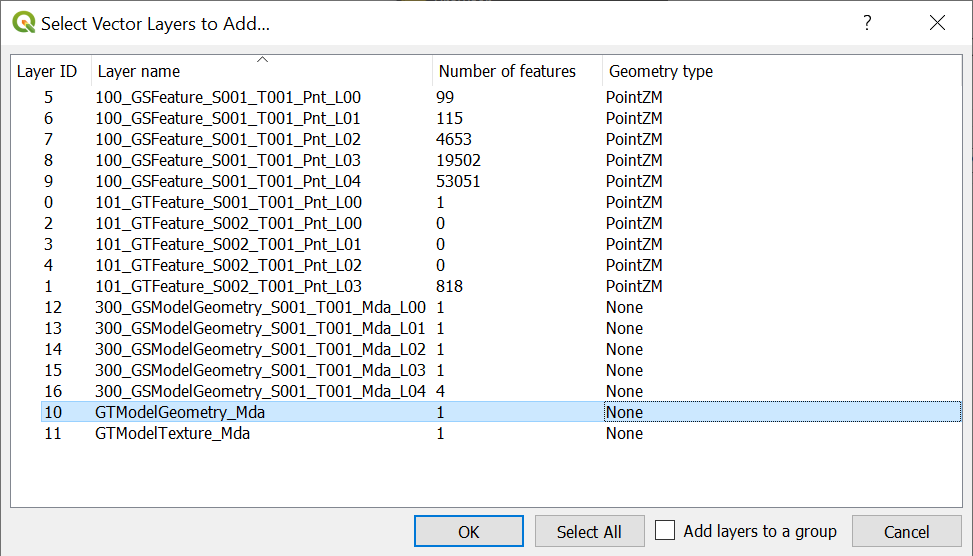

===== CDB GeoTypical Model Layers
The GeoTypical model references (101_GTFeature) are handled similarly to the GeoSpecific model references are represented in layers 101_GTFeature…L00 through 101_GTFeature…L03 in the figure above. The model geometry for the GeoTypical models resides in the GTModelGeometry_Mda layer in a zip archive file structure that follows the CDB GTModels structure starting at the 500_GTModelGeomtry level. The textures for the OpenFlight models used are stored in the GTModelTexture_Mda layer. This includes both the textures for both GeoTypical and GeoSpecific models for this database since the 301_GSModelTexture layer was not used for the San Diego CDB.

===== Creation Process
Software routines were added to the SimBlocks Content Creation application allowing for selection of CDB and output areas for incorporation into GeoPackage tiles. This Application uses library functionally from the open source osgEarth / OpenSceneGraph that have CDB support added that is referenced below.

 

===== File Counts
The San Diego CDB contained 25,461 files and 757 folders space on disk listed as 37.3GB. A targeted area GeoPackage file represents one file. A tiled GeoPackage set requires one file for each tile of each LOD down to the GeoPackage tile LOD for the xml reference files and one GeoPackage file at the target LOD. For a CDB using LOD3 for the GeoPackage tiling this would be 149 files and 85 folders.

===== Performance
Open source versions of osgEarth and OpenSceneGraph software were used to directly visualize CDB and record metrics on data load times. 

=== Converting CDB into GeoPackage with Models Converted to Binary glTF
 
==== GeoPackage Structure Overview
===== Imagery and Elevation
The imagery and elevation in these files is exactly as described above in Converting CDB into GeoPackage with OpenFlight Models.

===== CDB GeoSpecific Model Layers
The Geospecific layer names used when converting the CDB OpenFlight Models to glTF Binary representations are the same as in the OpenFlight version, however the process of writing the models into the 300_GSModelGeometry layers varies in that for each individual model a unique integer key is generated, the model is written into the layer using the model/gltf-binary mime type, and the key is recorded in the models reference (instance layer) as and attributed value. All models were written into their respective 300_GSModelGeometry layers with textures embedded as JPEG images for opaque textures and as PNG for transparent textures.

===== CDB GeoTypical Model Layers
The GeoTypical layers created in this process were the 101_GTFeature… layers and the GTModelGeometry_Mda layer. As with the GeoSpecific Mode Layers each individual GeoTypical model is written into the GTModelGeometry_Mda with a unique integer key and the key value is recorded in the 101_GTFeatures as an attributed value.

[#img_SimBlocks-9,reftext='{figure-caption} {counter:figure-num}']
.GeoSpecific and GeoTypical Model Layers from Tiled GeoPackage using glTF Binary (.glb) model files.
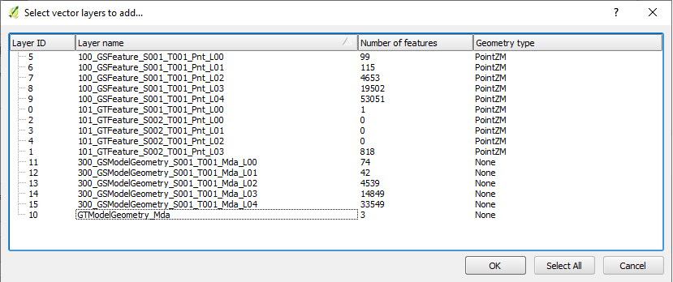

===== Creation Process
Software routines were added to the SimBlocks Content Creation application allowing for selection of CDB and output areas for incorporation into GeoPackage tiles while converting the 3d model content from OpenFlight to glTF models. The model conversion process was performed using libraries from the open source osgEarth / OpenSceneGraph libraries referenced above in this document. These were output as binary glTF files.

===== Lessons Leaned
The output capability for the glTF models is provided by an OpenSceneGraph (OSG) plugin provided in the osgEarth project. This project intern relies on the TinyGLTF project to perform the basic glTF (binary or JSON) reads and writes. While reading glTF, the data seemed to work fine, SimBlocks discovered and corrected several issues related to writing the glTF binary data. These fixes are present in the repositories referenced in the previous section.

===== File Counts
The file count issues vs CDB are the same as reference in the section Converting CDB into GeoPackage with OpenFlight Models.

===== File size
For the example GeoPackage Tile LOD3 U5 R6 required 2,390,364 KB of disk space with OpenFlight models while it took 34,583,256 KB of disk space with the glTF Binary files with embedded textures. This increased file size for the GeoPackage is a result of duplicating the texture content stored in the GTModels/GTModelTexture layer into many GLTF models as the San Diego CDB was created using only GeoTypical textures from this layer for both the GeoTypical and GeoSpecific models.

==== GeoPackage Content Creation (Austin, TX) for Unreal Engine and Unity
An area around Austin TX was created to demonstrate the ability to create unified content in GeoPackage dataset that can be applied in both the Unity and Unreal game engines. Austin TX was selected for its rather rich GIS environment that is publicly available.

===== Imagery
The imagery information that was originally downloaded from City of Austin's GIS sight is from the CapArea Imagery 2019 dataset can now be found on the https://data.tnris.org/collection/f84442b8-ac2a-4708-b5c0-9d15515f4483[Texas Natural Resources Information System].

[#img_SimBlocks-10,reftext='{figure-caption} {counter:figure-num}']
.City of Austin, Texas map showing 6-inch GSD imagery coverage.
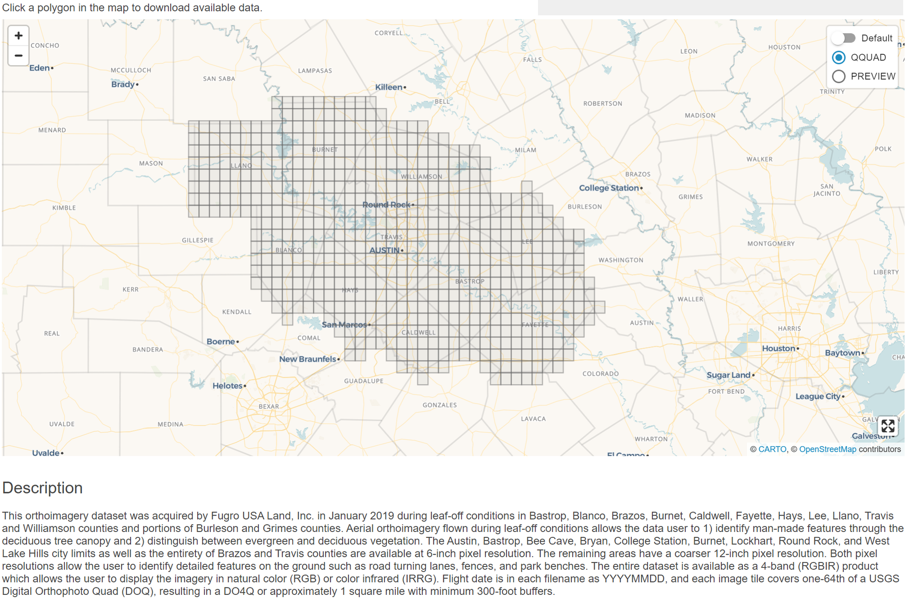

While SimBlocks originally downloaded Jpeg 2k tiles from the Cities GIS page, TRNS now also provides the data as a https://imagery.tnris.org/server/services/StratMap/StratMap19_NCCIR_CapArea/ImageServer/WMSServer[Web Map Service (WMS)].

===== Elevation
Elevation for the area was pulled from USGS via the https://apps.nationalmap.gov/downloader/#/[Download server].

[#img_SimBlocks-11,reftext='{figure-caption} {counter:figure-num}']
.The 1-meter elevation coverage in the Austin region is shown here.
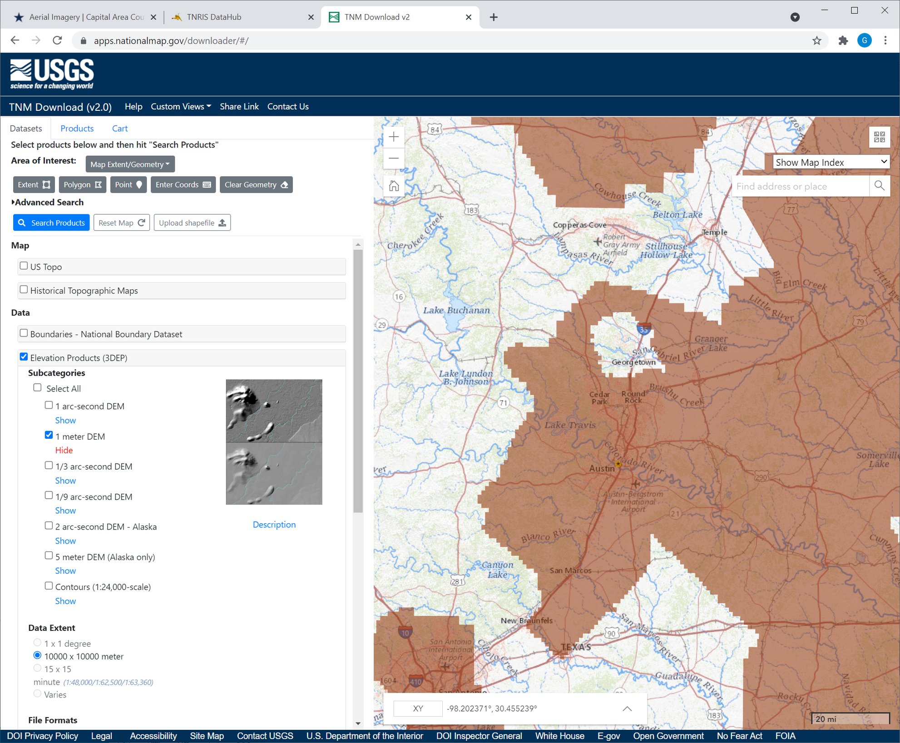

The data used for Austin was pulled from the USGS Web Coverage Service (WCS) found at https://elevation.nationalmap.gov/arcgis/services/3DEPElevation/ImageServer/WCSServer (Note: The Timeout setting for this site had to be increased to 60 seconds to prevent timeout errors during initialization and download)

[NOTE]
._Link Error_
===================
This link returns a 404. Either refer to the Download server (above image) or fix the link. It is also necessary to descibe which timeout. Is it a browser setting or something else? In my case, the response was so fast that I don't think any timeout change would matter. It would be better to make a "Note" this way rather than in-line in the text.
===================

===== Building Footprint information
The main portal for https://austintexas.gov/department/gis-data[Austin’s GIS data] contain links to all of the geographic data available. The Building footprint information can be found in the city's https://austintexas.app.box.com/s/8ah8itbha7u6lis9eipypnz5ljvwta4t[Box account]. The building footprint file is _building_footprints_2019.gdb.zip_. This file contains accurate building footprints that match the 2019 imagery layer with height information for each building.

===== Tree Location Information
The City of Austin maintains a tree inventory of trees within its geographical limits. The data is delivered as a https://data.austintexas.gov/Locations-and-Maps/Tree-Inventory/wrik-xasw[CSV file] and contains location, species, and truck diameter information.

The National Geospatial Intelligence Agency provides open US Cities data from its Geospatial Repository and Data Management System (GRiD). The system may be found here: https://grid.nga.mil/grid . One of the datasets available from the US Cities is a tree locations dataset. This dataset also contains the point location of the tress as well as tree height information for each tree in the dataset. This data was downloaded for the Austin area as a GeoPackage dataset.

===== GeoPackage Creation Process
The SimBlocks Content Creation tool was used to process the Imagery (6in GSD) and Elevation (1m GSD) information into a selected area.
 

===== For Unreal Engine Imagery and Elevation
The size of the area was set according the https://docs.unrealengine.com/4.26/en-US/BuildingWorlds/Landscape/TechnicalGuide/[Unreal Landscape requirements]. For the Austin area 4033x4033 and 8129x8129 were utilized. 

[NOTE]
.Unreal Engine Requirement
===================
These sizes are for the Elevation Grid and in this dataset Imagery raster sizes are paired to this dataset based on https://docs.unrealengine.com/4.26/en-US/RenderingAndGraphics/VirtualTexturing/Streaming/[Unreal’s UDIM requirements].
===================

SimBlocks used a maximum individual texture size of 8192x8192 and in the 4033x4033 landscape this resulted in 4x4 UDIM texture set. (i.e., sixteen 8192x8192 image tiles covering the 4033x4033 elevation coverage). For the 8129x8129 case it also resulted in a 4x4 UDIM texture set.
 

===== For Unity Imagery and Elevation
The Unity system does not place the same constraints on us regarding elevation post size. For convenience however, with this effort the same elevation sizes were used. The image layer for unity was written as a single raster layer at the 6in GSD. This resulted in an image raster of 26499x26499 for the 4033x4033 elevation grid. For the 8129x8129 elevation grid an image raster of 53413x53413 was utilized.

===== 3D Building Geometry (both Unreal and Unity)
For the area being created the Content Creation Software creates a 3D model in memory using the polygonal information provided from the Building Footprint information. The models were written to the GSModels Layer creating an integer unique key for the reference and the Location information was written to the GSModelReferences Layer as a point feature with the unique key added to the attribute table.
 

===== 3D Tree Features
Within the SimBlocks Content Creation tool a process was created to merge the content from the City of Austin tree inventory with the NGA GRiD tree information. The NGA GRiD information contains a broader area then the cities data. For each match found in the datasets the NGA data was updated with the cities species data and trunk diameter info. If no match was found the species field was set to “default”. This file was then used to create a mapping from each individual species found in the data to a tree species in the SimBlocks tree library. Once the mapping was set the GeoPackage creation process used the resulting data to place a model reference in the GTModelReference Layer of the output GeoPackage and storing one instance of each tree model mapped in the GTModels table.

=== Performance Metrics

[#img_SimBlocks-12,reftext='{figure-caption} {counter:figure-num}']
.The number of buildings loaded vs. the total load time shown for varying numbers of threads.
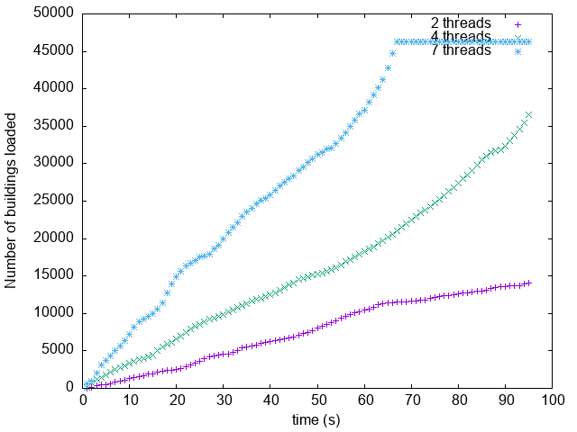

The above graph shows the number of buildings loaded vs the time in seconds when using 2, 4 and 7 threads. Not shown is how much time it would have taken for a single thread in debug mode. Debug mode was tremendously slower than release. A single area took 7 minutes to load and since it was loading on the main thread, the screen was frozen. There is a noticeable difference between 7 threads and 2 threads, imagine what 12 threads would be like.

The program is quite simple. When the One World SDK visits an area, it sends the geodetic extents to the plugin and puts it on a stack and notifies a sleeping thread that it has a task to do. The woken thread queries GeoPackage; and if it finds models there, it then generates a “Work” structure. The thread then puts it on a queue and wakens N-1 threads to start converting these models. The thread that is processing the last building in the chunk, then takes all the buildings and batches them together and then converts them to graphics buffers and puts it on a queue. The main thread will call an Update function that checks this queue and then converts this to a Unity mesh. The thread will then take the next “Work” structure and process that as described above. The program takes around 7 gigabytes once all buildings are loaded.

SimBlocks investigated time performance by measuring the time taken to do the various steps described above. It was found that the C++ plugin consumes around 50% of the processing time with 95% of that time used by TinyGLTF loading strings. Surprisingly, more time is spent in deleting the glTF models than actually batching them together at runtime. Only a tiny fraction (less than 1%) is spent querying the models from the GeoPackage. Clearly, the bottleneck is TinyGLTF. 19% of the time spent in TinyGLTF is in parsing image data. This can be reduced to nearly zero by sharing the images between models. Apart from the glTF loading from string, the other reason TinyGLTF may be slow is that the models are read from a magnetic disk.

=== Created / Converted Content in Unreal Engine 4.26.1
The export process to Unreal Engine utilizes the SimBlocks content creation tool's Datasmith transformation capability to convert the GeoPackage contents into forms that the Unreal Engine editor can consume. Keeping in mind that the GeoPackage raster and elevation are as described in the For Unreal Engine Imagery and Elevation section above. In this process the elevation and imagery tiles are extracted from the GeoPackage and rotated 90 degrees. The elevation in the GeoPackage is stored as 32-bit floating point datum. In its scaling to the 16 bit PNG required by Unreal. In this mapping 0 is mapped to 32768 and min to max elevation values are scaled from 32768 to 65536. Each Image raster is rotated 90 deg. as it is converted to 8 bit PNG raster images. An Unreal Datasmith output is then created describing the geometry of all 3d content in the GeoPackage file. The directory structure below shows the export of the Austin 8129x8129 output. The output Datasmith xml files are in the Datasmith subdirectory.

[NOTE]
._Bad Sentence_
===============================================
Half-way through the above paragraph the "sentence": "In its scaling to the 16 bit PNG required by Unreal." is not a complete sentence. It also does not make sense relative to the material before it. The text either needs to be removed or corrected.
===============================================

[#img_SimBlocks-13,reftext='{figure-caption} {counter:figure-num}']
.Windows Explorer shows the files exported by Unreal Datasmith.
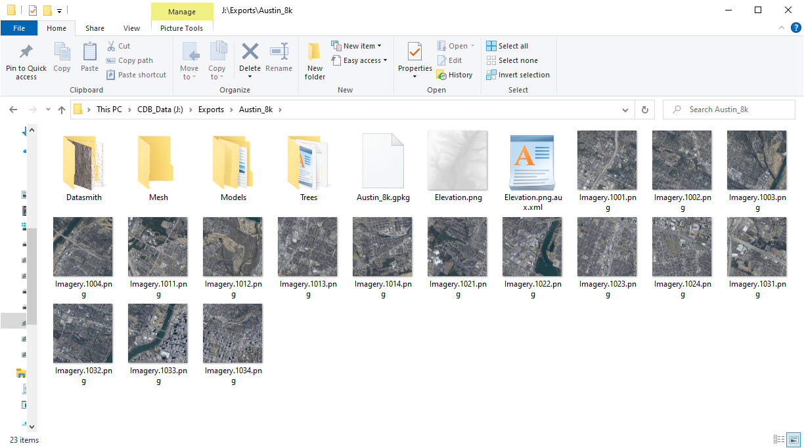

==== Importation of the Datasmith output into Unreal
Once the Datasmith export process completed the Unreal Engine Editor is used to import the data and covert it to native Unreal assets. To do this the user presses the Datasmith button on the Top of the Application window and navigates to the .udatasmith file in the Datasmith directory shown in the graphic below.

[#img_SimBlocks-14,reftext='{figure-caption} {counter:figure-num}']
.Datasmith import into Unreal Engine 4.26.1 is shown in this render.
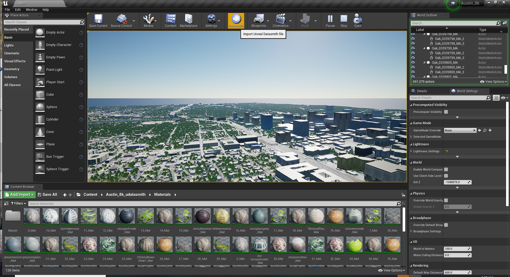

=== Technical Challenges
==== OpenSceneGraph glTF Creation

===== Issues with glTF creation in the osg software being used for conversion.

* The unexpected issues encountered in creating glTF could be considered and gap in technical capabilities.

* This gap was address by correcting the issues and publishing the updates.

 
[SanDiego-CDB-Issues]
===== Tile content issues in the San Diego CDB

* Tile Model Geometry limits exceeded

* Tile Model Reference counts exceeded

 
[Unity-Development-Issues]
===== C++\CLI Integration with Unity

* SimBlocks software development team evaluated if using a C++\CLI interface on top of some C++ code to call the functions from C#; however after some testing it was determined this would not be possible with Unity as the engine does not allow loading managed C++ modules.

* As an alternative, using other ways to interoperate between C++ and C# was successful.

 

===== Debugging External DLLs in Unity

* When a Plugin loads an external DLL, Unity will enter into an unstable state, making the Editor unusable. A workaround was to build the standalone player, which makes debugging more difficult.

===== Texture flickering, mipmap issues.

* Some texture flickering is noticeable, and SimBlocks team is currently investigating a mipmap solution.

=== Future Work
* Showing transportation elements is still an outstanding task.

* Reduce GeoPackage size by sharing textures between models

* Reduce GeoPackage size and loading time by using DXT/hardware texture compression

* Improve Unity rendering performance by batching models and sharing materials and textures

