== Component Implementation: Steinbeis

=== Overview

In this ISG2 Sprint, the Steinbeis team developed various data visualization clients, including Unreal Engine, Unity 3D, web client, and smartphone fetching the 3D data from the GeoVolume server. We used the 3D building models of the University of Applied Sciences Stuttgart (HFT Stuttgart) and its surrounding area as a use-case. These have been modeled with interiors and are available in different formats such as skp or x3d. From there, they can be converted to gltf/glb or 3D Tiles. We also integrate measurements of the CO2 concentration inside the rooms. These measurements come from the Sensors placed in rooms that are managed with the SensorThings API.

Moreover, the dynamic data from the moving sensors from different types of vehicles were integrated into our visualization clients. They can access and render these datasets from SensorThings to simulate 3D urban mobility. The dynamic moving data such as taxi, air-taxi movement, e-bike movement was managed and delivered through the OGC SensorThings API standard. At the same time, the concept and implementation used the GeoVolumes API for managing the 3D geospatial resources. 

The overall system architecture of Steinbeis's implementation is illustrated in <<Steinbeis_systemArchitecture>>.

[#Steinbeis_systemArchitecture,reftext='{figure-caption} {counter:figure-num}']
.The overall system achitecture of Steinbeis's implementation.
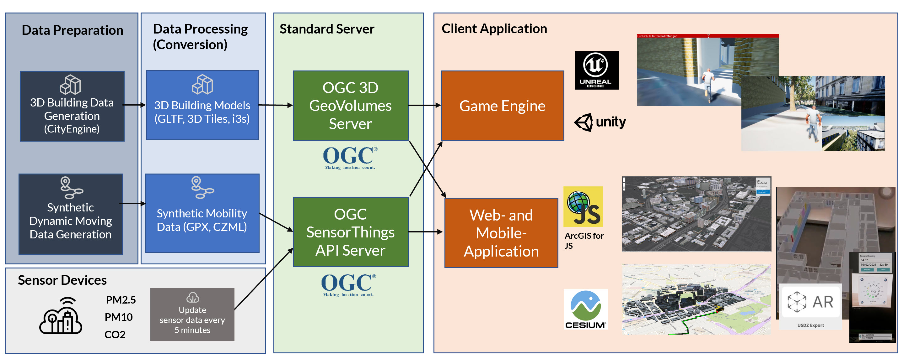

=== Server Side
==== GeoVolumes Server

In the OGC ISG Sprint Year 1 (https://www.ogc.org/projects/initiatives/isg-sprint-yr1), Steinbeis successfully implemented a GeoVolumes API server to deliver 3D geospatial resources supporting 3D Tiles, I3S, and Terrain available at http://steinbeis-3dps.eu/3DGeoVolumes. The data of this server was including New York City and San Diego. In this OGC ISG Sprint Year 2, we expanded the GeoVolumes server with the data around the HFT Stuttgart area, Germany and organized the 3D content in this GeoVolumes server by the usage of the data in the client as follows:

[upperroman]
. 3D model of HFT Stuttgart building in LoD-4.
. 3D building models for the surrounding area of the HFT Stuttgart in LoD-1.
. The combined models of I. and II.

The GeoVolumes server collections can be rendered in `HTML` as shown in <<Steinbeis_GeoVolumes>> and can be accessed via https://steinbeis-3dps.eu/3DGeoVolumes/collections/?f=html. The same result in `JSON` format can be accessed via https://steinbeis-3dps.eu/3DGeoVolumes/collections/?f=json. 
[#Steinbeis_GeoVolumes,reftext='{figure-caption} {counter:figure-num}']
.Steinbeis GeoVolumes Server.
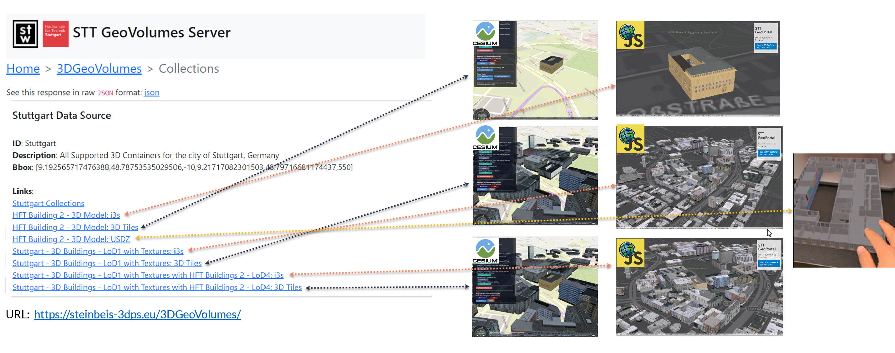

==== SensorThings Server

In this sprint, two SensorThings servers are developed to manage the environmental data (e.g. CO2, PM2.5, and PM10) from the sensors around the HFT Stuttgart area and the mobility routes around the Stuttgart area. Both servers can be accessed via http://193.196.138.56/frost-luftdata-api/ and http://193.196.138.56/sta-isg-sprint/ respectively.

The data modeling of the SensorThings API server for air quality data is shown in <<Steinbeis_STA_air>>. In this server, when the sensor system is attached to the building which existed in the CityGML model, the `gml_id` of the related CityGML object can be linked and stored in the SensorThings' Thing entity. This concept is called CityThings (https://doi.org/10.1177/2399808320983000)

[#Steinbeis_STA_air,reftext='{figure-caption} {counter:figure-num}']
.Steinbeis SensorThings API Server for Air quality sensors.
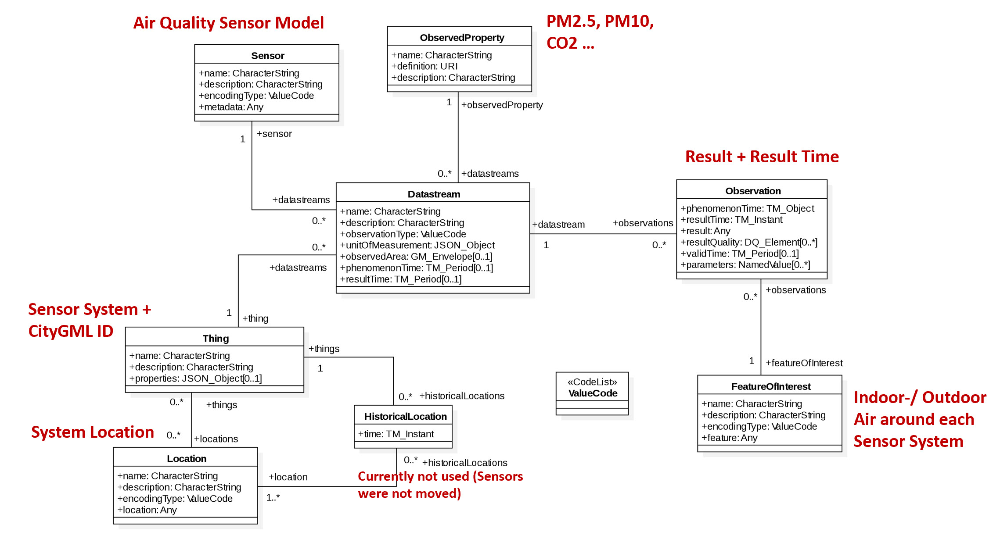

The data modeling of the SensorThings API server for mobility routes is shown in <<Steinbeis_STA>>. In this server, the SensorThings Location and HistoricalLocation entity are used for managing the route data of each vehicle. In this sprint, we used it to visualize synthetic ebike and air taxi routes in Stuttgart city.

[#Steinbeis_STA,reftext='{figure-caption} {counter:figure-num}']
.Steinbeis SensorThings API Server for Mobility routes.
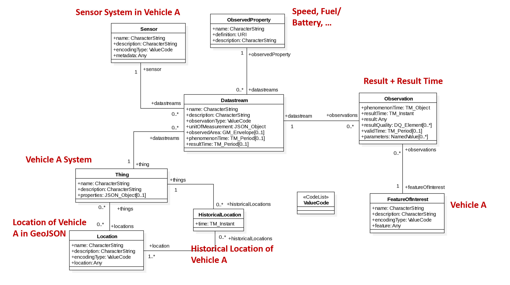

==== 3D Building Data Generation

As mentioned above, three types of 3D building datasets were used for the OGC ISG sprint year 2.
[upperroman]
. 3D model of HFT Stuttgart building in LoD-4.
+
The 3D model of HFT Stuttgart building 2 in LoD-4 is originally available in Trimble Sketchup (skp) format. For its use in the ISG sprint, data conversion from skp to glTF was done using Feature Manipulation Engine (FME).
[#skp_gltf,reftext='{figure-caption} {counter:figure-num}']
.Trimble Sketchup to glTF using FME.
image::images/Steinbeis/skp2gltf.jpg[width=800,align="center"]
The glTF output was produced in version 2.0 as a single binary file (glb). For its later use in ArcGIS CityEngine, the glTF model was imported using CityEngine’s inbuilt glTF importer.
[#gltf_cityengine,reftext='{figure-caption} {counter:figure-num}']
.glTF model of HFT Stuttgart building imported in ArcGIS CityEngine.
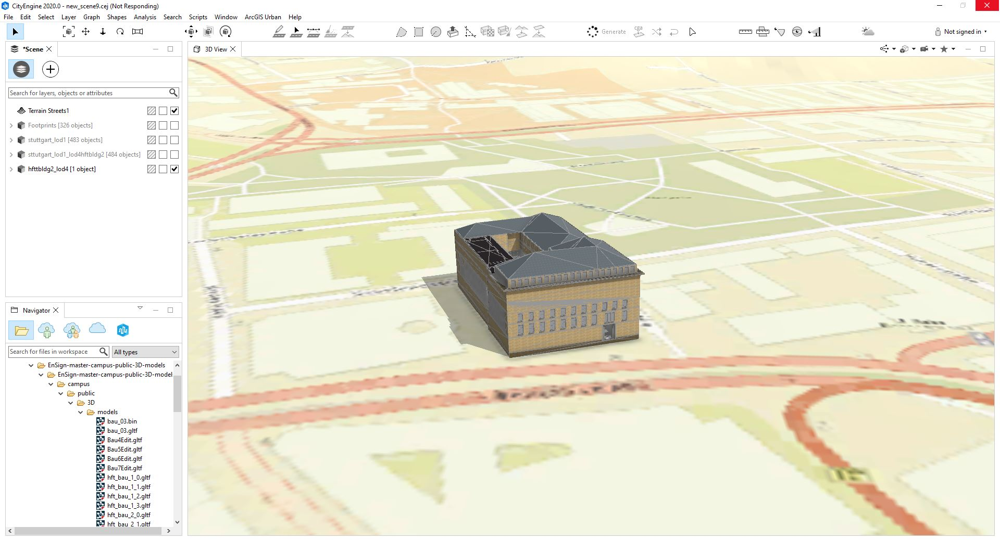
The output glTF file was found to be with incorrect surface normals in some parts of the model. Further investigation found that the surface normals were preserved if the same model was converted to COLLADA (dae) using Trimble Sketchup’s built-in COLLADA exporter. This issue was further confirmed by Ecere, who collaborated with the Steinbeis team to integrate the LoD-4 model of HFT Stuttgart within their visualization library / VR / AR applications and CDB X GeoPackage prototype producer. Further to investigate the issue, different glTF exporters such as the freely available glTF exporter plugin of Trimble Sketchup from https://extensions.sketchup.com/extension/052071e5-6c19-4f02-a7e8-fcfcc28a2fd8/gltf-exporter and CityEngine’s built-in glTF exporter was used. Unfortunately, each tool produced different glTF output in terms of data quality. Hence together with Ecere, a joint recommendation to improve the glTF data conversion pipeline from commonly used data formats such as Trimble Sketchup (skp), COLLADA (dae), 3D multipatch shapefiles/FileGeodatabase (shp, FileGDB) is suggested. For the moment, the incorrect surface normals from few parts of the original model were manually fixed for the use case development.
. 3D building models for the surrounding area of the HFT Stuttgart in LoD-1.
+
To generate 3D buildings around the HFT Stuttgart building, CityEngine’s built-in connection to Open Street Map (OSM) was used. First, the building footprints of the neighbouring buildings were fetched from the OSM dataset. These building footprints were then extruded to LOD-1 building models with generic textures using CityEngine’s built-in shape grammar rule file of Building_From_OpenStreetMap.cga.
[#lod1_cityengine,reftext='{figure-caption} {counter:figure-num}']
.3D building models in LOD-1 with generic textures using ArcGIS CityEngine.
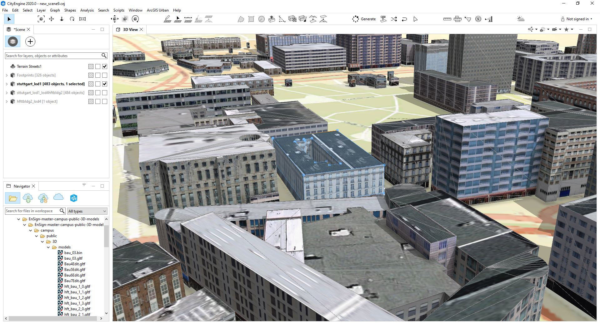

. The combined models of I. and II. 
+
For the combined used on the client side, both models I and II were merged inside CityEngine. The LOD-1 model of the HFT Stuttgart building was replaced with the imported LOD-4 glTF model.
[#lod1lod4_cityengine,reftext='{figure-caption} {counter:figure-num}']
.LOD-4 building model of HFT Stuttgart surrounded by LOD-1 building models in ArcGIS CityEngine.
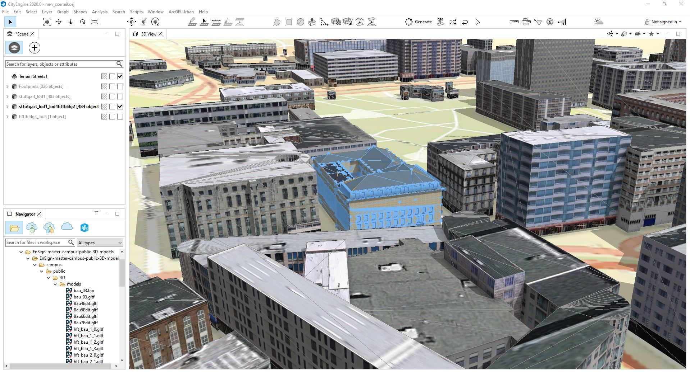
To preserver the georeferenced coordinates and textures, the combined model was exported to FileGDB. Using ArcGIS Pro and FME, FileGDB was converted to Scene Layer Package (slpk – i3s) and 3D Tiles respectively.
The overall data conversion flow diagram is illustrated in <<dataconversion_ISG>>.
[#dataconversion_ISG,reftext='{figure-caption} {counter:figure-num}']
.Data conversion pipeline from ArcGIS CityEngine to I3S and 3D Tiles .
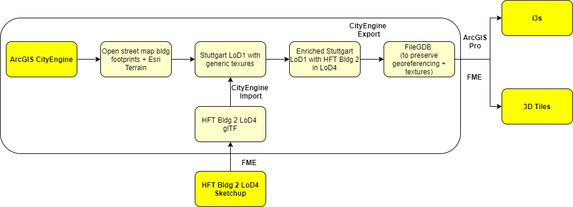

=== Client Side

The Focus of the Client side is to provide an overview of the compatibility between the different standards.
On the Frontend, different Tools were used for the visualization. CesiumJS and the ArcGIS Client are Javascript-based libraries for Web-Visualization.
Unreal Engine and Unity are Game Engines that allow for the creation of applications in the field of desktop games, as well as AR and VR applications. The Android Augmented Reality column is an application developed with Unreal Engine. In the iOS Augmented Reality application, the native tool in the Apple iOS devices is used to visualize 3D and AR content without having to download special apps.

Showing Overview with the Matrix table and explain each block. 

[#compatibleMatrix,reftext='{figure-caption} {counter:figure-num}']
.Steinbeis compatible matrix between client (coloumn) and server provider (row).
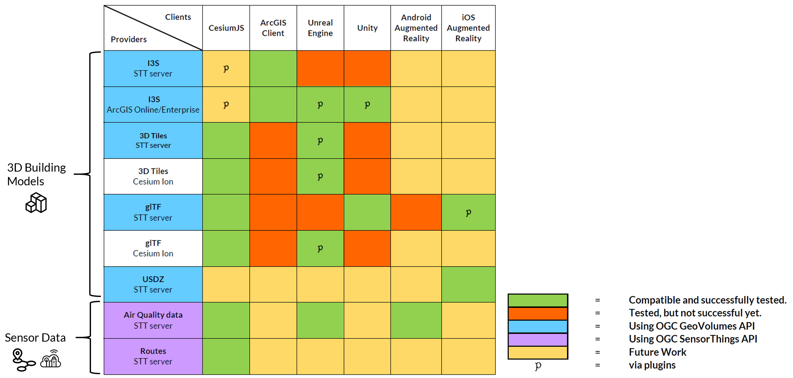

==== Game Engine
===== Unreal Engine
The Unreal Engine 4 developed by Epic Games (https://www.unrealengine.com/en-US/) was used in this sprint to test out the compatibility with the different datasets and the different methods of providing them.
For this use case, a third-person project was set up in the developer environment. To access the data, plugins were used. These are provided in the Epic Games Store Marketplace. 

- Unreal + 3D Tiles

3D Tiles are a Standard for 3D Data Streaming supported by the OGC and developed by Cesium. To access a 3D Tiles Dataset in UE4, Cesium developed a plugin called "Cesium for Unreal". The main function of the Plugin is to load assets from Cesium Ion, such as the Cesium Terrain, into the game world. Since the Plugin was designed to load 3D Tiles from Cesium Ion, the process is straightforward. Only the Asset ID and the key are required.
But it also opens the door for loading datasets in different ways. Since a recent update, the process for this is made more accessible since it has an option to switch between the Asset ID & Key and a URL field. The URL can point to a 3D Tileset from a Geovolumes Server. This was successfully tested with an implementation of the Geovolumes Server on a Steinbeis Server. 

https://steinbeis-3dps.eu/3DGeoVolumes/collections/Stuttgart/Stuttgart_3DBuildings_LoD1_HfTLoD4_unreal/tileset.c4u.json

Aside from that, it also allows to loading 3D Tiles from a local Source. For that purpose, the URL field has to be used and point to a location on a local drive. To indicate that the URL has to start with the file:/// prefix. 

[#systemArchitecture,reftext='{figure-caption} {counter:figure-num}']
.Unreal Engine: Loading 3D Tiles from GeoVolumes Server.
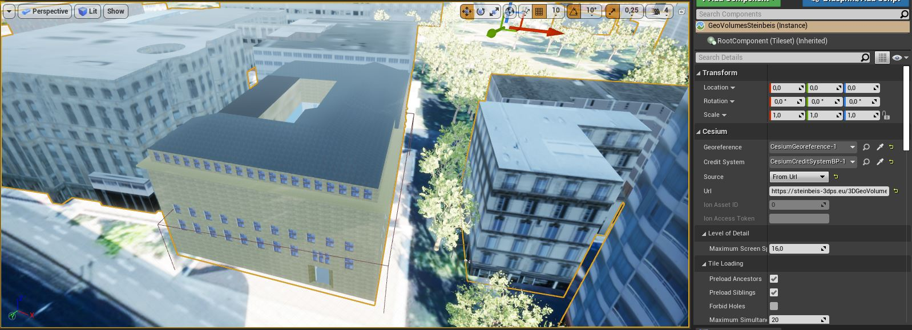

One issue to load 3D Tiles into Unreal Engine is that the coordinate system needs to be in line with how Unreal works. Because the test dataset didn't fit these requirements, it needed to be converted. An https://github.com/tomap-app/rtcCenter2transform[Open Source Tool^] (the PLATEAU project) is available to convert 3D Tiles into RTC (Relative to Center) format. The conversion is also indicated in the URL with the c4u ending generated by the conversion tool. A first effort to host this tool on a server for on-the-fly conversion failed but, with further investigation, seems plausible. This would be a great addition to the GeoVolumes Server because the tilesets wouldn't have to be hosted in two different formats (RTC and regular Coordinates) but instead could be converted on the fly and accessed through additions in the URL.

.RTC Conversion 3DTiles
|===
|Before Conversion |After Conversion

a|
[source,json]

"boundingVolume" : {
	    "box" : [ 
		  4157169.143514174, 
		  671422.7367559096, 
		  4774754.532228447, 
		  846.1180383828469, 
		  0, 
		  0, 
		  0, 
		  983.3672450176673, 
		  0, 
		  0, 
		  0, 
		  703.838994808495
	       ]
	   }

a|
[source,json]
----
"boundingVolume": {
            "box": [
                -3.955821495503187,
                -1.57150904845912,
                0,
                846.1180383828469,
                0,
                0,
                0,
                983.3672450176673,
                0,
                0,
                0,
                703.838994808495
            ]
        }
----

|===

- Unreal + I3s

To use I3s Tiles in Unreal Engine 4, the "ArcGIS Maps SDK for Unreal Engine" is needed. It is in beta and can be downloaded from the https://earlyadopter.esri.com/key/ArcGISforGameEngines[Esri Early Adopter^] site. It currently cannot be downloaded from within the Epic Games Marketplace. 
To use the plugin, it needs to be placed in the plugins folder of an Unreal Engine C{plus}{plus} Project. Upon installing it, a message shows that the plugin is developed for Unreal Engine version 4.25, which is the previous release of the UE. The plugin then provides a graphical user interface and possibilities over C++ programming to add I3s to the game world. They can be managed as Layers.

[#systemArchitecture,reftext='{figure-caption} {counter:figure-num}']
.Unreal Engine: Interface ArcGIS Maps SDK for Unreal Engine.
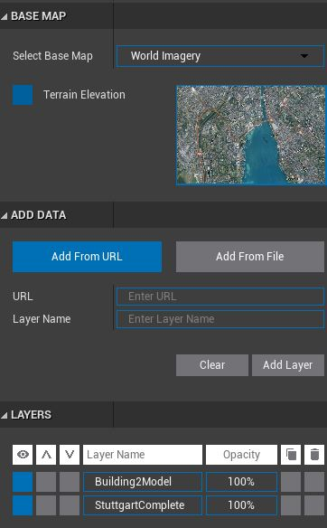

[#unreal_i3s,reftext='{figure-caption} {counter:figure-num}']
.Visualize i3s 3D models in Unreal Engine.
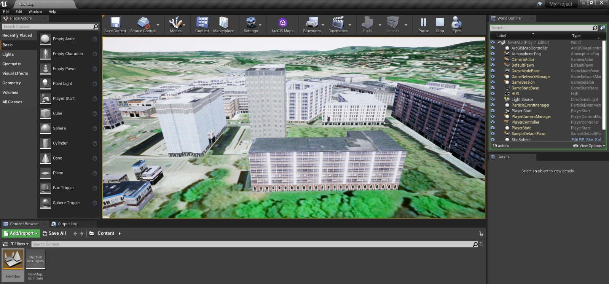

As shown in <<unreal_i3s>> and the compatibility matrix (<<compatibleMatrix>>), the streaming of the I3s from an ArcGIS server works with this solution.

To further investigate the interoperability between the Unreal Engine and the I3S format an I3S service was implemented based on the SLPK (Scene Layer Package) format, which is based on the I3S specification and realized as a compressed/portable version of an I3S file structure. The Steinbeis I3S service was implemented with Node.js and comprised all the endpoints necessary to access the I3S payloads: Node, Shared, Features, Geometries, Attributes, and Textures. Although the ArcGIS JavaScript Client was compatible with the Steinbeis I3S service, Unreal Engine wasn't able to fetch the payloads from our service. Since an API key is needed to access the I3S datasets hosted in the ArcGIS Enterprise Portal, Unreal Engine expected a portal item and not an I3S dataset hosted in a third-party server.

As of testing, there was no clear path on how to include I3s streamed from the Steinbeis server.

In comparison to the Cesium Plugin, it works differently and does not show directly in the Editor Window. This makes using it with things like a 3rd Person Pawn more difficult. Also, it requires a C{plus}{plus} project, whereas the Cesium plugin can also be used with a Blueprint Project.

- Unreal + GlTF

The possibility of including glTF Models into UE4 is given by multiple plugins such as the Datasmith Plugin, the glTFRuntime Plugin, and the glTF Exporter. The Datasmith and the glTF Exporter are published by Epic Games directly. In this sprint, the glTF Exporter has been tested with different glTF models. This is shown in the Compatibility Matrix. With this plugin, it is not possible to load glTF models from the Steinbeis Server into UE4.
In future work, it can be tested if glTF models can be loaded from Servers with glTFRuntime Plugin or over C++. 
There is a workaround to convert the gltf model in Cesium Ion to 3D Tiles and then use the model in Unreal Engine. This still allows for streaming the model over a Server, but the location has to be specified in Cesium Ion. Whereas if the model is imported via the glTF Exporter, it can be placed directly in the Unreal Engine viewer.

[#UnrealGlTF,reftext='{figure-caption} {counter:figure-num}']
.Local glTF Model in Unreal Engine.
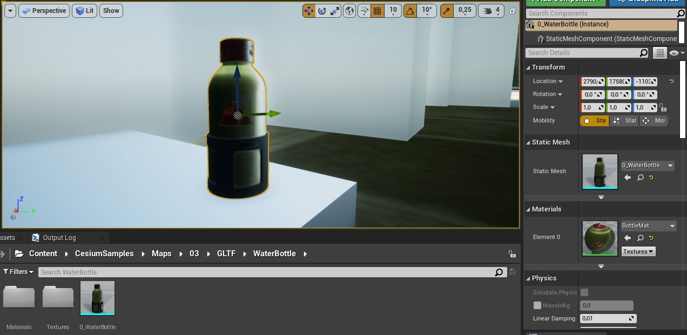

The tests were carried out with a glTF 2.0 Model of the University of Applied Sciences (HFT) and an official glTF 2.0 model of a Waterbottle.

- Unreal + SensorThings

The Sensor Things Server can be connected to a UE4 project like other Rest APIs. The Epic Games Marketplace provides different plugins for that purpose. For the sprint, the VaRest Plugin was tested since it can be used for free. It provides some functions in the blueprint system of UE4 that allow it to connect to SensorThings and request Observations. In this sprint, it was tested with Air quality Sensors in Stuttgart.

[#UnrealSensorThings,reftext='{figure-caption} {counter:figure-num}']
.Connection to SensorThings from Unreal Engine.
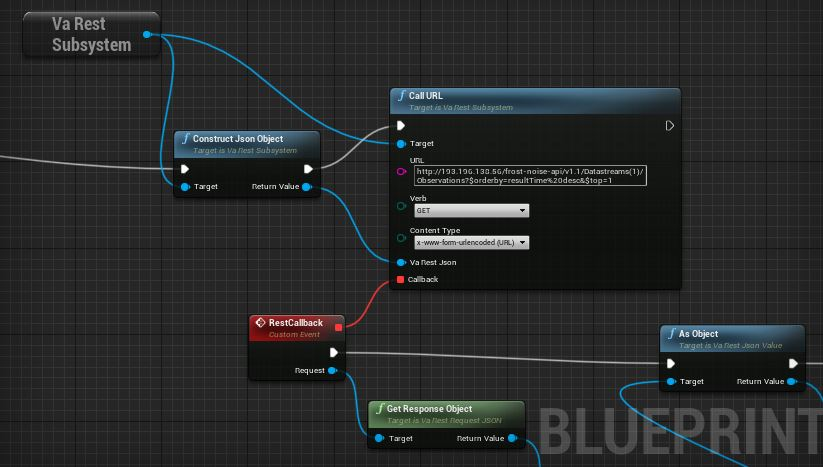

[#UnrealSensorThings2,reftext='{figure-caption} {counter:figure-num}']
.Connection to SensorThings from Unreal Engine in Game.
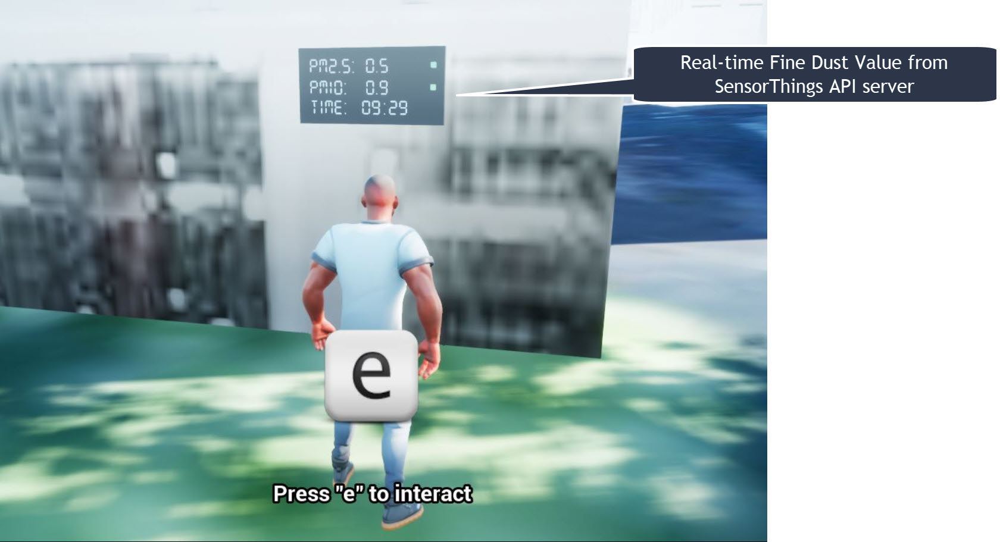

===== Unity 

- Unity + I3s

Compatibility between the Unity game engine and I3S is achieved via a Unity plugin developed by ESRI. An ESRI Early Adopter account is required in order to download the plugin and an API key to access the ESRI online services. The I3S plugin for Unity supports two of the available project templates in Unity, i.e., High Definition Render Pipeline and the Universal Render Pipeline. Installation of the plugin is managed by locally importing it as a Unity package. Next, the user can choose to use the plugin between a graphical user interface or a C# scripting interface. In order to activate the GUI, the user has to add the I3S plugin as a prefab in the scene hierarchy. The various GUI sections allow the user to customize the camera position (Latitude, Longitude, Height) and direction (Heading, Pitch, Roll) in a global coordinate reference system, the base map among different map tile servers, the addition of I3S data via a remote URL or local file as a layer and the added layers management by controlling their visibility, ordering, naming, opacity, duplication, and deletion. The addition of I3S layers hosted on the ArcGIS Enterprise Portal was seamless and error-free in Unity. An attempt to investigate the interoperability between the I3S plugin for Unity and the Steinbeis I3S server resulted, similar to the Unreal Engine, in failure for the same reason.

[#UnityI3s,reftext='{figure-caption} {counter:figure-num}']
.Visualize the I3S 3D building model service from Unity3D.
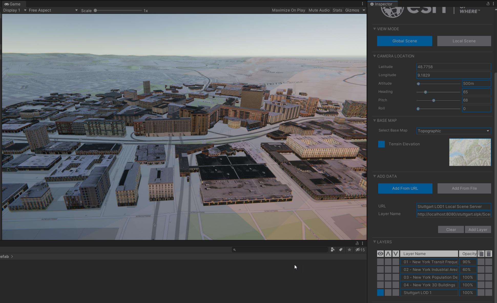

==== Web Visualization

In the ISG Sprint year 1, we successfully developed the client application based on the CesiumJS framework to load collections from the input 3D GeoVolumes API URL or select from an available list, then render the geospatial contents from the loaded collections/containers. This client is online at http://steinbeis-3dps.eu/STT3DClient/index.html and is used in the ISG Sprint year 2 to test and evaluate new 3D data of the HFT Stuttgart area on the GeoVolumes server. All data on the Steinbeis GeoVolumes server mentioned in the GeoVolumes Server section above are tested and shown in <<cesiumclient>>. 

[#cesiumclient,reftext='{figure-caption} {counter:figure-num}']
.Visualize different 3D building model data in the area of HFT Stuttgart via GeoVolumes server.
image::images/Steinbeis/cesiumClient.jpg[width=800,align="center"]

Extending to the above web clients, we also integrate the mobility route data such as synthetic eBike and air taxi routes from the Steinbeis SensorThings API server as shown in <<routeCesium>>.

[#routeCesium,reftext='{figure-caption} {counter:figure-num}']
.Visualize different 3D building model data in the area of HFT Stuttgart via GeoVolumes server.
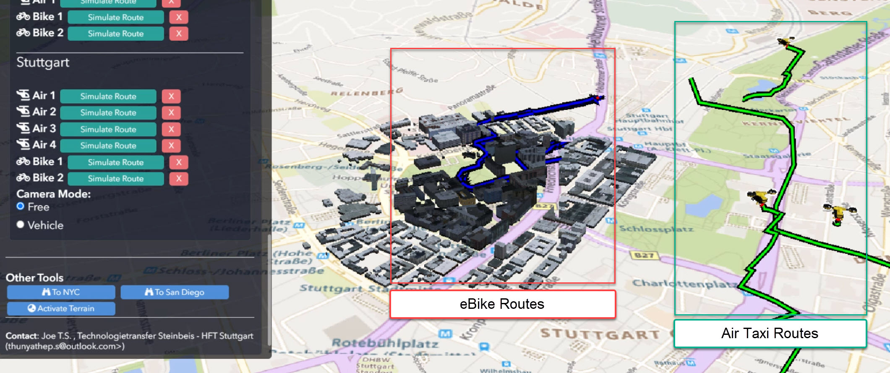

Moreover, we also used the ArcGIS for JS library to evaluate the i3s services from a GeoVolumes server. We tested the i3s services hosted on ArcGIS Online (for example, arcgis.com) and our own developed i3s service (for example, https://steinbeis-3dps.eu/scenelayers/hftbldg2/layers/0). We tested all data on the Steinbeis GeoVolumes server and got the same result as in the CesiumJS client.    

==== Mobile Visualization
- Android + Unreal Engine

The Mobile Augmented Reality Application was developed with the Unreal Engine and Googles ARCore. As described above, Unreal has good compatibility with local gltf models and SensorThings. The application is designed to recognize an Image of a Sensor as a Marker. When the Marker is in view, it shows the Real-Time measurements of the Air quality sensor by requesting it from the SensorThings server. Additionally, the application searches for planes where a gltf model of the HFT model can be placed by the User.

[#Android,reftext='{figure-caption} {counter:figure-num}']
.Visualization of Sensor Reading in AR Android Application.
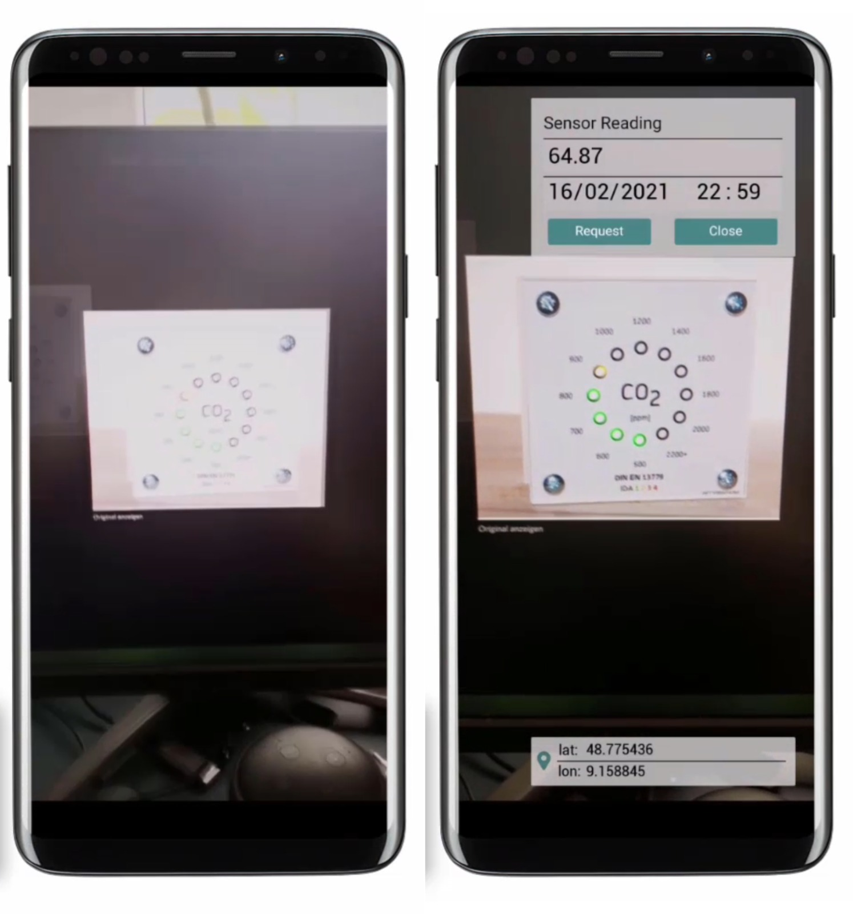

- iOS + GeoVolumes

3D data in `USDZ` format can be visualized directly in iOS devices without extra tools or plugins, as example in <<ios>> showing the HFT building models on the iPhone XR via the GeoVolumes API. In this sprint, we experimented with two ways to visualize the 3D data in iOS devices with `USDZ`. Firstly, we preprocessed the 3D data by converting them to `USDZ` and uploaded them to the Steinbeis GeoVolumes server. Then, these data can be loaded and visualized directly in iOS devices from the Steinbeis GeoVolumes server. Secondly, the data in `glTF` were be loaded from the server and converted on-the-fly to `USDZ` format with the 3rd party software (https://github.com/google/usd_from_gltf). 

[#ios,reftext='{figure-caption} {counter:figure-num}']
.Visualize the 3D building models in iOS devices via the GeoVolumes server.
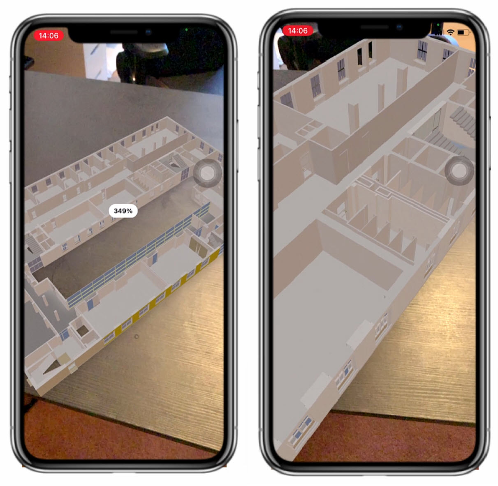
