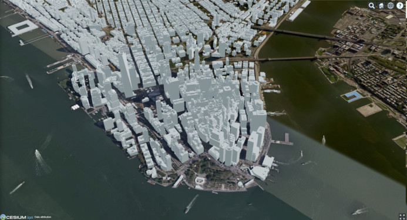

[appendix]
[[Datasets-Used-ISG-Year-2-Sprint]]
= Datasets Used in ISG Year 2 Sprint

=== Introduction
This is a complete list of all datasets used during the Sprint. As much information as possible is provided about each dataset. <<table_annex-datasets>> lists all datasets and provides summary information where available. The dataset name links to the notes for that dataset. The notes contain all of the detailed information that was available. The overview images are taken from images provided by the participants either in this Sprint or http://docs.ogc.org/per/20-087.html[ISG Year 1 Sprint] cite:[ISG_Y1_ER]. As much data as possible was collected from each of the participants. 

=== Datasets

[#table_annex-datasets,reftext='{table-caption} {counter:table-num}']
.Details of data sets used by the participants during the Sprint.
[cols="1,^1,^1,^1,^1,^1",options="header",align="center"]
|===
|*Dataset*|*Overview*|*Format*|*Size*|*Owner*|*License*

|<<dataset-notes-austin, Austin>>
  a| image::images/SimBlocks/SimBlocks - ISG2 - Austin in Unity.jpg[width=200,align="center"]
   | GeoPackage | 951MB((4km2) | Multiple - See Notes | Public Domain

|<<dataset-notes-berlin, Berlin>>
  a| _not available_ | _unknown_ | _unknown_ | _unknown_ | _unknown_

|<<dataset-notes-globe, Globe>>
  a| image::images/Ecere/HfT-Globe.jpg[width=200,align="center"]
   | Multiple | Multiple | Multiple | Varies

|<<dataset-notes-honolulu, Honolulu, HI>>
  a| image::images/FlightSafety/Shuttle_behind.JPG[width=200,align="center"]
   | CDB | _unknown_ | _unknown_ | _unknown_

|<<dataset-notes-miami, Miami, FL>>
  a| image::images/InfoDao/edition.png[width=200,align="center"]
   | _unknown_ | _unknown_ | _unknown_ | _unknown_

|<<dataset-notes-new-york-cdb, New York CDB>>
  a| 
   | CDB | _unknown_ | Provide by FlightSafety | _unknown_

|<<dataset-notes-paris, Paris>>
  a| image::images/SimBlocks/SimBlocks - ISG2 - Paris in Unity.jpg[width=200,align="center"]
   | GeoPackage | 4.41GB(4km2) |Multiple - See Notes | Mixed

|<<dataset-notes-san-diego-cdb, San Diego CDB>>
  a| image::images/SimBlocks/SmBlocks - ISG2 - San Diego CDB LOD3.png[width=200,align="center"]
   | GeoPackage (From CDB) | 32.9GB(GLTF-Binary) 2.27GB(OpenFlight) | Created By CAE USA Inc | _unknown_

|<<dataset-notes-stuttgart, Stuttgart>>
  a| image::images/Ecere/HfT-osm-buildings.jpg[width=200,align="center"] | OpenStreetMap | _unknown_ | OpenStreetMap contributors | https://wiki.osmfoundation.org/wiki/Terms_of_Use[Open Street Map License] cite:[OSM_L]

|<<dataset-notes-yemen, Yemen>>
  a| image::images/Cesium/EXT_feature_metadata_5.png[width=200,align="center"]
  | _unknown_ | _unknown_ | Provided by Presagis | _unknown_
|===

[[dataset-notes-austin]]
==== Austin Notes
Please See SimBlocks section of the ER Section GeoPackage Content Creation (Austin Tx) for Unreal Engine and Unity for a complete description of all datasets and processes used for Austin TX.

* Texas Natural Resource Information System
** Source Imagery: https://data.tnris.org/collection/f84442b8-ac2a-4708-b5c0-9d15515f4483
** Web Map Service (WMS): https://imagery.tnris.org/server/services/StratMap/StratMap19_NCCIR_CapArea/ImageServer/WMSServer

* Source Elevation: https://apps.nationalmap.gov/downloader/#/
* Building Footprints https://austintexas.app.box.com/s/8ah8itbha7u6lis9eipypnz5ljvwta4t
* Tree Locations https://data.austintexas.gov/Locations-and-Maps/Tree-Inventory/wrik-xasw

<<table_annex-datasets,_Back to table_>>

[[dataset-notes-berlin]]
==== Berlin Notes
* Used in https://www.ogc.org/pub/Testbed13/er.html[OGC Testbed 13] cite:[TestBed13]

<<table_annex-datasets,_Back to table_>>

[[dataset-notes-honolulu]]
==== Honolulu Notes
No notes are available.

<<table_annex-datasets,_Back to table_>>

[[dataset-notes-globe]]
==== Global Datasets

* Viewfinder Panoramas: worldwide elevation data from Jonathan de Ferranti: http://www.viewfinderpanoramas.org/Coverage%20map%20viewfinderpanoramas_org3.htm
* NASA Visible Earth Blue Marble: https://visibleearth.nasa.gov/collection/1484/blue-marble cite:[BlueMarble]
* *ESA Gaia’s Sky in colour https://sci.esa.int/web/gaia/-/60196-gaia-s-sky-in-colour-equirectangular-projection (Gaia Data Processing and Analysis Consortium (DPAC); A. Moitinho / A. F. Silva / M. Barros / C. Barata, University of Lisbon, Portugal; H. Savietto, Fork Research, Portugal.) CC BY SA 3.0.

<<table_annex-datasets,_Back to table_>>

[[dataset-notes-miami]]
==== Miami Notes
No notes are available.

<<table_annex-datasets,_Back to table_>>

[[dataset-notes-new-york-cdb]]
==== New York CDB Notes
No notes are available.

<<table_annex-datasets,_Back to table_>>

[[dataset-notes-paris]]
==== Paris Notes

Imagery: Bing Virtual Earth (for Paris resolution appears to be ~0.5 Meter/Pixel

Elevation:  Shuttle Radar Topography Mission (SRTM) (Sample rate ~30m)

Paris GIS Information:

Basic Site Home — Paris Data (https://opendata.paris.fr/pages/home/ cite:[Paris])

Note: The site is in French. To get descriptive information on the data layers from this site you will need to download the PDF files and load them in google docs and have google docs do the translation. For the site itself use chrome and let google translate it.

Building Footprints Volumes bâtis — Paris Data (https://opendata.paris.fr/explore/dataset/volumesbatisparis/information/)

Notes: Building Hight Information is described by number of floors in building. In general assume 4.3 M per floor but in truth this is quite variable.

Trees Les arbres — Paris Data (https://opendata.paris.fr/explore/dataset/les-arbres/information/?disjunctive.typeemplacement&disjunctive.arrondissement&disjunctive.libellefrancais&disjunctive.genre&disjunctive.espece&disjunctive.varieteoucultivar&disjunctive.stadedeveloppement&disjunctive.remarquable)

This dataset contains an inventory of trees in the city of Paris containing species of tree and height in meters.

Note: There are some spikes in the tree height information. Not all trees are in the inventory

Note: Both Building Heights and Trees were downloaded as GeoJSON.

Note on other layers available on basic site. There are many layers available that we may use in the future for enhancements such as street furniture, traffic signals and possibly additional building information that will allow automated selection of building templates.

* Building Footprints https://opendata.paris.fr/explore/dataset/volumesbatisparis/information
* Tree Locations https://opendata.paris.fr/explore/dataset/les-arbres/information/?disjunctive.typeemplacement&disjunctive.arrondissement&disjunctive.libellefrancais&disjunctive.genre&disjunctive.espece&disjunctive.varieteoucultivar&disjunctive.stadedeveloppement&disjunctive.remarquable
* Elevation (SRTM) https://earthexplorer.usgs.gov/ cite:[EarthExplorer]

<<table_annex-datasets,_Back to table_>>

[[dataset-notes-san-diego-cdb]]
==== San Diego CDB Notes

* Source CDB https://gsa-temp-public.s3.us-east-1.amazonaws.com/CDB_san_diego_v4.1.zip
* GTLF GeoPackage
* OpenFlight GeoPackage
* GeoPackage Files
* Other versions of the San Diego CDB
** the original one provided by CAE (specified above)
** the GeoPackage(s) created by SimBlocks based on earlier CDB Interoperability Experiments
** the CDB X GeoPackage datastore prototype that we produced for the CDB X Tech Sprint
** Additional information at https://github.com/sofwerx/cdb2-eng-report/blob/master/11-tiling-coverages.adoc or https://portal.ogc.org/index.php?m=projects&a=view&project_id=466&tab=2&artifact_id=95315

[[dataset-notes-stuttgart]]
==== Stuttgart Notes

* Street data: (c) OpenStreetMap contributors. https://openstreetmap.org/ cite:[OSM]
* Ecere sourced the data from a GeoFabrik ( https://download.geofabrik.de/ ) OSM PBF extract of Baden-Württemberg ( https://download.geofabrik.de/europe/germany/baden-wuerttemberg-latest.osm.pbf ), and converted this to our GNOSIS Map Tiles and our GNOSIS Data Store.
* Detailed HfT building interiors created by HfT students in Sketchup.

<<table_annex-datasets,_Back to table_>>

[[dataset-notes-yemen]]
==== Yemen Notes
No notes are available.

<<table_annex-datasets,_Back to table_>>
